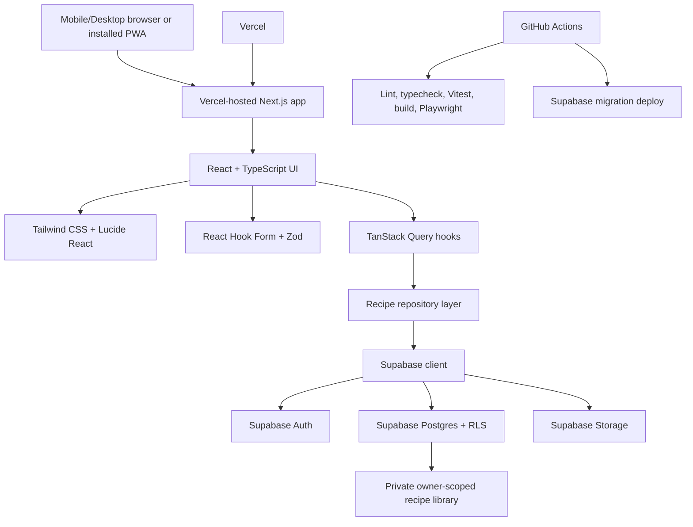

# PocketPlates Architecture And Setup Guide

## Current State

PocketPlates is a multi-user, private-first recipe Progressive Web App for students and beginner cooks. The current codebase is a Stage 0 foundation: it has the Next.js app shell, mobile-first starter UI, PWA manifest, TanStack Query provider, Supabase client boundary, recipe DTO/repository/query structure, unit test setup, E2E test setup, and GitHub Actions workflow templates.

## Stack

- App framework: Next.js with React and TypeScript.
- Styling: Tailwind CSS.
- Icons and placeholders: Lucide React plus deterministic SVG/icon treatments.
- Server state: TanStack Query from the start.
- Forms and validation: React Hook Form and Zod.
- Backend platform: Supabase.
- Database: Supabase Postgres with migration files.
- Auth: Supabase Auth with open email sign-up.
- Storage: Supabase Storage for future recipe images.
- Hosting: Vercel.
- CI/CD: GitHub Actions plus Vercel Git deployments.
- Testing: Vitest for unit/integration tests and Playwright for E2E tests.

## Architecture



## Data Model

The database schema is migration-first and represented in:

- `supabase/migrations/20260710000000_initial_recipe_schema.sql`
- `docs/database-schema.dbml`
- `docs/database-erd.mmd`

Core entities:

- `profiles`: one profile per Supabase Auth user.
- `recipes`: owner-scoped recipe records with cost rating, single difficulty rating, visibility, image fields, and timestamps.
- `recipe_meal_types`: multi-select meal categories for each recipe.
- `recipe_ingredients`: ordered ingredients.
- `recipe_steps`: ordered instructions.
- `recipe_links`: source URLs.
- `tags` and `recipe_tags`: user-owned tags and recipe/tag joins.
- `equipment` and `recipe_equipment`: user-owned equipment labels and recipe/equipment joins.

Future-ready entities:

- `pantry_items`
- `meal_plans`
- `meal_plan_entries`
- `grocery_lists`
- `grocery_list_items`

## Code Organization

```txt
src/
  app/
    app.constants.ts
    globals.css
    layout.tsx
    manifest.ts
    page.tsx
    providers.tsx
  features/
    recipes/
      recipe-library.constants.ts
      recipe.mappers.ts
      recipe.queries.ts
      recipe.repository.ts
      recipe.types.ts
      __tests__/
        recipe.mappers.test.ts
  lib/
    env/
      env.constants.ts
    query/
      query-client.ts
      query-keys.ts
      query.constants.ts
    supabase/
      client.ts
      database.types.ts
```

## Documentation Organization

- `README.md`: short repository entry point and file index.
- `docs/ARCHITECTURE.md`: authoritative system architecture, features, setup, and onboarding guide.
- `docs/project-plan.md`: product plan, roadmap, and implementation priorities.
- `docs/changelog/`: chronological implementation notes for each completed change slice.
- `docs/database-schema.dbml`: DBML source for dbdiagram.io.
- `docs/database-erd.mmd`: Mermaid ERD source.
- `docs/assets/`: generated visual references and mockups.

## Server-State Rule

Use TanStack Query for server state from the start. Components should consume feature-level query hooks, such as `useRecipeList`, instead of making ad hoc API calls in `useEffect`. Keep `useEffect` for true browser-side effects such as focus handling, subscriptions, or direct browser APIs.

## Local Setup

1. Install dependencies:

```bash
npm install
```

2. Create local environment values:

```bash
cp .env.example .env.local
```

3. Fill these values in `.env.local` after creating a Supabase project:

```txt
NEXT_PUBLIC_SUPABASE_URL=
NEXT_PUBLIC_SUPABASE_ANON_KEY=
```

4. Start the local app:

```bash
npm run dev
```

5. Run checks:

```bash
npm run lint
npm run typecheck
npm run test
npm run build
npm run test:e2e
```

If Playwright browsers are missing:

```bash
npx playwright install
```

## Supabase Setup

1. Create a Supabase project.
2. Copy the project URL and anon key into `.env.local`.
3. Install and authenticate the Supabase CLI if needed.
4. Link the local repo to the Supabase project:

```bash
supabase link --project-ref <your-project-ref>
```

5. Push migrations:

```bash
supabase db push
```

6. Generate database types:

```bash
npm run supabase:types
```

7. Confirm Row Level Security policies are enabled and signup creates `profiles` rows.

## Email And SMTP Setup

Supabase default auth email is acceptable for early local testing, but configure custom SMTP before sharing PocketPlates with real users.

Recommended Gmail or Google Workspace setup:

1. Create or choose a dedicated sender mailbox.
2. Enable 2-Step Verification.
3. Create a Google app password.
4. In Supabase, open Authentication email/SMTP settings.
5. Enable custom SMTP.
6. Use:

```txt
Host: smtp.gmail.com
Port: 587
Username: your sender email
Password: Google app password
Sender: same mailbox or verified sender
```

For a larger public release, prefer a transactional provider such as Resend, Postmark, SendGrid, Brevo, or AWS SES.

## Deployment Setup

1. Push the repo to GitHub.
2. Connect the GitHub repo to Vercel.
3. Add Vercel environment variables:

```txt
NEXT_PUBLIC_SUPABASE_URL
NEXT_PUBLIC_SUPABASE_ANON_KEY
```

4. Add GitHub secrets for migration workflows:

```txt
SUPABASE_ACCESS_TOKEN
SUPABASE_PROJECT_REF
SUPABASE_DB_PASSWORD
```

5. Let Vercel deploy previews for pull requests and production from `main`.
6. Let GitHub Actions run CI and migration deployment.

## PWA Support

PocketPlates is not limited to iPhone Safari. It can run as:

- an iPhone/iPad Safari PWA via Add to Home Screen
- an Android installed PWA through Chrome, Edge, or Samsung Internet
- a desktop installable web app in supported Chromium browsers
- a normal responsive website in any modern browser

PWA capabilities vary by browser and operating system. If App Store distribution becomes important later, the web app can be wrapped with Capacitor before considering a full native rewrite.

## Implementation Roadmap

1. Stage 0: foundation, app shell, CI, tests, Supabase boundary, TanStack Query setup.
2. Stage 1: true MVP private recipe library.
3. Stage 2: student-friendly filters, cost, difficulty, equipment, tags, ingredient search.
4. Stage 3: meal planning, grocery lists, serving scaling, pantry/cost features.
5. Stage 4: public/shared recipe discovery.
6. Stage 5: polish, import flows, nutrition/macros, recommendations.
