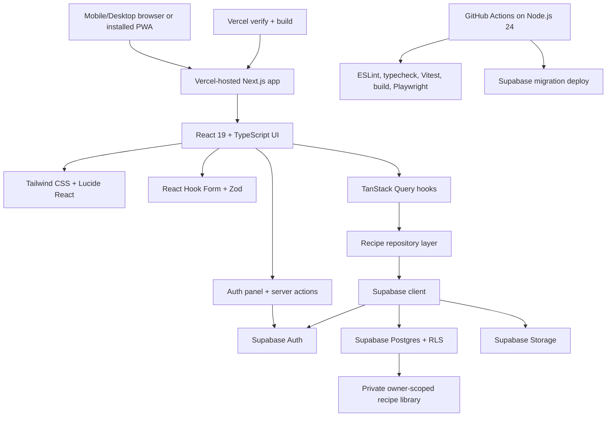

# PocketPlates Architecture And Setup Guide

## Current State

PocketPlates is a multi-user, private-first recipe Progressive Web App for students and beginner cooks. The current codebase has completed the Stage 1 private recipe library: it has the Next.js app shell, authenticated recipe list/detail/create/edit/archive flows, PWA manifest, TanStack Query provider, Supabase browser/server/proxy client boundaries, auth callback handling, email and Google sign-in actions, password reset and confirmation resend flows, profile-aware signed-in display, recipe DTO/repository/query structure, unit test setup, E2E test setup, and GitHub Actions workflow templates.

## Stack

- App framework: Next.js 16 with React 19 and TypeScript.
- Styling: Tailwind CSS.
- Icons and placeholders: Lucide React plus deterministic SVG/icon treatments.
- Server state: TanStack Query from the start.
- Forms and validation: React Hook Form and Zod.
- Backend platform: Supabase.
- Database: Supabase Postgres with migration files.
- Auth: Supabase Auth with open email sign-up and planned Google OAuth.
- Storage: Supabase Storage for future recipe images.
- Hosting: Vercel.
- CI/CD: GitHub Actions on Node.js 24 plus Vercel Git deployments that run lightweight verification before building.
- Linting: ESLint 9 flat config with Next.js Core Web Vitals and TypeScript rules.
- Testing: Vitest 4 for unit/integration tests and Playwright for E2E tests.

## Architecture



## Data Model

The database schema is migration-first and represented in:

- `supabase/migrations/20260710000000_initial_recipe_schema.sql`
- `docs/database-schema.dbml`
- `docs/database-erd.mmd`

Core entities:

- `profiles`: one profile per Supabase Auth user.
- `recipes`: owner-scoped recipe records with cost rating, single difficulty rating, visibility, image fields, and timestamps.
- `recipe_meal_types`: multi-select meal categories for each recipe.
- `recipe_ingredients`: ordered ingredients.
- `recipe_steps`: ordered instructions.
- `recipe_links`: source URLs.
- `tags` and `recipe_tags`: user-owned tags and recipe/tag joins.
- `equipment` and `recipe_equipment`: user-owned equipment labels and recipe/equipment joins.

Future-ready entities:

- `pantry_items`
- `meal_plans`
- `meal_plan_entries`
- `grocery_lists`
- `grocery_list_items`

## Code Organization

```txt
src/
  app/
    auth/
      callback/
        route.ts
      update-password/
        page.tsx
    app.constants.ts
    globals.css
    layout.tsx
    manifest.ts
    page.tsx
    providers.tsx
    recipes/
      [id]/
        edit/
          page.tsx
        page.tsx
      new/
        page.tsx
  features/
    auth/
      auth.actions.ts
      auth.constants.ts
      auth-panel.tsx
      auth-submit-button.tsx
      sign-out-button.tsx
      __tests__/
        auth.constants.test.ts
    recipes/
      recipe-card.tsx
      recipe-detail.tsx
      recipe-edit.tsx
      recipe-form.tsx
      recipe-library.tsx
      recipe-library.constants.ts
      recipe.mappers.ts
      recipe.queries.ts
      recipe.repository.ts
      recipe.types.ts
      recipe.validation.ts
      __tests__/
        recipe.mappers.test.ts
  lib/
    env/
      env.constants.ts
    query/
      query-client.ts
      query-keys.ts
      query.constants.ts
    supabase/
      client.ts
      database.types.ts
      middleware.ts
      server.ts
proxy.ts
eslint.config.mjs
vercel.json
vitest.config.mts
```

## Documentation Organization

- `README.md`: short repository entry point and file index.
- `docs/ARCHITECTURE.md`: authoritative system architecture, features, setup, and onboarding guide.
- `docs/project-plan.md`: product plan, roadmap, and implementation priorities.
- `docs/changelog/`: chronological implementation notes for each completed change slice.
- `docs/database-schema.dbml`: DBML source for dbdiagram.io.
- `docs/database-erd.mmd`: Mermaid ERD source.
- `docs/assets/`: generated visual references and mockups.

## Server-State Rule

Use TanStack Query for server state from the start. Components should consume feature-level query hooks, such as `useRecipeList`, instead of making ad hoc API calls in `useEffect`. Keep `useEffect` for true browser-side effects such as focus handling, subscriptions, or direct browser APIs.

## Auth Boundary

Signed-out visitors see the auth panel on `/`. Email/password, Google OAuth, confirmation resend, and password reset request flows run through server actions and the `/auth/callback` route. Password recovery links redirect through the callback into `/auth/update-password`, where a signed-in recovery session can set the new password. Middleware refreshes Supabase auth cookies before rendering, and server-rendered pages use the Supabase server client to check the current user before showing private app UI.

Once signed in, the user sees a Supabase-backed recipe library. The list is loaded through TanStack Query and the recipe repository, then filtered by recipe title and one or more meal types. Recipe cards link to owner-scoped detail pages. RLS keeps results owner-scoped. The header shows a profile label from `profiles.display_name`, `profiles.username`, or email, plus a sign-out action.

## Recipe Read Path

The recipe read path keeps database rows, DTOs, and UI state separate:

- `recipe.repository.ts` queries `recipes` and `recipe_meal_types` through the browser Supabase client.
- `recipe.mappers.ts` converts snake_case Supabase rows into camelCase `RecipeCardDto` and `RecipeDetailDto` objects.
- `recipe.queries.ts` exposes `useRecipeList` and `useRecipeDetail` for TanStack Query caching.
- `recipe-library.tsx` owns search and meal-type filter UI state.
- `recipe-card.tsx` renders compact mobile-friendly recipe cards.

## Recipe Write Path

Recipe create/edit/archive flows use the same repository and TanStack Query boundary:

- `/recipes/new` checks the server auth session before rendering the client recipe form.
- `/recipes/[id]` checks the server auth session before rendering recipe detail.
- `/recipes/[id]/edit` checks the server auth session before rendering the edit form.
- `recipe-form.tsx` uses React Hook Form with `recipe.validation.ts` Zod rules for title, servings, meal types, ingredients, steps, optional source URL, optional image URL, notes, cost rating, and difficulty.
- The add/edit form is intentionally mobile-first. A user adds a title, positive whole-number servings, at least one meal type, at least one ingredient, and at least one step. Optional recipe notes, source URL, image URL, cost rating, and difficulty can be left blank.
- Ingredient rows keep four editable fields: ingredient name, amount, unit, and notes. Ingredient names are required. Amounts are optional but, when present, must be positive numbers or simple fractions such as `1`, `1.5`, `1/2`, or `1 1/2`. Units are optional but must come from the supported unit picker. Ingredient notes stay available for preparation details like "finely chopped", "optional", or "to taste".
- Step rows now contain only instruction text. Dedicated timer minutes are no longer edited or displayed; timing should be written directly into the instruction, such as "Simmer for 10 minutes."
- Validation errors are shown next to the specific ingredient or step field that needs attention, and the form caps recipe size with practical limits for servings, ingredients, and steps.
- `recipe.repository.ts` writes the main `recipes` row, replaces ordered `recipe_meal_types`, `recipe_ingredients`, and `recipe_steps` child rows, and soft-archives recipes through `archived_at`.
- Before writing ingredient rows, `recipe.repository.ts` parses accepted amount strings into numeric values for `recipe_ingredients.amount`. Blank optional fields are written as `null`, and step timers are written as `null`.
- `recipe.queries.ts` exposes create, update, and archive mutations and invalidates recipe list/detail caches after successful writes.
- `recipe.errors.ts` maps Supabase, PostgREST, Auth, Storage, network, and unknown failures into safe user-facing messages. Recipe list, detail, edit, save, and archive screens show the classified message without exposing raw table names, RLS policy details, constraint names, or backend error text.
- Save and archive actions show spinner-backed pending labels, disable repeat clicks while the mutation runs, and stay busy through the redirect handoff. The recipe form also disables its editable fields and row controls while saving so a user cannot change the recipe mid-submit.

## Local Setup

1. Install dependencies:

```bash
npm install
```

2. Create `.env.local` in the project root after creating a Supabase project:

```txt
NEXT_PUBLIC_SUPABASE_URL=
NEXT_PUBLIC_SUPABASE_PUBLISHABLE_KEY=
SUPABASE_SECRET_KEY=
```

`NEXT_PUBLIC_SUPABASE_PUBLISHABLE_KEY` is the modern replacement for the legacy `anon` key in browser-safe code. `SUPABASE_SECRET_KEY` is server-only and should stay out of any `NEXT_PUBLIC_` variable; it is reserved for future backend-only admin work and is not used by the browser client.

3. Start the local app:

```bash
npm run dev
```

4. Run checks. CI runs these checks on Node.js 24 with placeholder public Supabase values because GitHub Actions does not inherit Vercel environment variables. Playwright starts the local Next.js server on `127.0.0.1:3000` so E2E tests use a deterministic base URL:

```bash
npm run lint
npm run typecheck
npm run test
npm run build
npm run test:e2e
```

Vercel deployments use `vercel.json` to run `npm run verify && npm run build`, so lint, typecheck, and unit tests must pass before Vercel produces a deployment build. GitHub branch protection is still required if production deploys should be limited to commits whose full GitHub Actions CI, including Playwright E2E, has passed.

If Playwright browsers are missing:

```bash
npx playwright install
```

## Supabase Setup

1. Create a Supabase project.
2. Copy the project URL and publishable key into `.env.local`.
3. Create a secret API key only if the project needs backend-only administrative access. Store it as `SUPABASE_SECRET_KEY`; never expose it to browser code, mobile clients, public source code, or Vercel public environment variables.
4. A separate Supabase JWT secret is not required for the current app setup. Use the publishable key for client access and the secret key for future server-only admin operations. Only revisit JWT secrets if the app later signs/verifies custom JWTs directly or adds Edge Functions that rely on Supabase JWT verification behavior.
5. Install and authenticate the Supabase CLI if needed.
6. Link the local repo to the Supabase project:

```bash
npm run supabase:link -- --project-ref <your-project-ref>
```

7. Push migrations:

```bash
npm run supabase:db:push
```

8. Generate database types:

```bash
npm run supabase:types
```

9. Confirm Row Level Security policies are enabled, target the `authenticated` role, and signup creates `profiles` rows.

## Email And SMTP Setup

Supabase default auth email is acceptable for early local testing, but configure custom SMTP before sharing PocketPlates with real users.

Recommended Gmail or Google Workspace setup:

1. Create or choose a dedicated sender mailbox.
2. Enable 2-Step Verification.
3. Create a Google app password.
4. In Supabase, open Authentication email/SMTP settings.
5. Enable custom SMTP.
6. Use:

```txt
Host: smtp.gmail.com
Port: 587
Username: your sender email
Password: Google app password
Sender: same mailbox or verified sender
```

For a larger public release, prefer a transactional provider such as Resend, Postmark, SendGrid, Brevo, or AWS SES.

## Google OAuth Setup

Use Supabase as the application auth broker and Google Cloud Console as the OAuth credential provider.

1. Create a dedicated PocketPlates email account for app ownership and support.
2. Create or select a Google Cloud project for PocketPlates.
3. In Google Cloud Console, open API and Services from the side bar.
4. Configure the OAuth consent screen with the app name, support email, developer contact email, and any required test users while the app is in testing mode.
5. Open Credentials, choose Create Credentials, and create an OAuth client ID for a web application.
6. Add authorized JavaScript origins:

```txt
http://localhost:3000
https://<production-domain>
```

Add the production domain after the deployed application URL is known.

7. Add authorized redirect URIs:

```txt
https://<project-ref>.supabase.co/auth/v1/callback
http://127.0.0.1:54321/auth/v1/callback
```

The `https://<project-ref>.supabase.co/auth/v1/callback` URI is required for the hosted Supabase project. The `http://127.0.0.1:54321/auth/v1/callback` URI is only needed when using local Supabase.

8. Copy the Google OAuth client ID and client secret into Supabase Authentication > Providers > Google. Do not commit either value to the repo.
9. Enable the Google provider in Supabase Auth.
10. Add the local and deployed app URLs to the Supabase Auth site URL and redirect URL allow list, including localhost for development and the Vercel production URL before release.
11. Test Google sign-in with a Google account that is allowed by the OAuth consent screen.

Keep Google SMTP credentials separate from Google OAuth credentials. SMTP uses a Google app password for the sender mailbox; OAuth login uses a Google Cloud OAuth client ID and client secret stored only in Supabase.

## Deployment Setup

1. Push the repo to GitHub.
2. Connect the GitHub repo to Vercel.
3. Add Vercel environment variables:

```txt
NEXT_PUBLIC_SUPABASE_URL
NEXT_PUBLIC_SUPABASE_PUBLISHABLE_KEY
SUPABASE_SECRET_KEY
```

4. Add GitHub secrets for migration workflows:

```txt
SUPABASE_ACCESS_TOKEN
SUPABASE_PROJECT_REF
SUPABASE_DB_PASSWORD
```

5. Let Vercel deploy previews for pull requests and production from `main`.
6. Let GitHub Actions run CI and migration deployment. The database deployment workflow lists linked migrations before and after `supabase db push` so migration state is visible in the workflow logs.

## PWA Support

PocketPlates is not limited to iPhone Safari. It can run as:

- an iPhone/iPad Safari PWA via Add to Home Screen
- an Android installed PWA through Chrome, Edge, or Samsung Internet
- a desktop installable web app in supported Chromium browsers
- a normal responsive website in any modern browser

PWA capabilities vary by browser and operating system. If App Store distribution becomes important later, the web app can be wrapped with Capacitor before considering a full native rewrite.

## Implementation Roadmap

1. Stage 0: foundation, app shell, CI, tests, Supabase boundary, TanStack Query setup.
2. Stage 1: true MVP private recipe library.
3. Stage 2: student-friendly filters, cost, difficulty, equipment, tags, ingredient search.
4. Stage 3: meal planning, grocery lists, serving scaling, pantry/cost features.
5. Stage 4: public/shared recipe discovery.
6. Stage 5: polish, import flows, nutrition/macros, recommendations.
