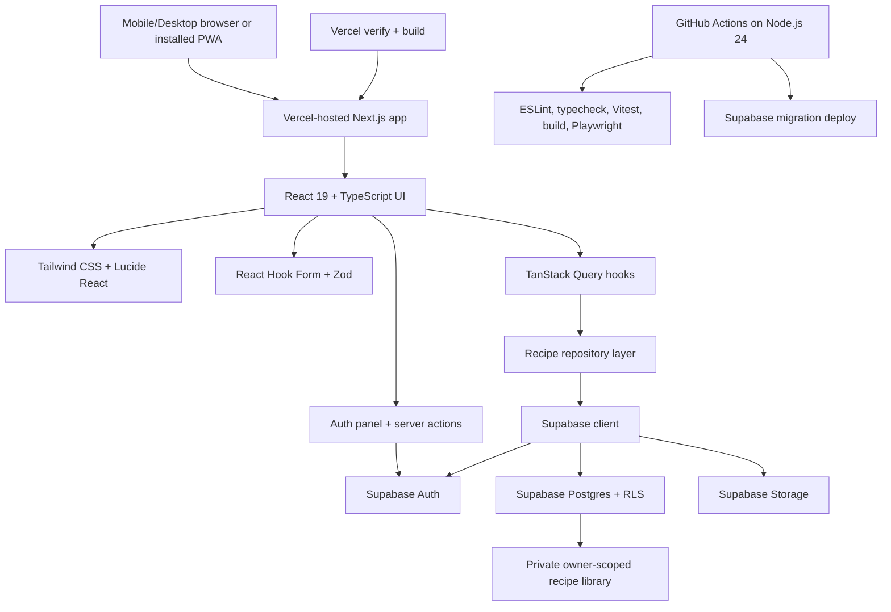
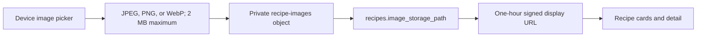
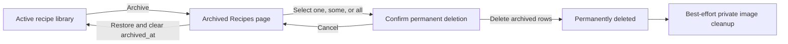
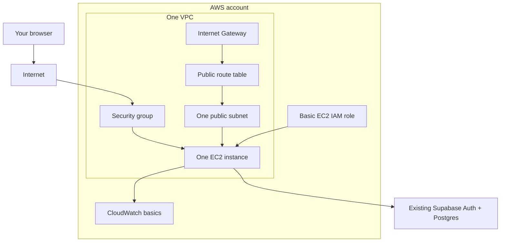

# PocketPlates Architecture And Setup Guide

## Current State

PocketPlates is a multi-user, private-first recipe Progressive Web App for students and beginner cooks. The current codebase has completed the Stage 1 private recipe library: it has the Next.js app shell, authenticated recipe list/detail/create/edit/archive/restore/permanent-delete flows, private device image uploads, PWA manifest, TanStack Query provider, Supabase browser/server/proxy client boundaries, auth callback handling, email and Google sign-in actions, password reset and confirmation resend flows, profile-aware signed-in display, recipe DTO/repository/query structure, unit test setup, E2E test setup, and GitHub Actions workflow templates.

## Stack

- App framework: Next.js 16 with React 19 and TypeScript.
- Styling: Tailwind CSS.
- Icons and placeholders: Lucide React plus deterministic SVG/icon treatments.
- Server state: TanStack Query from the start.
- Forms and validation: React Hook Form and Zod.
- Backend platform: Supabase.
- Database: Supabase Postgres with migration files.
- Auth: Supabase Auth with open email sign-up and Google OAuth.
- Storage: private Supabase Storage recipe images with owner-scoped access policies.
- Hosting: Vercel.
- Containerization: production Docker image for the AWS migration path, using Next.js standalone output.
- AWS learning path: begin with a minimal Terraform sandbox in `infra/test`, then compare against the fuller reference implementation in `infra/aws`.
- CI/CD: GitHub Actions on Node.js 24 plus Vercel Git deployments that run lightweight verification before building.
- Linting: ESLint 9 flat config with Next.js Core Web Vitals and TypeScript rules.
- Testing: Vitest 4 for unit/integration tests and Playwright for E2E tests.

## Architecture


```mermaid
flowchart TD
    A["Mobile/Desktop browser or installed PWA"] --> B["Vercel-hosted Next.js app"]
    B --> C["React 19 + TypeScript UI"]
    C --> D["Tailwind CSS + Lucide React"]
    C --> E["React Hook Form + Zod"]
    C --> F["TanStack Query hooks"]
    C --> Q["Auth panel + server actions"]
    Q --> I["Supabase Auth"]
    F --> G["Recipe repository layer"]
    G --> H["Supabase client"]
    H --> I["Supabase Auth"]
    H --> J["Supabase Postgres + RLS"]
    H --> K["Supabase Storage"]
    J --> L["Private owner-scoped recipe library"]
    M["GitHub Actions on Node.js 24"] --> N["ESLint, typecheck, Vitest, build, Playwright"]
    M --> O["Supabase migration deploy"]
    P["Vercel verify + build"] --> B
```

## Data Model

The database schema is migration-first and represented in:

- `supabase/migrations/20260710000000_initial_recipe_schema.sql`
- `supabase/migrations/20260818222347_add_private_recipe_image_storage.sql`
- `docs/database-schema.dbml`
- `docs/database-erd.mmd`

Core entities:

- `profiles`: one profile per Supabase Auth user.
- `recipes`: owner-scoped recipe records with cost rating, single difficulty rating, visibility, image fields, and timestamps.
- `recipe_meal_types`: multi-select meal categories for each recipe.
- `recipe_ingredients`: ordered ingredients.
- `recipe_steps`: ordered instructions.
- `recipe_links`: up to five ordered source URLs per recipe, each with an optional display label.
- `tags` and `recipe_tags`: user-owned tags and recipe/tag joins.
- `equipment` and `recipe_equipment`: user-owned equipment labels and recipe/equipment joins.

Future-ready entities:

- `pantry_items`
- `meal_plans`
- `meal_plan_entries`
- `grocery_lists`
- `grocery_list_items`

Recipe create and edit flows write sources to `recipe_links`. The legacy `recipes.source_url` column remains readable as a fallback for recipes created before multi-source support, but new saves clear it and use the child rows. Source rows follow recipe ownership through existing Row Level Security policies.

## Code Organization

```txt
src/
  app/
    auth/
      callback/
        route.ts
      update-password/
        page.tsx
    app.constants.ts
    globals.css
    layout.tsx
    manifest.ts
    page.tsx
    AppProviders.tsx
    recipes/
      archived/
        loading.tsx
        page.tsx
      [id]/
        edit/
          page.tsx
        page.tsx
      new/
        page.tsx
  components/
    ui/
      __tests__/
        shared-ui.test.tsx
      ActionButton.tsx
      AppPageShell.tsx
      BackLink.tsx
      InlineNotice.tsx
      SelectableChip.tsx
  features/
    auth/
      auth.actions.ts
      auth.constants.ts
      AuthHero.tsx
      AuthPanel.tsx
      AuthSubmitButton.tsx
      SignOutButton.tsx
      __tests__/
        auth.constants.test.ts
    recipes/
      ArchivedRecipeLibrary.tsx
      DeleteArchivedRecipesDialog.tsx
      RecipeCard.tsx
      RecipeDetail.tsx
      RecipeEdit.tsx
      recipe-filters.tsx
      RecipeFormFields.tsx
      recipe-form-list.tsx
      RecipeForm.tsx
      RecipeImageField.tsx
      recipe-image.constants.ts
      recipe-image.repository.ts
      RecipeIngredientFields.tsx
      RecipeLibrary.tsx
      RecipeNavigation.tsx
      recipe-library.constants.ts
      RecipeStepFields.tsx
      recipe.mappers.ts
      recipe.queries.ts
      recipe.repository.ts
      recipe.types.ts
      recipe.validation.ts
      __tests__/
        recipe-image.constants.test.ts
        recipe-image.repository.test.ts
        recipe.mappers.test.ts
  lib/
    env/
      __tests__/
        env.constants.test.ts
      env.constants.ts
    query/
      query-client.ts
      query-keys.ts
      query.constants.ts
    supabase/
      client.ts
      database.types.ts
      middleware.ts
      server.ts
proxy.ts
eslint.config.mjs
vercel.json
vitest.config.mts
```

## Documentation Organization

- `README.md`: short repository entry point and file index.
- `Dockerfile` and `.dockerignore`: production image build inputs for the AWS migration path.
- `docs/aws-migration-learning-plan.md`: AWS migration refresher, manual setup checklist, minimal learning architecture, and next-step plan.
- `infra/aws/`: fuller Phase 5 Terraform reference implementation for the low-cost AWS EC2 learning environment.
- `docs/ARCHITECTURE.md`: authoritative system architecture, features, setup, and onboarding guide.
- `docs/project-plan.md`: product plan, roadmap, and implementation priorities.
- `docs/changelog/`: chronological implementation notes for each completed change slice.
- `docs/database-schema.dbml`: DBML source for dbdiagram.io.
- `docs/database-erd.mmd`: Mermaid ERD source.
- `docs/assets/`: generated visual references and mockups.
- `infra/test/`: planned beginner Terraform sandbox. This folder is intentionally created by hand during the learning path.

## Shared UI Boundary

Small, application-wide presentation components live under `src/components/ui`. A module that exports one component uses that component's exact PascalCase filename, making imports discoverable without adding barrel files. Next.js route conventions and cohesive multi-export modules keep their framework or descriptive filenames.

- `AppPageShell.tsx` owns the mobile-width page background, horizontal spacing, shadow, and the two established vertical-spacing modes used by full screens and compact error/auth screens.
- `ActionButton.tsx` owns primary, secondary, and danger button presentation plus explicit pending rendering. Feature components still own where pending state comes from: `AuthSubmitButton` reads server-form status, while recipe screens pass TanStack Query and redirect state.
- `SelectableChip.tsx` owns selected-state accessibility and the tinted or plain chip treatments used by recipe forms and filters.
- `InlineNotice.tsx` owns error, informational, and neutral notice treatments with the established padding densities.
- `BackLink.tsx` owns the arrow-backed navigation treatment used by recipe detail and form screens.

Feature-specific components remain with their domain. `AuthHero.tsx` shares the repeated PocketPlates authentication heading treatment without moving auth content into the generic UI layer. `RecipeCard.tsx` remains the reusable recipe summary card for both active and archived results. `RecipeNavigation.tsx` owns a shared three-slot Home–Add–More bar and the More sheet. Archived Recipes is the sheet's only current destination; future secondary pages can be added to its small item definition without shifting the centered Add action or copying navigation markup. Ingredient and step rows remain separate because their fields, summaries, and validation differ.

## Server-State Rule

Use TanStack Query for server state from the start. Components should consume feature-level query hooks, such as `useRecipeList`, instead of making ad hoc API calls in `useEffect`. Keep `useEffect` for true browser-side effects such as focus handling, subscriptions, or direct browser APIs.

## Supabase Client Boundary

`getSupabasePublicConfig` in `env.constants.ts` validates the public Supabase URL and publishable key once for all client factories. The browser, server-rendered, cookie-writing, and middleware factories remain separate because each has different cookie and request behavior. The shared helper never returns `SUPABASE_SECRET_KEY`; that value remains reserved for future server-only administrative work.

## Auth Boundary

Signed-out visitors see the auth panel on `/`. Email/password, Google OAuth, confirmation resend, and password reset request flows run through server actions and the `/auth/callback` route. Password recovery links redirect through the callback into `/auth/update-password`, where a signed-in recovery session can set the new password. Middleware refreshes Supabase auth cookies before rendering, and server-rendered pages use the Supabase server client to check the current user before showing private app UI. Supabase 5xx failures during email signup are treated as confirmation-email delivery failures in the UI because account creation depends on the configured Supabase Auth email provider.

Once signed in, the user sees a Supabase-backed recipe library. The list is loaded through TanStack Query and the recipe repository, then filtered by recipe title, one or more meal types, cost rating, and difficulty. Recipe cards link to owner-scoped detail pages. RLS keeps results owner-scoped. The header shows a profile label from `profiles.display_name`, `profiles.username`, or email, plus a consistently sized sign-out action. A three-slot bottom bar keeps Home and More at the edges with Add Recipe centered; More opens a sheet containing Archived Recipes. A single page-level Filters action opens every filter option. It shares one left-aligned wrapping toolbar with the individually removable selected values, eliminating both a horizontally scrolling quick-filter bar and an otherwise empty first row.

## Recipe Read Path

The recipe read path keeps database rows, DTOs, and UI state separate:

- `recipe.repository.ts` queries active and archived `recipes` plus `recipe_meal_types` through the browser Supabase client. Active results require `archived_at` to be null, archived results require it to be non-null and are ordered by the newest archive timestamp, and existing owner-scoped RLS limits both lists to the signed-in user. When the user filters by breakfast, lunch, dinner, or snack, the repository also includes recipes tagged `flexible`; filtering by Flexible itself stays exact.
- `recipe-image.repository.ts` exchanges durable private object paths for one-hour signed display URLs. Legacy pasted `image_url` values remain readable only when a recipe has no Storage path.
- `recipe.mappers.ts` converts snake_case Supabase rows into camelCase `RecipeCardDto` and `RecipeDetailDto` objects.
- `recipe.queries.ts` exposes active-list, archived-list, and detail hooks for TanStack Query caching. Both list hooks reuse the same batched private-image URL mapping.
- `RecipeLibrary.tsx` owns search and filter state plus active-library query results.
- `ArchivedRecipeLibrary.tsx` owns archived results, checkbox selection, select-all state, and restore/permanent-delete interactions without introducing a global store or a second list framework.
- `DeleteArchivedRecipesDialog.tsx` owns the explicit irreversible-action confirmation, selected recipe summary, pending state, Escape handling, and safe failure message.
- `recipe-filters.tsx` renders the single Filters action, active-count badge, applied-filter chips, and filter dialog from state owned by `RecipeLibrary.tsx`. The action, chips, and Clear all control share one wrapping toolbar; each chip removes only its represented value, while the summary and dialog can both clear every active filter without introducing another state owner.
- `RecipeCard.tsx` renders compact mobile-friendly recipe cards.

## Recipe Write Path

Recipe create/edit/archive/restore/permanent-delete flows use the same repository and TanStack Query boundary:

- `/recipes/new` checks the server auth session before rendering the client recipe form.
- `/recipes/[id]` checks the server auth session before rendering recipe detail.
- `/recipes/[id]/edit` checks the server auth session before rendering the edit form.
- `RecipeForm.tsx` owns React Hook Form setup, image-change state, save mutations, submission errors, and redirect state. It provides form state to its field sections through `FormProvider`.
- `RecipeFormFields.tsx` coordinates the basic, meal-type, optional metadata, source, ingredient, and step sections. Basic fields and source-link controls remain local, while the cost and difficulty selects reuse the same typed option definitions as the recipe filters.
- `RecipeImageField.tsx` replaces pasted cover-image URLs with a device file picker. It validates JPEG, PNG, and WebP files against the 2 MB bucket limit, previews a valid selection, and exposes explicit replace and remove actions.
- `RecipeIngredientFields.tsx` owns the ingredient field array, compact and expanded ingredient row UI, drag context, active row, field-array moves, and reversible removal state.
- `RecipeStepFields.tsx` owns the step field array, compact and expanded step row UI, drag context, active row, field-array moves, and reversible removal state.
- `recipe-form-list.tsx` contains the repeating-list mechanics shared by source, ingredient, and step sections: add and undo controls, drag sensors, removed-row types, and index adjustments after moves, removals, or restoration. Ingredient and step row markup stays separate because their fields and summaries differ.
- Repeating source, ingredient, and step sections place explicit add actions after their rows and focus the newly appended field so mobile entry continues down the page.
- `recipe.validation.ts` defines the Zod rules for title, servings, meal types, ingredients, steps, up to five optional source links with optional labels, notes, cost rating, and difficulty. File validation stays in `recipe-image.constants.ts` because files are upload state rather than database form values.
- The add/edit form is intentionally mobile-first. A user adds a title, positive whole-number servings, at least one meal type, at least one ingredient, and at least one step. Optional recipe notes, source links, cover image, cost rating, and difficulty can be left blank.
- Ingredient rows keep four editable fields: ingredient name, amount, unit, and notes. Ingredient names are required. Amounts are optional but, when present, must be positive numbers or simple fractions such as `1`, `1.5`, `1/2`, or `1 1/2`. Units are optional but must come from the supported unit picker. Ingredient notes stay available for preparation details like "finely chopped", "optional", or "to taste".
- Ingredient and step rows collapse into one-line summaries when they are not being edited, with section headings showing the current row count. Selecting a summary exposes that row's full controls, adding a row expands and focuses it, and field-level validation keeps affected rows open. Both row types expose a direct red delete icon instead of an overflow menu.
- Removing a source, ingredient, or step replaces that row's former list position with a screen-reader-announced Undo notice. This keeps the recovery action beside the user's deletion context, including at the beginning, middle, or end of a list. Undo restores the complete row at its original position, including whether an ingredient or step had been expanded, before the form is saved.
- Ingredient and step rows can be reordered while adding or editing a recipe. Dedicated drag handles support mouse, delayed touch activation, and keyboard input without making editable row content draggable. React Hook Form keeps reordered values together, and the repository persists their array positions through `recipe_ingredients.sort_order` and `recipe_steps.sort_order`.
- Step rows now contain only instruction text. Dedicated timer minutes are no longer edited or displayed; timing should be written directly into the instruction, such as "Simmer for 10 minutes."
- Validation errors are shown next to the specific source, ingredient, or step field that needs attention. Source URLs must be complete HTTP(S) URLs and cannot be duplicated, and the form caps recipe size with practical limits for sources, servings, ingredients, and steps.
- `recipe.repository.ts` writes the main `recipes` row, replaces ordered `recipe_meal_types`, `recipe_links`, `recipe_ingredients`, and `recipe_steps` child rows, coordinates image reference changes, and changes archive state through `archived_at`. Restoring clears only `archived_at`; it does not rewrite recipe children or image references. Permanent deletion first resolves only the selected owner-visible rows that remain archived, then deletes and returns only rows that still satisfy that condition so existing foreign-key cascades remove their child data and Storage cleanup cannot affect a concurrently restored recipe. Existing `recipes.source_url` values remain readable as a legacy fallback until the recipe is saved into `recipe_links`.
- New recipes are created before their image is uploaded so each object path can include both the authenticated owner ID and recipe ID. A failed upload rolls back the new recipe. During replacement, the new object is uploaded and referenced before the old object is removed; if the reference update fails, the new object is cleaned up and the prior image remains. Old-object cleanup after a successful reference change is best effort so a cleanup failure never restores a cover the user removed.
- `recipes.image_storage_path` stores the durable private object path. `recipes.image_url` remains a legacy fallback for previously pasted URLs and is cleared when a stored image is added or explicitly removed.
- Before writing ingredient rows, `recipe.repository.ts` parses accepted amount strings into numeric values for `recipe_ingredients.amount`. Blank optional fields are written as `null`, and step timers are written as `null`.
- `recipe.queries.ts` exposes create, update, archive, restore, and archived-only permanent-delete mutations. Successful restore and deletion operations invalidate the shared recipe key so active and archived data refresh together.
- `recipe.errors.ts` maps Supabase, PostgREST, Auth, Storage, network, and unknown failures into safe user-facing messages. Recipe list, detail, edit, save, archive, restore, and delete screens show the classified message without exposing raw table names, RLS policy details, constraint names, or backend error text.
- Save, archive, restore, and permanent-delete actions show spinner-backed pending labels and disable repeat clicks while their mutation runs. The archived page labels only the affected restore action as `Restoring...`, disables competing archive-management operations during a mutation, and keeps the confirmation dialog open with a safe message when deletion fails. The recipe form also disables its editable fields and row controls while saving so a user cannot change the recipe mid-submit. Route-level and query-level loading states reuse recipe skeleton components for the active library, archived library, detail, and form screens so mobile navigation gives immediate visual feedback instead of plain loading text.

## Recipe Image Storage

The `recipe-images` bucket is private. Reads, uploads, and deletes are owner-scoped through `storage.objects` policies, and every object uses this path shape:

```txt
<auth-user-id>/<recipe-id>/<generated-id>.<extension>
```

Only JPEG, PNG, and WebP objects up to 2 MB are accepted. The browser never receives a Supabase secret key: authenticated uploads use the existing publishable client and RLS, while private reads use one-hour signed URLs. Making recipes shareable later does not require changing the current owner boundary; a future sharing layer can issue signed URLs after checking recipe visibility or promote moderated public images into a separate public bucket.


```mermaid
flowchart LR
    picker["Device image picker"] --> validation["JPEG, PNG, or WebP; 2 MB maximum"]
    validation --> upload["Private recipe-images object"]
    upload --> path["recipes.image_storage_path"]
    path --> signed["One-hour signed display URL"]
    signed --> cards["Recipe cards and detail"]
```

## Archive Lifecycle

The archive action is reversible in the app. `recipe.repository.ts` sets `recipes.archived_at`, while active recipe list and detail queries require `archived_at` to be null. Archiving does not delete the recipe row, child records, or private cover image. The shared More sheet links to the authenticated `/recipes/archived` route, which lists the signed-in owner's archived recipes newest-first and retains their signed cover-image display.

Restoring clears only `archived_at`, then invalidates the shared recipe query key so the restored card leaves the archived page and becomes available in the active library. A failed restore keeps the card visible and presents a safe retryable message.

Permanent deletion remains separate and is available only from the archived page. A user can select individual recipes or all currently listed archived recipes, then must confirm an alert dialog that states the action cannot be undone. The repository rechecks that the selected owner-visible rows are still archived before deleting them. Database cascades remove ingredients, steps, meal types, and source links. After the database delete succeeds, private cover images for the returned deleted IDs are removed in one best-effort Storage request; a concurrent restore is therefore excluded from both deletion and image cleanup, and a Storage cleanup failure cannot restore a recipe that was already deleted.


```mermaid
flowchart LR
    active["Active recipe library"] -->|Archive| archived["Archived Recipes page"]
    archived -->|Restore and clear archived_at| active
    archived -->|Select one, some, or all| confirm["Confirm permanent deletion"]
    confirm -->|Cancel| archived
    confirm -->|Delete archived rows| deleted["Permanently deleted"]
    deleted --> cleanup["Best-effort private image cleanup"]
```

## Local Setup

1. Install dependencies:

```bash
npm install
```

2. Create `.env.local` in the project root after creating a Supabase project:

```txt
NEXT_PUBLIC_SUPABASE_URL=
NEXT_PUBLIC_SUPABASE_PUBLISHABLE_KEY=
SUPABASE_SECRET_KEY=
```

`NEXT_PUBLIC_SUPABASE_PUBLISHABLE_KEY` is the modern replacement for the legacy `anon` key in browser-safe code. `SUPABASE_SECRET_KEY` is server-only and should stay out of any `NEXT_PUBLIC_` variable; it is reserved for future backend-only admin work and is not used by the browser client.

3. Start the local app:

```bash
npm run dev
```

4. Run checks. CI runs these checks on Node.js 24 with placeholder public Supabase values because GitHub Actions does not inherit Vercel environment variables. Playwright starts the local Next.js server on `127.0.0.1:3000` so E2E tests use a deterministic base URL:

```bash
npm run lint
npm run typecheck
npm run test
npm run build
npm run test:e2e
```

Vercel deployments use `vercel.json` to run `npm run verify && npm run build`, so lint, typecheck, and unit tests must pass before Vercel produces a deployment build. GitHub branch protection is still required if production deploys should be limited to commits whose full GitHub Actions CI, including Playwright E2E, has passed.

If Playwright browsers are missing:

```bash
npx playwright install
```

### Production Docker Image

The AWS migration path uses a production Docker image built from Next.js standalone output. The image build requires:

- `next.config.mjs` with `output: "standalone"`.
- `Dockerfile`.
- `.dockerignore`.

Docker Compose and a dev container are not required for the first Phase 4 image build. Compose is introduced later for the EC2 server layout with Caddy.

Build the local image with the browser-safe Supabase values as build arguments:

Start Docker Desktop first. Then run:

```bash
npm run docker:build
```

Run the container with runtime environment variables:

```bash
npm run docker:run
```

The `docker:build` script reads the public Supabase values from `.env.local` and passes them as Docker build args. Open `http://localhost:3000` to verify the container responds. Do not copy `.env.local` into the image; `.dockerignore` excludes env files from the Docker build context.

For Docker auth testing, Supabase must allow the container callback URL:

```txt
http://localhost:3000/auth/callback
```

If Google sign-in returns to the Vercel deployment instead, keep Google Cloud Console unchanged and add the Docker callback URL to Supabase Auth redirect URLs. Google redirects to Supabase first; Supabase redirects back to the app URL.

### AWS Learning Deployment

The AWS migration is now documented as a learning path rather than an immediate production replacement. Vercel remains the stable app host and Supabase remains the auth/database backend.

Start with `docs/aws-migration-learning-plan.md` when returning to this work. That file records what is known to be complete, what must be verified manually in the AWS Console, and what to build next.

The intended beginner architecture is:


```mermaid
flowchart TD
    user["Your browser"] --> internet["Internet"]

    subgraph aws["AWS account"]
        subgraph vpc["One VPC"]
            igw["Internet Gateway"]
            route["Public route table"]
            subnet["One public subnet"]
            sg["Security group"]
            ec2["One EC2 instance"]
        end

        iam["Basic EC2 IAM role"]
        logs["CloudWatch basics"]
    end

    internet --> sg
    sg --> ec2
    igw --> route
    route --> subnet
    subnet --> ec2
    iam --> ec2
    ec2 --> logs
    ec2 --> supabase["Existing Supabase Auth + Postgres"]
```

Build this first in `infra/test/`:

```txt
infra/test/
  versions.tf
  providers.tf
  main.tf
  variables.tf
  outputs.tf
  README.md
```

Postpone ECR, Docker Compose, Caddy, HTTPS, Elastic IP, Route 53, GitHub Actions deployment, ALB, NAT Gateway, ECS, and EKS until the basic EC2/VPC path makes sense.

`infra/aws/` still exists as a fuller Phase 5 reference implementation. It is useful for comparison later, but it is no longer the recommended first place to learn Terraform.

The fuller reference implementation in `infra/aws/` contains:

| File | What it does |
| --- | --- |
| `versions.tf` | Requires Terraform 1.6+ and pins the AWS provider to the 5.x line for predictable behavior. |
| `providers.tf` | Sets the AWS region and default tags shared by supported resources. |
| `variables.tf` | Defines configurable inputs for naming, region, networking, EC2 size, SSH access, ECR behavior, log retention, and optional budget alerts. |
| `main.tf` | Creates the VPC, public subnet, internet gateway, route table, security group, IAM role/profile, ECR repository/lifecycle policy, CloudWatch log groups, EC2 host, optional Elastic IP, and optional AWS Budget. |
| `outputs.tf` | Prints the EC2 instance ID, public URL, ECR repository URL, log group names, and Session Manager command after apply. |
| `user-data.sh` | Runs on first EC2 boot to install Docker, attempt CloudWatch agent installation, start Docker, and prepare `/opt/pocketplates`. |
| `terraform.tfvars.example` | Shows safe local overrides without real account details or secrets. |
| `README.md` | Documents the Terraform workflow, design choices, cost warnings, and destroy procedure. |

The stack intentionally avoids NAT Gateway, Application Load Balancer, RDS, ECS, and EKS. The first AWS lab is one public EC2 instance running Docker, with Caddy and Compose added in the next deployment phase. SSH is closed by default; set `ssh_key_name` and `ssh_cidr_blocks` only if you intentionally want SSH from a specific IP. Otherwise, use AWS Systems Manager Session Manager after the instance registers.

Run the Terraform review workflow from the repo:

```bash
cd infra/aws
aws configure set region ap-southeast-1
aws login
aws configure set profile.pocketplates-terraform.region ap-southeast-1
aws configure set profile.pocketplates-terraform.credential_process "aws configure export-credentials --profile default --format process"
AWS_PROFILE=pocketplates-terraform aws sts get-caller-identity
terraform init
terraform fmt
terraform validate
AWS_PROFILE=pocketplates-terraform terraform plan
```

Use `aws login` for the local Terraform workflow. It gives the AWS CLI temporary credentials from your AWS Console session and avoids long-lived access keys. `aws configure set region ap-southeast-1` sets the default region before login and planning. The `pocketplates-terraform` profile uses `credential_process` so Terraform can ask the AWS CLI for the same temporary credentials. Do not run `aws configure export-credentials` directly because it prints temporary credentials. `AWS_PROFILE=pocketplates-terraform aws sts get-caller-identity` confirms the signed-in AWS principal before Terraform talks to AWS.

Only create the lab after checking the plan:

```bash
AWS_PROFILE=pocketplates-terraform terraform apply
```

Destroy the lab after a learning session:

```bash
AWS_PROFILE=pocketplates-terraform terraform destroy
```

Keep local Terraform state and variable files out of Git. `.gitignore` excludes `.terraform/`, `*.tfstate`, `*.tfvars`, and crash logs while allowing `terraform.tfvars.example`.

### Local Supabase Database Verification

Local Supabase requires Docker Desktop. Start Docker before running the CLI commands below. The project already contains `supabase/config.toml`; only run `npx supabase init` in a new checkout if that file is missing.

Start the local Supabase stack:

```bash
npx supabase start
```

Recreate the local database from the committed migration chain:

```bash
npx supabase db reset --local
```

This is the primary migration verification. A successful reset proves that a clean local Postgres database can apply every migration in order. It deletes local database data, but it does not reset the linked hosted project.

Confirm migration history and lint the resulting schema:

```bash
npx supabase migration list --local
npx supabase db lint --local --level error --fail-on error
npx supabase status
```

A clean result means the local migration chain applies and the schema linter found no errors. It does not by itself prove hosted deployment credentials, production migration state, application behavior, or every RLS access path. Run the application checks as well, and verify the linked migration list during deployment.

Supabase Studio is available at the Studio URL printed by `npx supabase status`, usually `http://127.0.0.1:54323`. Stop the local containers when they are no longer needed:

```bash
npx supabase stop
```

## Supabase Setup

1. Create a Supabase project.
2. Copy the project URL and publishable key into `.env.local`.
3. Create a secret API key only if the project needs backend-only administrative access. Store it as `SUPABASE_SECRET_KEY`; never expose it to browser code, mobile clients, public source code, or Vercel public environment variables.
4. A separate Supabase JWT secret is not required for the current app setup. Use the publishable key for client access and the secret key for future server-only admin operations. Only revisit JWT secrets if the app later signs/verifies custom JWTs directly or adds Edge Functions that rely on Supabase JWT verification behavior.
5. Install and authenticate the Supabase CLI if needed.
6. Link the local repo to the Supabase project:

```bash
npm run supabase:link -- --project-ref <your-project-ref>
```

7. Push migrations:

```bash
npm run supabase:db:push
```

The recipe image Storage setup is migration-managed. During the initial feature setup, the `recipe-images` bucket was created manually in the Supabase dashboard as private with a 2 MB file limit and an `image/*` MIME restriction. Migration `20260818222347_add_private_recipe_image_storage.sql` adopts that existing bucket—or creates it in a fresh environment—and narrows the allowed types to `image/jpeg`, `image/png`, and `image/webp`. It also creates authenticated owner-only read, upload, and delete policies. After pushing migrations, verify under Storage that the bucket is private, the 2 MB limit is present, and the three exact MIME types are listed. Do not add a public read policy while recipes remain private.

8. Generate database types:

```bash
npm run supabase:types
```

9. Confirm Row Level Security policies are enabled, target the `authenticated` role, and signup creates `profiles` rows. The `handle_new_user` trigger is idempotent and is not callable by browser roles; if email signup returns a Supabase Auth 500 without creating a user, check Auth logs and custom SMTP/template settings before changing app code.

10. Confirm email signup works against the linked project after SMTP is configured. A successful unconfirmed signup should create an auth user and return without a session until the user clicks the confirmation link.

## Email And SMTP Setup

Supabase default auth email is acceptable for early local testing, but configure custom SMTP before sharing PocketPlates with real users.

Recommended Gmail or Google Workspace setup:

1. Create or choose a dedicated sender mailbox.
2. Enable 2-Step Verification.
3. Create a Google app password.
4. In Supabase, open Authentication email/SMTP settings.
5. Enable custom SMTP.
6. Use:

```txt
Host: smtp.gmail.com
Port: 587
Username: full sender email address, such as pocketplates@gmail.com
Password: 16-character Google app password, not the normal Google password
Sender: same mailbox or verified sender
```

The SMTP username must be the full Gmail or Google Workspace email address that owns the app password. Do not use the Google Cloud OAuth client ID, OAuth client secret, display name, or a partial mailbox name for SMTP. If signup returns a Supabase Auth 500 while custom SMTP is enabled, check Supabase Auth logs for SMTP or template errors, then verify the SMTP host, port, sender, username, app password, and confirmation email template. A Gmail `535 5.7.8 Username and Password not accepted` error means the configured SMTP username/password is invalid or the Google app password needs to be recreated.

For a larger public release, prefer a transactional provider such as Resend, Postmark, SendGrid, Brevo, or AWS SES.

## Google OAuth Setup

Use Supabase as the application auth broker and Google Cloud Console as the OAuth credential provider.

1. Create a dedicated PocketPlates email account for app ownership and support.
2. Create or select a Google Cloud project for PocketPlates.
3. In Google Cloud Console, open API and Services from the side bar.
4. Configure the OAuth consent screen with the app name, support email, developer contact email, and any required test users while the app is in testing mode.
5. Open Credentials, choose Create Credentials, and create an OAuth client ID for a web application.
6. Add authorized JavaScript origins:

```txt
http://localhost:3000
https://<production-domain>
```

Add the production domain after the deployed application URL is known.

7. Add authorized redirect URIs:

```txt
https://<project-ref>.supabase.co/auth/v1/callback
http://127.0.0.1:54321/auth/v1/callback
```

The `https://<project-ref>.supabase.co/auth/v1/callback` URI is required for the hosted Supabase project. The `http://127.0.0.1:54321/auth/v1/callback` URI is only needed when using local Supabase.

8. Copy the Google OAuth client ID and client secret into Supabase Authentication > Providers > Google. Do not commit either value to the repo.
9. Enable the Google provider in Supabase Auth.
10. Add the local and deployed app URLs to the Supabase Auth site URL and redirect URL allow list, including localhost for development and the Vercel production URL before release.
11. Test Google sign-in with a Google account that is allowed by the OAuth consent screen.

Keep Google SMTP credentials separate from Google OAuth credentials. SMTP uses a Google app password for the sender mailbox; OAuth login uses a Google Cloud OAuth client ID and client secret stored only in Supabase.

## Deployment Setup

1. Push the repo to GitHub.
2. Connect the GitHub repo to Vercel.
3. Add Vercel environment variables:

```txt
NEXT_PUBLIC_SUPABASE_URL
NEXT_PUBLIC_SUPABASE_PUBLISHABLE_KEY
SUPABASE_SECRET_KEY
```

4. Add GitHub environment secrets for migration workflows to the `Production` environment:

GitHub path:

```txt
Repository > Settings > Environments > Production > Environment secrets
```

```txt
SUPABASE_ACCESS_TOKEN
SUPABASE_PROJECT_REF
SUPABASE_DB_PASSWORD
```

Use a Supabase personal access token for `SUPABASE_ACCESS_TOKEN`, the project reference string from the Supabase project dashboard URL for `SUPABASE_PROJECT_REF`, and the project's database password for `SUPABASE_DB_PASSWORD`. Store the values only as GitHub environment secrets; do not commit them to the repository or add them to browser-exposed environment variables.

The database deployment workflow declares the `Production` environment before running Supabase CLI commands. If any of these secrets are missing, the workflow stops during preflight with the missing secret name instead of continuing to a vague Supabase authentication error.

5. Let Vercel deploy previews for pull requests and production from `main`.
6. Let GitHub Actions run CI and migration deployment. The database deployment workflow validates required Supabase secrets, lists linked migrations before and after `supabase db push`, and keeps migration state visible in the workflow logs.

## PWA Support

PocketPlates is not limited to iPhone Safari. It can run as:

- an iPhone/iPad Safari PWA via Add to Home Screen
- an Android installed PWA through Chrome, Edge, or Samsung Internet
- a desktop installable web app in supported Chromium browsers
- a normal responsive website in any modern browser

PWA capabilities vary by browser and operating system. If App Store distribution becomes important later, the web app can be wrapped with Capacitor before considering a full native rewrite.

## Implementation Roadmap

1. Stage 0: foundation, app shell, CI, tests, Supabase boundary, TanStack Query setup.
2. Stage 1: true MVP private recipe library with archived recipe viewing and restoration.
3. Stage 2: student-friendly filters, cost, difficulty, equipment, tags, ingredient search.
4. Stage 3: meal planning, grocery lists, serving scaling, pantry/cost features.
5. Stage 4: public/shared recipe discovery.
6. Stage 5: polish, import flows, nutrition/macros, recommendations.
