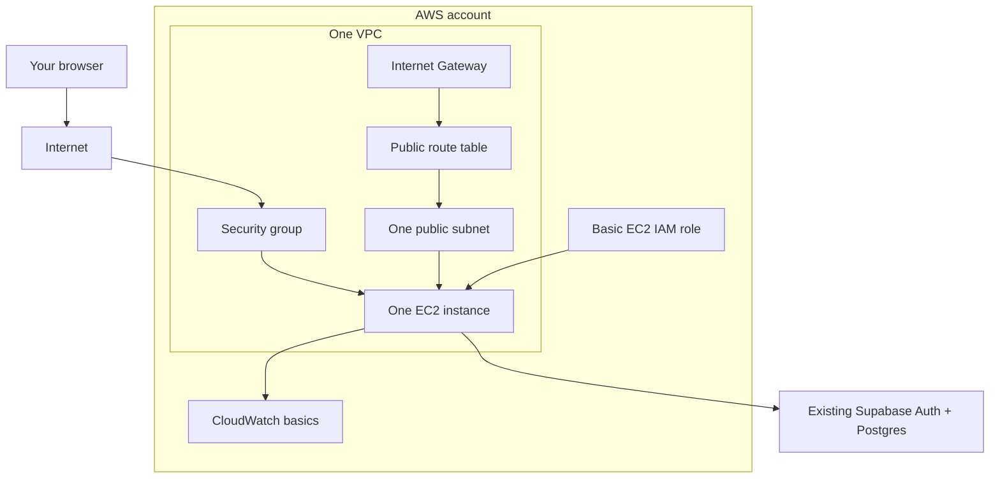

# AWS Migration Learning Plan

This is the refresher document for the PocketPlates AWS learning path. Start here when you have been away from the project and need to remember what is done, how to check AWS setup, and what to do next.

The goal is not to build a production-grade AWS platform immediately. The goal is to learn Terraform and AWS in small steps while keeping the app deployable, understandable, and cheap to tear down.

## Current Status

Known completed in the repository:

- [x] Production Docker image inputs exist for the Next.js app.
- [x] `infra/aws/` contains a fuller Phase 5 Terraform reference implementation.
- [x] AWS CLI login workflow is documented.
- [x] Terraform local state, local variable files, and provider cache files are ignored by Git.

Likely completed manually, but verify in AWS before continuing:

- [ ] AWS account created.
- [ ] Root MFA enabled.
- [ ] IAM admin user created.
- [ ] IAM admin MFA enabled.
- [ ] Billing dashboard access confirmed for the IAM admin user.
- [ ] AWS Budget alerts created.
- [ ] Free Tier alerts enabled if available for the account.
- [ ] AWS CLI region set to `ap-southeast-1`.
- [ ] `aws login` works locally.

Not completed yet:

- [ ] Beginner Terraform sandbox in `infra/test/`.
- [ ] Minimal EC2 infrastructure applied from `infra/test/`.
- [ ] App deployed to EC2.
- [ ] Docker image pushed to ECR.
- [ ] Docker Compose and Caddy configured on EC2.
- [ ] GitHub Actions deployment to AWS.
- [ ] CloudWatch app log shipping and useful alarms.

## How To Check Where You Stopped

Use this section before writing more Terraform or applying infrastructure.

### 1. Check Local AWS CLI Setup

```bash
aws configure get region
aws login
aws sts get-caller-identity
```

Expected result:

- Region should be `ap-southeast-1`, unless you intentionally changed it.
- Identity should show your AWS account and IAM/admin principal.
- Do not paste the full identity output into public places if it includes account details you prefer to keep private.

### 2. Check Billing Setup In AWS Console

In the AWS Console, check:

- Billing and Cost Management opens for your IAM admin user.
- A monthly budget exists, such as USD 5.
- Budget alert emails are configured.
- Free Tier alerts are enabled if AWS shows that option for your account.
- Cost Explorer opens. It may take time to show data on a newer account.

Mark the manual checklist above after checking these items.

### 3. Check Whether Terraform Has Created Anything

From the repo:

```bash
test -d infra/test && terraform -chdir=infra/test state list || echo "infra/test not created yet"
```

If `infra/test` does not exist yet, or Terraform says there is no state, then the beginner sandbox has not created tracked Terraform resources yet.

For the fuller reference implementation:

```bash
cd infra/aws
terraform state list
```

If there is no state, `infra/aws` has not applied infrastructure from this machine.

### 4. Check AWS Resources Directly

In the AWS Console for `ap-southeast-1`, check:

- EC2 instances.
- EBS volumes.
- Elastic IPs.
- VPCs.
- ECR repositories.
- CloudWatch log groups.
- Budgets.

If you created learning resources manually, tag them with `Project=PocketPlates` when possible so they are easier to find and clean up.

## Minimal Architecture To Learn First

Start with this architecture in `infra/test/`. It is intentionally smaller than `infra/aws/`.



What to include first:

- VPC.
- One public subnet.
- Internet gateway.
- Public route table.
- Security group with HTTP `80`.
- One small EC2 instance.
- Basic IAM role only when you are ready to learn instance permissions.
- CloudWatch only after EC2 exists and you want to learn logs/metrics.

What to postpone:

- ECR.
- Docker Compose.
- Caddy.
- HTTPS.
- Elastic IP.
- Route 53.
- GitHub Actions deployment.
- ALB, NAT Gateway, RDS, ECS, and EKS.

## Beginner Terraform Folder

Use this folder for your own learning code:

```txt
infra/test/
  versions.tf
  providers.tf
  main.tf
  variables.tf
  outputs.tf
  README.md
```

Terraform only deploys the folder you run it from. If you run Terraform in `infra/test`, it will not automatically apply `infra/aws`.

Recommended learning order:

1. Create only `versions.tf` and `providers.tf`.
2. Add a tiny, low-risk resource or data lookup so you can run `terraform init`, `terraform fmt`, `terraform validate`, and `terraform plan`.
3. Add a VPC.
4. Add one public subnet.
5. Add an internet gateway.
6. Add a route table and route table association.
7. Add a security group.
8. Add one EC2 instance.
9. Add outputs for the instance ID and public IP.
10. Add IAM role and instance profile.
11. Add CloudWatch basics.
12. Compare your result against `infra/aws/` only after each piece makes sense.

## Daily Terraform Workflow

Use this flow while learning:

```bash
cd infra/test
aws configure set region ap-southeast-1
aws login
terraform init
terraform fmt
terraform validate
terraform plan
```

Only apply after reading the plan:

```bash
terraform apply
```

Destroy resources after practice:

```bash
terraform destroy
```

If Terraform cannot see the `aws login` session, use the documented process-credentials profile from `infra/aws/README.md`:

```bash
aws configure set profile.pocketplates-terraform.region ap-southeast-1
aws configure set profile.pocketplates-terraform.credential_process "aws configure export-credentials --profile default --format process"
AWS_PROFILE=pocketplates-terraform terraform plan
```

Do not run `aws configure export-credentials` by itself because it prints temporary credentials.

## Future Plan

1. Verify manual AWS account and billing setup using the checklist above.
2. Create `infra/test/` as your beginner Terraform sandbox.
3. Build the minimal architecture one resource type at a time.
4. Apply and destroy the sandbox until the full lifecycle feels comfortable.
5. Run the Docker image locally again.
6. Add only enough EC2 bootstrap to run a simple app process.
7. Add Docker deployment.
8. Add ECR after Docker deployment makes sense.
9. Add Caddy and HTTPS only after HTTP works.
10. Add CloudWatch logs and a tiny runbook.
11. Compare the beginner sandbox against `infra/aws/` and decide whether to simplify, replace, or keep both.

## Rule Of Thumb

If you cannot explain a Terraform file in one or two sentences, do not apply it yet. Keep the learning version smaller than the reference version until each AWS object has a job you understand.
