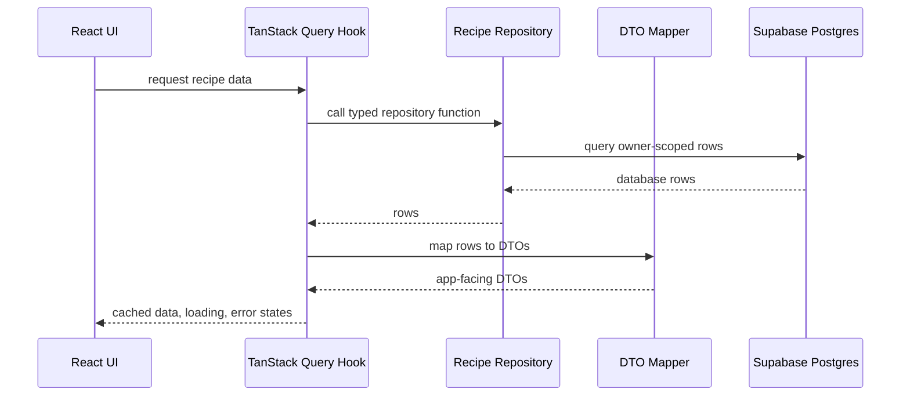

# Tidy Foundation And Documentation

## Why

This cleanup aligns the new starter app with the project rules in `.codex/AGENTS.md`. The changes reduce inline magic strings, make the starter UI easier to extend, ensure the PWA manifest references a real icon asset, and add a single master documentation file that explains the current architecture, setup flow, external services, and validation commands.

The cleanup also clarifies that TanStack Query is the standard server-state layer from the start. Components should use feature query hooks backed by repositories instead of ad hoc `useEffect` API fetching.

## File Manifest

Created:

- `docs/ARCHITECTURE.md`
- `docs/changelog/2026-07-10-2046-tidy-foundation-docs.md`
- `public/icons/pocketplates.svg`
- `src/app/app.constants.ts`
- `src/features/recipes/recipe-library.constants.ts`
- `src/lib/env/env.constants.ts`
- `src/lib/query/query.constants.ts`

Modified:

- `README.md`
- `src/app/layout.tsx`
- `src/app/manifest.ts`
- `src/app/page.tsx`
- `src/lib/query/query-client.ts`
- `src/lib/supabase/client.ts`

Deleted:

- `.DS_Store`
- `supabase/.DS_Store`

## Local Structure

```txt
docs/
  ARCHITECTURE.md
  changelog/
    2026-07-10-2046-tidy-foundation-docs.md
public/
  icons/
    pocketplates.svg
src/
  app/
    app.constants.ts
    layout.tsx
    manifest.ts
    page.tsx
  features/
    recipes/
      recipe-library.constants.ts
  lib/
    env/
      env.constants.ts
    query/
      query.constants.ts
      query-client.ts
    supabase/
      client.ts
```

## Diagram Updates


