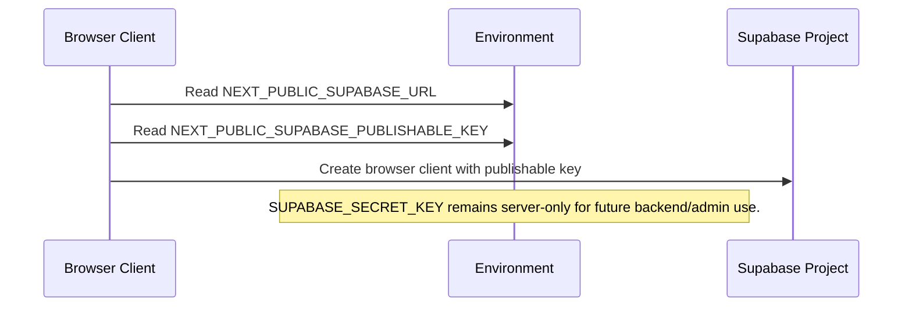

# Update Supabase API Keys

## Why

Supabase now recommends publishable and secret API keys instead of the legacy `anon` and `service_role` keys. The application only needs browser-safe Supabase access today, so the client now reads `NEXT_PUBLIC_SUPABASE_PUBLISHABLE_KEY`. A server-only `SUPABASE_SECRET_KEY` placeholder was added for future backend/admin operations, but it is intentionally not used by browser code.

The current app does not require a separate Supabase JWT secret. That should only be revisited if the app later signs or verifies custom JWTs directly, or adds Edge Functions that depend on Supabase JWT verification behavior.

## File Manifest

- Modified `.env.example`
- Modified `src/lib/env/env.constants.ts`
- Modified `src/lib/supabase/client.ts`
- Modified `docs/ARCHITECTURE.md`
- Modified `docs/project-plan.md`
- Created `docs/changelog/2026-07-10-2148-update-supabase-api-keys.md`

## Visual Context & Structure

```txt
recipe-app/
  .env.example
  docs/
    ARCHITECTURE.md
    project-plan.md
    changelog/
      2026-07-10-2148-update-supabase-api-keys.md
  src/
    lib/
      env/
        env.constants.ts
      supabase/
        client.ts
```

## Diagram Updates


