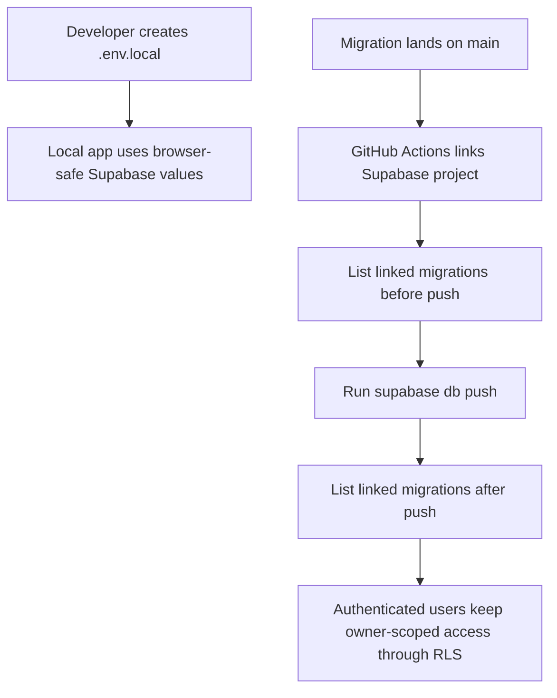

# Tighten RLS And Env Setup

## What Changed

The setup docs now direct developers to create `.env.local` directly instead of copying from `.env.example`, and the `.env.example` file was removed to avoid keeping local app variables and operational secrets in the same committed template.

The Supabase deployment workflow now lists linked migrations before and after `supabase db push`, making the migration state visible in GitHub Actions logs. A forward migration replaces the existing owner-scoped RLS policies with equivalent policies that explicitly target the `authenticated` role and use `(select auth.uid())` owner checks.

## Why

The project already uses `.env.local` for real local configuration, and avoiding a committed example file lowers the chance that sensitive operational values are copied around casually. The RLS migration follows current Supabase guidance while preserving the private, owner-scoped access model. The workflow migration-list checks improve deployment auditability before feature work begins.

## Files Changed

- Deleted `.env.example`
- Modified `.github/workflows/database-deploy.yml`
- Modified `docs/ARCHITECTURE.md`
- Modified `docs/project-plan.md`
- Created `supabase/migrations/20260711192000_refine_rls_policy_roles.sql`
- Created `docs/changelog/2026-07-11-1918-tighten-rls-and-env-setup.md`

## Localized Structure

```txt
.
├── .github/
│   └── workflows/
│       └── database-deploy.yml
├── docs/
│   ├── ARCHITECTURE.md
│   ├── project-plan.md
│   └── changelog/
│       └── 2026-07-11-1918-tighten-rls-and-env-setup.md
└── supabase/
    └── migrations/
        ├── 20260710000000_initial_recipe_schema.sql
        └── 20260711192000_refine_rls_policy_roles.sql
```

## Flow



## Verification Notes

The migration changes only policies, not table or enum shapes, so generated Supabase TypeScript types did not need to change.

Checks run:

- `npm run lint`
- `npm run typecheck`
- `npm run test`
- `npm run build`
- `npx supabase db lint --linked --schema public --fail-on error`
- `npx supabase migration list --linked`
- `npx supabase db push --linked --dry-run`
