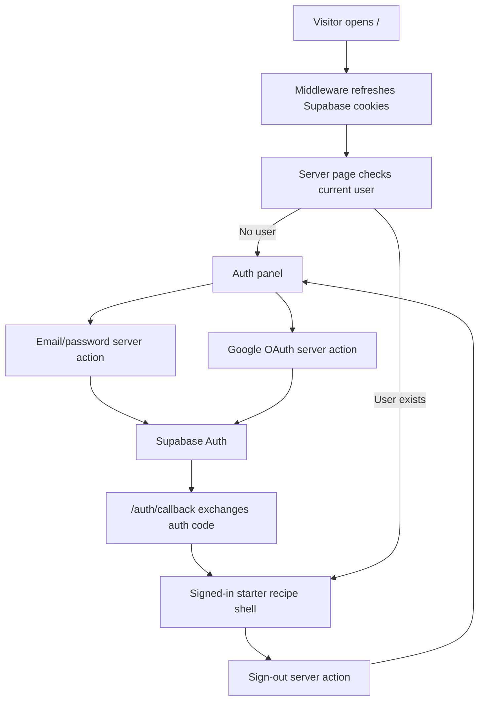

# Add Auth Session Foundation

## What Changed

Stage 1 now has its first application slice: Supabase Auth session handling and a signed-in/signed-out app boundary. Signed-out visitors see an auth panel with email/password and Google sign-in options. Signed-in users see the existing starter recipe shell with their email and a sign-out action.

The app now has Supabase server and cookie clients, middleware-backed auth cookie refresh, an OAuth/email callback route, server actions for sign-in/sign-up/sign-out, and a small auth message helper with unit coverage.

## Why

Stage 1 starts with making a real user able to enter the app securely before building private recipe CRUD. This keeps the recipe read/write work behind the same authentication boundary that will enforce owner-scoped data access through Supabase RLS.

## Files Changed

- Created `middleware.ts`
- Created `src/app/auth/callback/route.ts`
- Modified `src/app/page.tsx`
- Created `src/features/auth/auth.actions.ts`
- Created `src/features/auth/auth.constants.ts`
- Created `src/features/auth/auth-panel.tsx`
- Created `src/features/auth/sign-out-button.tsx`
- Created `src/features/auth/__tests__/auth.constants.test.ts`
- Created `src/lib/supabase/middleware.ts`
- Created `src/lib/supabase/server.ts`
- Modified `tests/e2e/home.spec.ts`
- Modified `docs/ARCHITECTURE.md`
- Modified `docs/project-plan.md`
- Created `docs/changelog/2026-07-11-1958-add-auth-session-foundation.md`

## Localized Structure

```txt
.
├── middleware.ts
├── docs/
│   ├── ARCHITECTURE.md
│   ├── project-plan.md
│   └── changelog/
│       └── 2026-07-11-1958-add-auth-session-foundation.md
├── src/
│   ├── app/
│   │   ├── auth/
│   │   │   └── callback/
│   │   │       └── route.ts
│   │   └── page.tsx
│   ├── features/
│   │   └── auth/
│   │       ├── __tests__/
│   │       │   └── auth.constants.test.ts
│   │       ├── auth.actions.ts
│   │       ├── auth.constants.ts
│   │       ├── auth-panel.tsx
│   │       └── sign-out-button.tsx
│   └── lib/
│       └── supabase/
│           ├── middleware.ts
│           └── server.ts
└── tests/
    └── e2e/
        └── home.spec.ts
```

## Auth Flow



## Verification Notes

This slice does not change database tables, generated Supabase types, RLS policies, or storage buckets.

Checks run:

- `npm run lint`
- `npm run typecheck`
- `npm run test`
- `npm run build`
- `npm run test:e2e`
