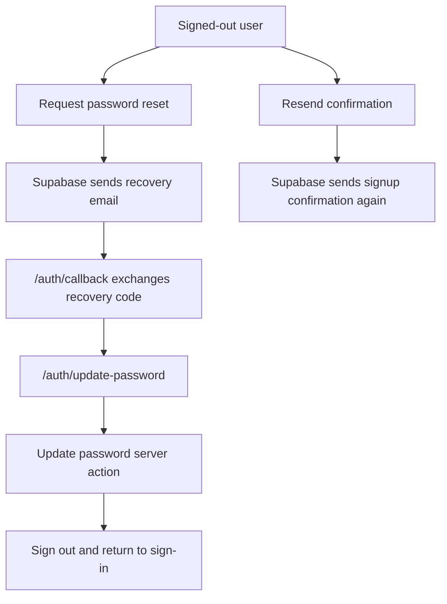

# Harden Auth UX

## What Changed

Stage 1 auth now includes account recovery and stronger interaction states. The signed-out auth panel can request a password reset email, resend an account confirmation email, show pending submit states, and continue to support email/password and Google sign-in. Password recovery links route through `/auth/callback?next=/auth/update-password`, where the user can choose a new password before being signed out and asked to sign in again.

The signed-in starter shell now displays the generated profile's display name or username when available, falling back to the user's email. E2E coverage now checks the reset and confirmation-resend UI states. The project guidance was also updated so future feature slices must mark progress in `docs/project-plan.md` as part of the same change.

## Why

This completes the approved Stage 1 auth UX hardening slice before recipe CRUD starts. Recovery and resend flows are basic account operations users expect, and pending states keep the interface clear when server actions are in flight. Marking progress directly in the project plan keeps the roadmap honest as implementation advances.

## Files Changed

- Modified `AGENTS.md`
- Modified `docs/ARCHITECTURE.md`
- Modified `docs/project-plan.md`
- Created `docs/changelog/2026-07-11-2016-harden-auth-ux.md`
- Created `src/app/auth/update-password/page.tsx`
- Modified `src/app/page.tsx`
- Modified `src/features/auth/__tests__/auth.constants.test.ts`
- Modified `src/features/auth/auth.actions.ts`
- Modified `src/features/auth/auth.constants.ts`
- Modified `src/features/auth/auth-panel.tsx`
- Created `src/features/auth/auth-submit-button.tsx`
- Modified `src/features/auth/sign-out-button.tsx`
- Modified `tests/e2e/home.spec.ts`

## Localized Structure

```txt
.
├── AGENTS.md
├── docs/
│   ├── ARCHITECTURE.md
│   ├── project-plan.md
│   └── changelog/
│       └── 2026-07-11-2016-harden-auth-ux.md
├── src/
│   ├── app/
│   │   ├── auth/
│   │   │   └── update-password/
│   │   │       └── page.tsx
│   │   └── page.tsx
│   └── features/
│       └── auth/
│           ├── __tests__/
│           │   └── auth.constants.test.ts
│           ├── auth.actions.ts
│           ├── auth.constants.ts
│           ├── auth-panel.tsx
│           ├── auth-submit-button.tsx
│           └── sign-out-button.tsx
└── tests/
    └── e2e/
        └── home.spec.ts
```

## Auth Recovery Flow



## Verification Notes

This slice does not change database schema, generated Supabase types, RLS policies, or storage buckets.

Checks run:

- `npm run lint`
- `npm run typecheck`
- `npm run test`
- `npm run build`
- `npm run test:e2e`
