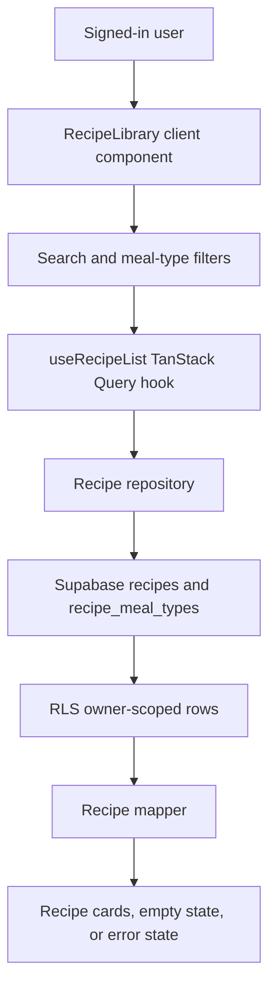

# Add Recipe Read Path

## What Changed

The signed-in home screen now uses a real Supabase-backed recipe library instead of hard-coded starter cards. Recipes load through the existing TanStack Query hook and repository boundary, map into app DTOs, and render as compact mobile cards.

The library supports title search and multi-select meal-type filters for breakfast, lunch, dinner, snack, and flexible. Empty, loading, and error states are now shown inside the signed-in recipe library. The old starter card constants were removed.

## Why

This completes Stage 1's recipe read slice before adding write flows. Users who sign in now see their owner-scoped private recipe data from Supabase, with RLS preserving the privacy boundary.

## Files Changed

- Modified `docs/ARCHITECTURE.md`
- Modified `docs/project-plan.md`
- Created `docs/changelog/2026-07-11-2033-add-recipe-read-path.md`
- Modified `src/app/page.tsx`
- Created `src/features/recipes/recipe-card.tsx`
- Created `src/features/recipes/recipe-library.tsx`
- Modified `src/features/recipes/recipe-library.constants.ts`
- Modified `src/features/recipes/recipe.mappers.ts`
- Modified `src/features/recipes/recipe.repository.ts`
- Modified `src/features/recipes/recipe.types.ts`
- Modified `src/features/recipes/__tests__/recipe.mappers.test.ts`

## Localized Structure

```txt
.
├── docs/
│   ├── ARCHITECTURE.md
│   ├── project-plan.md
│   └── changelog/
│       └── 2026-07-11-2033-add-recipe-read-path.md
└── src/
    ├── app/
    │   └── page.tsx
    └── features/
        └── recipes/
            ├── __tests__/
            │   └── recipe.mappers.test.ts
            ├── recipe-card.tsx
            ├── recipe-library.tsx
            ├── recipe-library.constants.ts
            ├── recipe.mappers.ts
            ├── recipe.repository.ts
            └── recipe.types.ts
```

## Recipe Read Flow



## Verification Notes

This slice changes database-facing read queries but does not change database schema, generated Supabase types, RLS policies, or storage buckets.

Checks run:

- `npm run lint`
- `npm run typecheck`
- `npm run test`
- `npm run build`
- `npm run test:e2e`
- `npx supabase db lint --linked --schema public --fail-on error`
