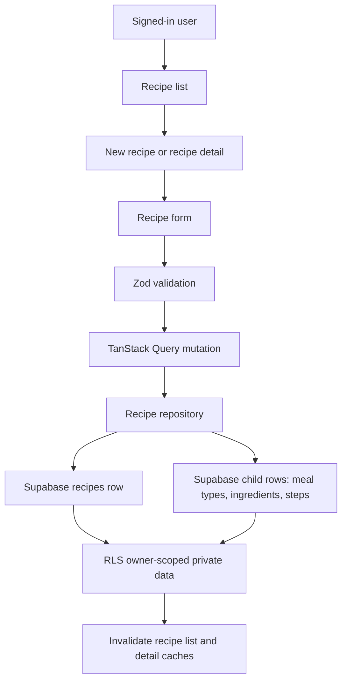

# Add Recipe Write Path

## What Changed

Stage 1 now has the private recipe write path. Signed-in users can open recipe details, add recipes, edit recipes, and archive recipes. The form supports the MVP fields: title, servings, meal types, ingredients, steps, notes, one source URL, and image URL, plus the existing cost and difficulty fields.

The recipe repository now loads detail rows, creates and updates recipe rows, replaces ordered child rows for meal types, ingredients, and steps, and soft-archives recipes through `archived_at`. TanStack Query hooks now cover detail, create, update, and archive flows with cache invalidation.

The auth panel also now resyncs its local mode when same-page auth links update the `mode` URL parameter, which keeps reset/resend views reliable in mobile and desktop smoke tests.

## Why

This completes the final Stage 1 implementation slice and turns the app from a read-only private library into a usable MVP where each signed-in user can save and retrieve their own private recipes.

## Files Changed

- Modified `docs/ARCHITECTURE.md`
- Created `docs/changelog/2026-07-11-2055-add-recipe-write-path.md`
- Modified `docs/project-plan.md`
- Created `src/app/recipes/[id]/edit/page.tsx`
- Created `src/app/recipes/[id]/page.tsx`
- Created `src/app/recipes/new/page.tsx`
- Modified `src/features/auth/auth-panel.tsx`
- Modified `src/features/recipes/__tests__/recipe.mappers.test.ts`
- Created `src/features/recipes/recipe-detail.tsx`
- Created `src/features/recipes/recipe-edit.tsx`
- Created `src/features/recipes/recipe-form.tsx`
- Modified `src/features/recipes/recipe-library.tsx`
- Modified `src/features/recipes/recipe.mappers.ts`
- Modified `src/features/recipes/recipe.queries.ts`
- Modified `src/features/recipes/recipe.repository.ts`
- Modified `src/features/recipes/recipe.types.ts`
- Created `src/features/recipes/recipe.validation.ts`

## Localized Structure

```txt
.
├── docs/
│   ├── ARCHITECTURE.md
│   ├── project-plan.md
│   └── changelog/
│       └── 2026-07-11-2055-add-recipe-write-path.md
└── src/
    ├── app/
    │   └── recipes/
    │       ├── [id]/
    │       │   ├── edit/
    │       │   │   └── page.tsx
    │       │   └── page.tsx
    │       └── new/
    │           └── page.tsx
    └── features/
        ├── auth/
        │   └── auth-panel.tsx
        └── recipes/
            ├── __tests__/
            │   └── recipe.mappers.test.ts
            ├── recipe-detail.tsx
            ├── recipe-edit.tsx
            ├── recipe-form.tsx
            ├── recipe-library.tsx
            ├── recipe.mappers.ts
            ├── recipe.queries.ts
            ├── recipe.repository.ts
            ├── recipe.types.ts
            └── recipe.validation.ts
```

## Recipe Write Flow



## Verification Notes

This slice changes database-facing reads and writes but does not add a new migration, schema change, generated type change, RLS policy change, or storage bucket.

Checks run:

- `npm run lint`
- `npm run typecheck`
- `npm run test`
- `npm run build`
- `npm run test:e2e`
- `npx supabase db lint --linked --schema public --fail-on error`
