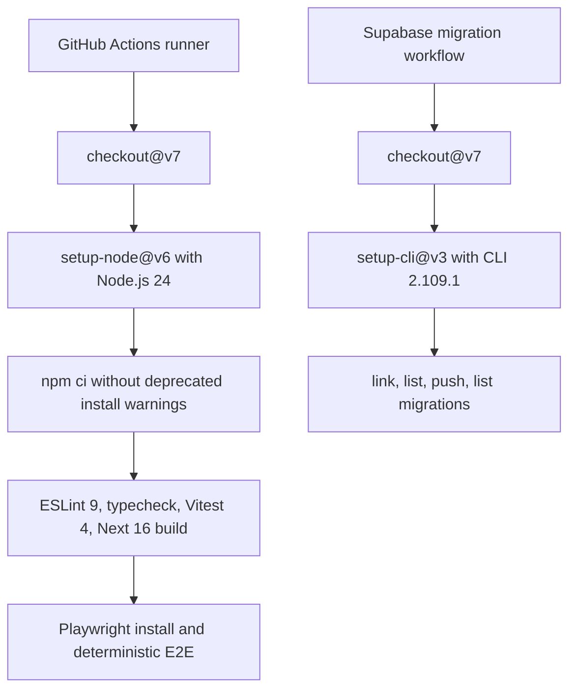

# Refresh CI Actions

## Why

GitHub Actions started warning that Node.js 20 action runtimes are deprecated and that older actions were being forced onto Node.js 24. The CI workflows now use Node.js 24-compatible action majors directly, and the Supabase migration deployment workflow uses the current setup action with the same Supabase CLI version declared by the app lockfile.

The maintenance pass also removed install-time deprecation warnings and audit findings by moving the app to Next.js 16, React 19, ESLint 9 flat config, Vitest 4, Vite 8, and the Next.js 16 proxy entry point. Playwright now starts the dev server with an explicit host and port so E2E runs cannot silently drift to a different port.

## Changed Files

- Deleted `.eslintrc.json`
- Modified `.github/workflows/ci.yml`
- Modified `.github/workflows/database-deploy.yml`
- Modified `docs/ARCHITECTURE.md`
- Created `docs/changelog/2026-07-12-1409-refresh-ci-actions.md`
- Modified `docs/project-plan.md`
- Created `eslint.config.mjs`
- Deleted `middleware.ts`
- Modified `next-env.d.ts`
- Modified `package-lock.json`
- Modified `package.json`
- Modified `playwright.config.ts`
- Created `proxy.ts`
- Modified `src/app/auth/callback/route.ts`
- Modified `src/app/auth/update-password/page.tsx`
- Modified `src/app/page.tsx`
- Modified `src/app/recipes/[id]/edit/page.tsx`
- Modified `src/app/recipes/[id]/page.tsx`
- Modified `src/app/recipes/new/page.tsx`
- Modified `src/features/auth/auth-panel.tsx`
- Modified `src/features/auth/auth.actions.ts`
- Modified `src/features/recipes/recipe-form.tsx`
- Modified `src/lib/supabase/server.ts`
- Modified `tsconfig.json`
- Deleted `vitest.config.ts`
- Created `vitest.config.mts`

## Localized Structure

```txt
.github/
  workflows/
    ci.yml
    database-deploy.yml
src/
  app/
    auth/
      callback/
        route.ts
      update-password/
        page.tsx
    recipes/
      [id]/
        edit/
          page.tsx
        page.tsx
      new/
        page.tsx
    page.tsx
  features/
    auth/
      auth-panel.tsx
      auth.actions.ts
    recipes/
      recipe-form.tsx
  lib/
    supabase/
      server.ts
docs/
  ARCHITECTURE.md
  project-plan.md
  changelog/
    2026-07-12-1409-refresh-ci-actions.md
.eslintrc.json
eslint.config.mjs
middleware.ts
next-env.d.ts
package-lock.json
package.json
playwright.config.ts
proxy.ts
tsconfig.json
vitest.config.mts
```

## Verification Flow


