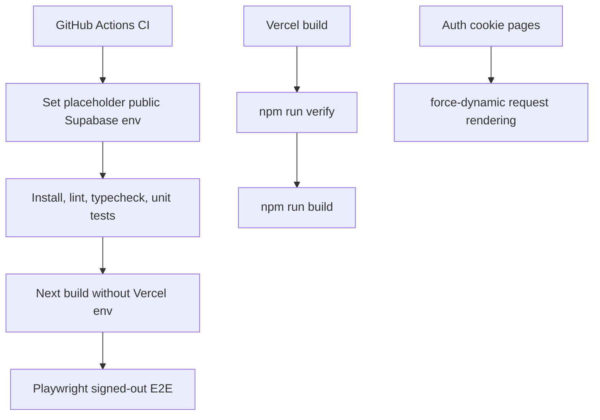

# Fix CI Build Environment

## Why

GitHub Actions failed during `next build` because the CI runner did not have the public Supabase environment variables that exist in Vercel. The app only needs placeholder public values for CI build and signed-out E2E checks, while real deployment values remain configured in Vercel.

The auth-dependent pages also now explicitly opt into dynamic rendering so Next.js does not try to prerender pages that depend on request cookies. Vercel builds now run lightweight verification before producing a deployment build, without changing Vercel settings directly.

## Changed Files

- Modified `.github/workflows/ci.yml`
- Modified `docs/ARCHITECTURE.md`
- Created `docs/changelog/2026-07-12-1837-fix-ci-build-env.md`
- Modified `docs/project-plan.md`
- Modified `package.json`
- Created `vercel.json`
- Modified `src/app/auth/update-password/page.tsx`
- Modified `src/app/page.tsx`
- Modified `src/app/recipes/[id]/edit/page.tsx`
- Modified `src/app/recipes/[id]/page.tsx`
- Modified `src/app/recipes/new/page.tsx`

## Localized Structure

```txt
.github/
  workflows/
    ci.yml
src/
  app/
    auth/
      update-password/
        page.tsx
    recipes/
      [id]/
        edit/
          page.tsx
        page.tsx
      new/
        page.tsx
    page.tsx
docs/
  ARCHITECTURE.md
  project-plan.md
  changelog/
    2026-07-12-1837-fix-ci-build-env.md
package.json
vercel.json
```

## CI Flow


