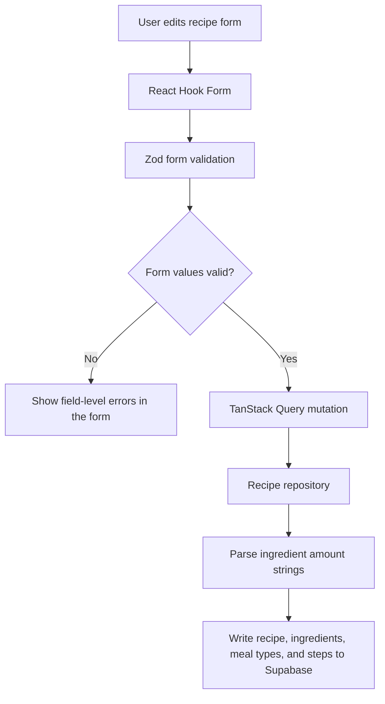

# Harden Recipe Form Validation

## What Changed

The recipe add/edit form now validates ingredient input more carefully. Ingredient amounts can be blank, positive numbers, simple fractions, or mixed fractions, and invalid text such as random letters is rejected before save. Ingredient units now use a controlled picker with supported units, while ingredient notes remain available for preparation details.

The dedicated step timer field was removed from the editable form and recipe detail display. Timing should now be written directly in the step instruction text, such as "Simmer for 10 minutes." The repository writes step timers as `null` for new edits while preserving ordered step instructions.

The form also now shows field-specific errors inside ingredient and step rows, enforces practical limits for servings, ingredients, and steps, and keeps amount parsing at the repository boundary before writing numeric ingredient amounts to Supabase.

## Why

The previous form accepted invalid ingredient amounts and arbitrary units, which could save confusing recipe data. Tightening validation at both the form and repository boundary keeps saved recipes cleaner while preserving useful free-text areas like ingredient notes and step instructions.

## Files Changed

- Modified `docs/ARCHITECTURE.md`
- Created `docs/changelog/2026-07-12-1953-harden-recipe-form-validation.md`
- Modified `docs/project-plan.md`
- Modified `docs/recipe-form-fixes-todo.md`
- Modified `src/features/recipes/__tests__/recipe.mappers.test.ts`
- Modified `src/features/recipes/recipe-detail.tsx`
- Modified `src/features/recipes/recipe-form.tsx`
- Modified `src/features/recipes/recipe.mappers.ts`
- Modified `src/features/recipes/recipe.repository.ts`
- Modified `src/features/recipes/recipe.types.ts`
- Modified `src/features/recipes/recipe.validation.ts`

## Localized Structure

```txt
.
├── docs/
│   ├── ARCHITECTURE.md
│   ├── project-plan.md
│   ├── recipe-form-fixes-todo.md
│   └── changelog/
│       └── 2026-07-12-1953-harden-recipe-form-validation.md
└── src/
    └── features/
        └── recipes/
            ├── __tests__/
            │   └── recipe.mappers.test.ts
            ├── recipe-detail.tsx
            ├── recipe-form.tsx
            ├── recipe.mappers.ts
            ├── recipe.repository.ts
            ├── recipe.types.ts
            └── recipe.validation.ts
```

## Validation Flow



## Verification Notes

Checks run:

- `npm run lint`
- `npm run typecheck`
- `npm run test`
- `npm run build`
- `npm run test:e2e`
- `curl -I http://127.0.0.1:3000`

The local dev server was started at `http://127.0.0.1:3000`, and the home route returned HTTP 200 with the PocketPlates auth screen content. A direct Playwright browser-runtime check through the Node REPL could not run because that runtime's cached Chromium executable was missing, but the repository Playwright test suite completed successfully.
