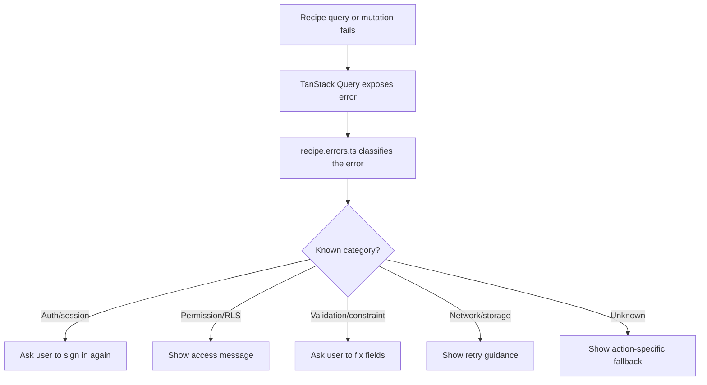

# Harden Recipe Error Feedback

## What Changed

Recipe load, save, edit, and archive flows now use a shared safe error-message mapper. The mapper classifies common Supabase, PostgREST, Auth, Storage, network, and unknown failures into user-facing messages without exposing raw backend details.

The recipe list, detail page, edit loader, recipe form, and archive action now display classified messages such as session-expired, permission, validation, storage, network, and action-specific fallback errors. Existing "recipe not found" behavior remains unchanged when a recipe detail query succeeds but returns no recipe.

## Why

The previous recipe UI used broad fallback messages like "We could not save this recipe. Please try again." for most failures. That gave too little guidance when the issue was a session, permission, validation, network, or storage problem. The new mapper improves feedback while keeping table names, RLS policy details, constraint names, and backend error text out of the UI.

## Files Changed

- Modified `docs/ARCHITECTURE.md`
- Created `docs/changelog/2026-07-12-2008-harden-recipe-error-feedback.md`
- Modified `docs/project-plan.md`
- Modified `docs/recipe-form-fixes-todo.md`
- Created `src/features/recipes/__tests__/recipe.errors.test.ts`
- Modified `src/features/recipes/recipe-detail.tsx`
- Modified `src/features/recipes/recipe-edit.tsx`
- Created `src/features/recipes/recipe.errors.ts`
- Modified `src/features/recipes/recipe-form.tsx`
- Modified `src/features/recipes/recipe-library.tsx`

## Localized Structure

```txt
.
├── docs/
│   ├── ARCHITECTURE.md
│   ├── project-plan.md
│   ├── recipe-form-fixes-todo.md
│   └── changelog/
│       └── 2026-07-12-2008-harden-recipe-error-feedback.md
└── src/
    └── features/
        └── recipes/
            ├── __tests__/
            │   └── recipe.errors.test.ts
            ├── recipe-detail.tsx
            ├── recipe-edit.tsx
            ├── recipe.errors.ts
            ├── recipe-form.tsx
            └── recipe-library.tsx
```

## Error Feedback Flow



## Verification Notes

Checks run:

- `npm run lint`
- `npm run typecheck`
- `npm run test`
- `npm run build`
- `npm run test:e2e`
