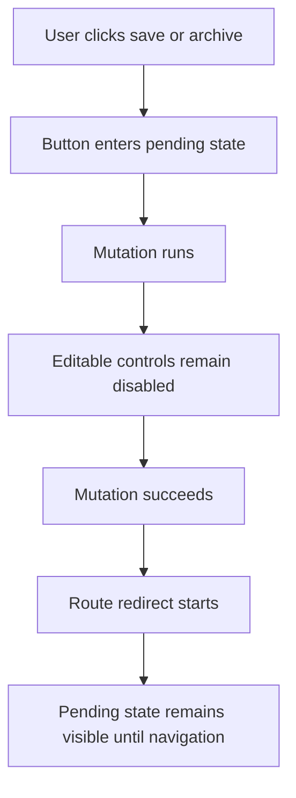

# Add Recipe Action Pending States

## What Changed

Recipe save and archive actions now show spinner-backed pending labels while work is in progress. The save form disables its editable fields, meal type buttons, add/remove row controls, and submit button while the save mutation runs and while the app hands off to the recipe detail redirect.

Archive now guards against repeated clicks, shows an archiving spinner, and stays disabled through the redirect back to the library. Shared auth submit buttons, including sign out, also show a spinner while their form action is pending.

## Why

On slower deployments, users could click a button and see little feedback beyond disabled styling or a text change. The updated pending states make the app feel responsive, reduce duplicate submissions, and make it clearer that the app is already processing the action.

## Files Changed

- Modified `docs/ARCHITECTURE.md`
- Created `docs/changelog/2026-07-12-2020-add-recipe-action-pending-states.md`
- Modified `docs/project-plan.md`
- Modified `docs/recipe-form-fixes-todo.md`
- Modified `src/features/auth/auth-submit-button.tsx`
- Modified `src/features/recipes/recipe-detail.tsx`
- Modified `src/features/recipes/recipe-form.tsx`

## Localized Structure

```txt
.
├── docs/
│   ├── ARCHITECTURE.md
│   ├── project-plan.md
│   ├── recipe-form-fixes-todo.md
│   └── changelog/
│       └── 2026-07-12-2020-add-recipe-action-pending-states.md
└── src/
    └── features/
        ├── auth/
        │   └── auth-submit-button.tsx
        └── recipes/
            ├── recipe-detail.tsx
            └── recipe-form.tsx
```

## Pending State Flow



## Verification Notes

Checks run:

- `npm run lint`
- `npm run typecheck`
- `npm run test`
- `npm run build`
- `npm run test:e2e`
