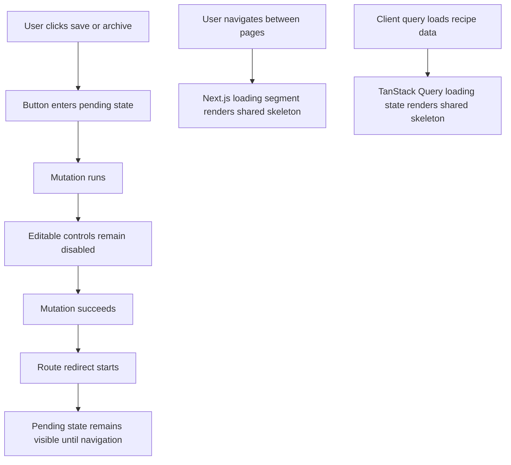

# Add Recipe Action And Navigation Pending States

## What Changed

Recipe save and archive actions now show spinner-backed pending labels while work is in progress. The save form disables its editable fields, meal type buttons, add/remove row controls, and submit button while the save mutation runs and while the app hands off to the recipe detail redirect.

Archive now guards against repeated clicks, shows an archiving spinner, and stays disabled through the redirect back to the library. Shared auth submit buttons, including sign out, also show a spinner while their form action is pending.

Recipe route transitions now use reusable skeleton loaders for the home/library route, new recipe route, recipe detail route, and edit recipe route. The same skeleton components are reused by client-side TanStack Query loading states, so recipe list, detail, and edit loading screens share one visual pattern instead of repeating placeholder markup.

## Why

On slower deployments, users could click a button or navigate between recipe pages and see little feedback beyond disabled styling, a text change, or plain loading text. The updated pending states and skeleton loaders make the app feel responsive, reduce duplicate submissions, and make it clearer that the app is already processing the action or loading the next screen.

## Files Changed

- Modified `docs/ARCHITECTURE.md`
- Created `docs/changelog/2026-07-12-2020-add-recipe-action-pending-states.md`
- Modified `docs/project-plan.md`
- Modified `docs/recipe-form-fixes-todo.md`
- Created `src/app/loading.tsx`
- Created `src/app/recipes/[id]/edit/loading.tsx`
- Created `src/app/recipes/[id]/loading.tsx`
- Created `src/app/recipes/new/loading.tsx`
- Modified `src/features/auth/auth-submit-button.tsx`
- Modified `src/features/recipes/recipe-detail.tsx`
- Modified `src/features/recipes/recipe-edit.tsx`
- Modified `src/features/recipes/recipe-form.tsx`
- Modified `src/features/recipes/recipe-library.tsx`
- Created `src/features/recipes/recipe-skeletons.tsx`

## Localized Structure

```txt
.
├── docs/
│   ├── ARCHITECTURE.md
│   ├── project-plan.md
│   ├── recipe-form-fixes-todo.md
│   └── changelog/
│       └── 2026-07-12-2020-add-recipe-action-pending-states.md
└── src/
    ├── app/
    │   ├── loading.tsx
    │   └── recipes/
    │       ├── [id]/
    │       │   ├── edit/
    │       │   │   └── loading.tsx
    │       │   └── loading.tsx
    │       └── new/
    │           └── loading.tsx
    └── features/
        ├── auth/
        │   └── auth-submit-button.tsx
        └── recipes/
            ├── recipe-detail.tsx
            ├── recipe-edit.tsx
            ├── recipe-form.tsx
            ├── recipe-library.tsx
            └── recipe-skeletons.tsx
```

## Pending State Flow



## Verification Notes

Checks run:

- `npm run lint`
- `npm run typecheck`
- `npm run test`
- `npm run build`
- `npm run test:e2e`
- `curl -I http://127.0.0.1:3000`
- `curl -I http://127.0.0.1:3000/recipes/new`
