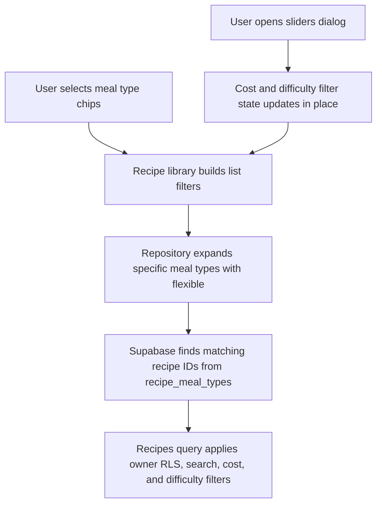

# Fix Recipe Library Filters

## What Changed

Recipe meal type filtering now treats Flexible as "works for any meal type." When a user filters by Breakfast, Lunch, Dinner, or Snack, the repository looks for recipes tagged with the selected meal types plus recipes tagged Flexible. Filtering by Flexible itself remains exact.

The recipe library now has a lightweight filter dialog opened from the bottom navigation Filter button. Meal type chips stay visible in the library because they are already the fastest common filter, and the popup also includes meal type controls so the bottom Filter button is a complete filter surface. Cost rating supports multi-select filtering, and difficulty supports single-select filtering. The popup avoids introducing a separate filter page or extra route load.

Shared cost and difficulty labels now live with the recipe library constants so cards and filters use one label source.

## Why

Flexible recipes were being hidden from specific meal type filters even though they are meant to work for any meal. The library also had repository support for cost and difficulty filters, but no UI for users to apply them. This slice makes saved recipes easier to find while keeping the library screen compact.

## Files Changed

- Modified `docs/ARCHITECTURE.md`
- Created `docs/changelog/2026-07-12-2042-fix-recipe-library-filters.md`
- Modified `docs/project-plan.md`
- Modified `docs/recipe-form-fixes-todo.md`
- Created `src/features/recipes/__tests__/recipe.repository.test.ts`
- Created `src/features/recipes/__tests__/recipe-library.test.tsx`
- Modified `src/features/recipes/recipe-card.tsx`
- Modified `src/features/recipes/recipe-library.constants.ts`
- Modified `src/features/recipes/recipe-library.tsx`
- Modified `src/features/recipes/recipe.repository.ts`

## Localized Structure

```txt
.
├── docs/
│   ├── ARCHITECTURE.md
│   ├── project-plan.md
│   ├── recipe-form-fixes-todo.md
│   └── changelog/
│       └── 2026-07-12-2042-fix-recipe-library-filters.md
└── src/
    └── features/
        └── recipes/
            ├── __tests__/
            │   ├── recipe-library.test.tsx
            │   └── recipe.repository.test.ts
            ├── recipe-card.tsx
            ├── recipe-library.constants.ts
            ├── recipe-library.tsx
            └── recipe.repository.ts
```

## Filter Flow



## Verification Notes

Checks run:

- `npx tsc --noEmit`
- `npx vitest run src/features/recipes/__tests__/recipe-library.test.tsx src/features/recipes/__tests__/recipe.repository.test.ts`
- `npm run verify`
- `npm run build`
- `curl -I http://127.0.0.1:3000`
