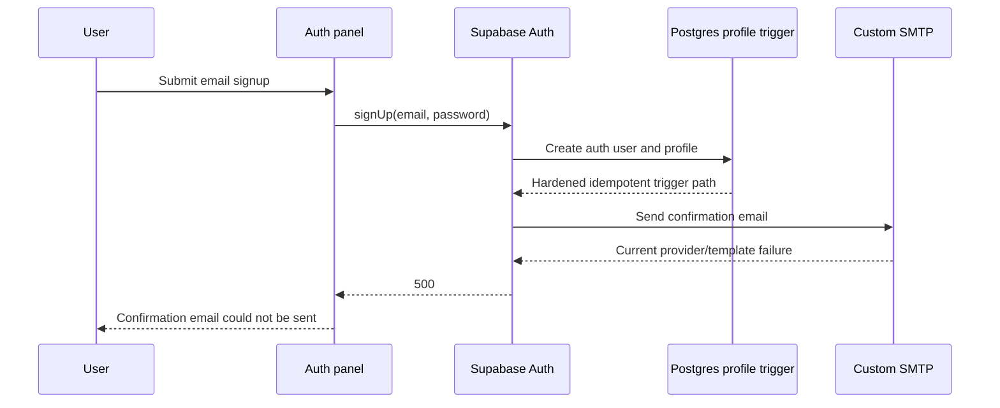

# Harden Auth Signup Diagnostics

## What Changed

Email signup failures from Supabase Auth with 5xx status codes now redirect to a confirmation-email-specific message instead of the generic account creation message. This better matches the live diagnosis: signup returned a Supabase Auth 500 before creating a user, while the database profile trigger worked independently and Auth logs showed Gmail SMTP rejecting the configured credentials.

A forward migration also hardens the database-owned auth profile trigger. The trigger now tolerates duplicate profile rows, has an explicit function search path, and is no longer directly executable by browser roles. The linked Supabase project was brought up to date with the pending RLS refinement migration and this new trigger hardening migration.

The setup documentation now calls out the exact Gmail SMTP values that matter for first-time configuration: use the full sender email address as the SMTP username, use a 16-character Google app password, and do not reuse Google Cloud OAuth client credentials for SMTP.

## Why

Supabase Auth 500s usually come from external dependencies such as database triggers, Auth hooks, SMTP, or email templates. The database trigger path was hardened and verified, but the controlled signup check still returns a 500 with no user row created. Auth logs confirmed Gmail SMTP is returning `535 5.7.8 Username and Password not accepted`, so the remaining action is to replace the rejected SMTP credentials or recreate the Google app password in the Supabase dashboard.

## Files Changed

- Created `supabase/migrations/20260712141657_harden_auth_profile_trigger.sql`
- Created `docs/changelog/2026-07-12-2219-harden-auth-signup-diagnostics.md`
- Modified `src/features/auth/auth.actions.ts`
- Modified `src/features/auth/auth.constants.ts`
- Modified `src/features/auth/__tests__/auth.constants.test.ts`
- Modified `docs/ARCHITECTURE.md`
- Modified `docs/project-plan.md`

## Localized Structure

```txt
docs/
  ARCHITECTURE.md
  project-plan.md
  changelog/
    2026-07-12-2219-harden-auth-signup-diagnostics.md
src/
  features/
    auth/
      __tests__/
        auth.constants.test.ts
      auth.actions.ts
      auth.constants.ts
supabase/
  migrations/
    20260712141657_harden_auth_profile_trigger.sql
```

## Flow



## Verification Notes

- Applied pending linked Supabase migrations with `npx supabase db push --yes`.
- Confirmed linked migration history includes `20260710000000`, `20260711192000`, and `20260712141657`.
- Reran a controlled signup check after the migration; Supabase Auth still returned a 500 before creating a user.
- Queried recent Supabase Auth logs through the Management API and confirmed Gmail SMTP rejected the configured credentials with `535 5.7.8 Username and Password not accepted`.
