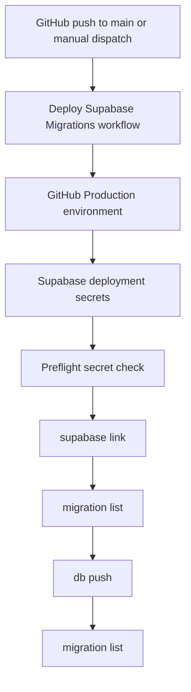

# Fix Database Deploy Secrets

## What Changed

- Updated the Supabase migration deployment workflow to declare the GitHub `Production` environment before reading deployment secrets.
- Moved Supabase deployment credentials to job-level environment variables so every Supabase CLI step uses the same values.
- Added a preflight check that reports missing `SUPABASE_ACCESS_TOKEN`, `SUPABASE_PROJECT_REF`, or `SUPABASE_DB_PASSWORD` before `supabase link` runs.
- Clarified deployment setup documentation so migration secrets are added to the GitHub `Production` environment, including the GitHub settings path and where each Supabase value comes from.

## Why

The migration deployment failed during `supabase link` because `SUPABASE_ACCESS_TOKEN` was not available to the workflow run. Declaring the deployment environment and validating required secrets makes the credential boundary explicit and turns missing configuration into a direct, actionable error.

## Changed Files

- Modified `.github/workflows/database-deploy.yml`
- Modified `docs/ARCHITECTURE.md`
- Modified `docs/project-plan.md`
- Created `docs/changelog/2026-07-13-0934-fix-database-deploy-secrets.md`

## Localized Structure

```txt
.
├── .github/
│   └── workflows/
│       └── database-deploy.yml
└── docs/
    ├── ARCHITECTURE.md
    ├── project-plan.md
    └── changelog/
        └── 2026-07-13-0934-fix-database-deploy-secrets.md
```

## Deployment Flow


