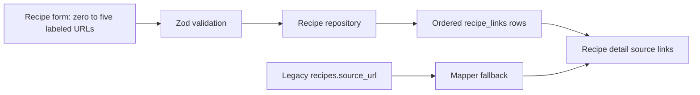

# Add Multiple Recipe Sources

## What Changed

- Replaced the single recipe source field with an optional list of up to five source URLs.
- Added an optional label for each source and numbered fallback labels on recipe detail pages.
- Persisted ordered sources in the existing `recipe_links` table during recipe create and update operations.
- Kept existing recipes compatible by reading `recipes.source_url` when no child source links exist.
- Added validation for full HTTP(S) URLs, duplicate URLs, label length, and the five-link maximum.
- Added a forward migration that makes `recipe_links.label` nullable.
- Updated unit tests and data-model documentation for the multi-source flow.

## Why

A recipe may combine an original post, variations, or inspiration from several places. Optional labels let users distinguish those links without making extra metadata mandatory.

## Changed Files

- Created `supabase/migrations/20260713020019_allow_optional_recipe_link_labels.sql`.
- Modified `src/lib/supabase/database.types.ts`.
- Modified `src/features/recipes/recipe.types.ts`.
- Modified `src/features/recipes/recipe.validation.ts`.
- Modified `src/features/recipes/recipe.mappers.ts`.
- Modified `src/features/recipes/recipe.repository.ts`.
- Modified `src/features/recipes/recipe-form.tsx`.
- Modified `src/features/recipes/recipe-detail.tsx`.
- Modified `src/features/recipes/__tests__/recipe.mappers.test.ts`.
- Modified `docs/ARCHITECTURE.md`.
- Modified `docs/database-schema.dbml`.
- Modified `docs/database-erd.mmd`.
- Modified `docs/project-plan.md`.
- Modified `docs/recipe-form-fixes-todo.md`.

## Localized Structure

```text
recipe-app/
├── docs/
│   ├── changelog/2026-07-13-1002-add-multiple-recipe-sources.md
│   ├── ARCHITECTURE.md
│   ├── database-erd.mmd
│   ├── database-schema.dbml
│   ├── project-plan.md
│   └── recipe-form-fixes-todo.md
├── src/
│   ├── features/recipes/
│   │   ├── __tests__/recipe.mappers.test.ts
│   │   ├── recipe-detail.tsx
│   │   ├── recipe-form.tsx
│   │   ├── recipe.mappers.ts
│   │   ├── recipe.repository.ts
│   │   ├── recipe.types.ts
│   │   └── recipe.validation.ts
│   └── lib/supabase/database.types.ts
└── supabase/migrations/
    └── 20260713020019_allow_optional_recipe_link_labels.sql
```

## Source Flow


