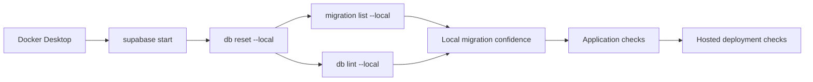

# Document Local Supabase Verification

## What Changed

- Added the Docker-backed local Supabase startup and shutdown workflow to the setup guide.
- Documented clean database reset, migration history, schema lint, status, and Studio inspection commands.
- Explained what successful local database checks prove and which remote or application risks remain separate.
- Updated the recipe write-path documentation to reflect multiple labeled source links.
- Marked local Supabase verification documentation complete in the project plan.

## Why

The project now has a working local Supabase stack and a verified migration chain. Future contributors need one repeatable workflow for checking migrations before deploying them, along with clear boundaries around what those checks do and do not guarantee.

## Changed Files

- Modified `docs/ARCHITECTURE.md`.
- Modified `docs/project-plan.md`.
- Created `docs/changelog/2026-07-13-1020-document-local-supabase-verification.md`.

## Localized Structure

```text
recipe-app/
└── docs/
    ├── ARCHITECTURE.md
    ├── project-plan.md
    └── changelog/
        └── 2026-07-13-1020-document-local-supabase-verification.md
```

## Verification Flow


