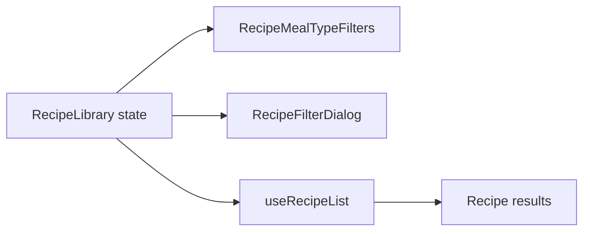

# Refactor Recipe Filters

## What Changed

- Extracted persistent meal-type filters and the modal filter controls from `RecipeLibrary`.
- Consolidated selected and unselected filter-chip styling in the new filter module.
- Kept search, filter state, recipe querying, results, and navigation owned by `RecipeLibrary`.
- Updated architecture and roadmap documentation for the new component boundary.

## Why

The recipe library mixed result rendering and navigation with a large block of repeated filter UI. The extraction gives the controls one clear home while preserving the existing state flow and user behavior.

## Changed Files

- Created `src/features/recipes/recipe-filters.tsx`.
- Modified `src/features/recipes/recipe-library.tsx`.
- Modified `docs/ARCHITECTURE.md`.
- Modified `docs/project-plan.md`.
- Created `docs/changelog/2026-07-13-1038-refactor-recipe-filters.md`.

## Localized Structure

```text
recipe-app/
├── docs/
│   ├── ARCHITECTURE.md
│   ├── project-plan.md
│   └── changelog/
│       └── 2026-07-13-1038-refactor-recipe-filters.md
└── src/features/recipes/
    ├── recipe-filters.tsx
    └── recipe-library.tsx
```

## Filter Ownership


