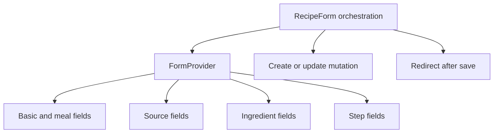

# Refactor Recipe Form Fields

## What Changed

- Reduced `RecipeForm` to form initialization, mutation selection, submission, redirect state, and save feedback.
- Added a shared React Hook Form provider for nested recipe field sections.
- Moved basic details, meal types, optional metadata, sources, ingredients, and steps into a focused field module.
- Kept each dynamic field array beside the controls that add and remove its rows.
- Added a component test covering source, ingredient, and step row interactions.
- Updated architecture and roadmap documentation for the new form boundary.

## Why

The recipe form mixed orchestration and every field implementation in one component. Separating those responsibilities makes future changes such as image upload easier to locate while preserving one form state owner and the existing validation paths.

## Changed Files

- Created `src/features/recipes/recipe-form-fields.tsx`.
- Modified `src/features/recipes/recipe-form.tsx`.
- Created `src/features/recipes/__tests__/recipe-form.test.tsx`.
- Modified `docs/ARCHITECTURE.md`.
- Modified `docs/project-plan.md`.
- Created `docs/changelog/2026-07-13-1051-refactor-recipe-form-fields.md`.

## Localized Structure

```text
recipe-app/
├── docs/
│   ├── ARCHITECTURE.md
│   ├── project-plan.md
│   └── changelog/
│       └── 2026-07-13-1051-refactor-recipe-form-fields.md
└── src/features/recipes/
    ├── __tests__/recipe-form.test.tsx
    ├── recipe-form-fields.tsx
    └── recipe-form.tsx
```

## Form Ownership


