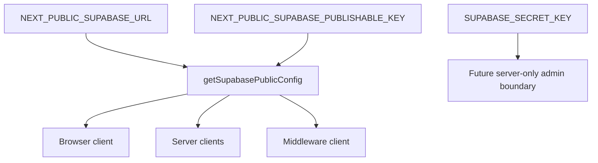

# Centralize Supabase Public Configuration

## What Changed

- Added one validated accessor for the public Supabase URL and publishable key.
- Reused the accessor in browser, server, cookie-writing, and middleware Supabase client factories.
- Removed repeated missing-environment checks from individual client modules.
- Added tests for valid and missing browser-safe Supabase configuration.
- Documented the public configuration boundary and preserved server-only secret handling.

## Why

Each Supabase client factory repeated the same environment lookup and error message. A single accessor keeps that contract consistent without combining factories that have different cookie and request responsibilities.

## Changed Files

- Modified `src/lib/env/env.constants.ts`.
- Created `src/lib/env/__tests__/env.constants.test.ts`.
- Modified `src/lib/supabase/client.ts`.
- Modified `src/lib/supabase/server.ts`.
- Modified `src/lib/supabase/middleware.ts`.
- Modified `docs/ARCHITECTURE.md`.
- Modified `docs/project-plan.md`.
- Created `docs/changelog/2026-07-13-1058-centralize-supabase-public-config.md`.

## Localized Structure

```text
recipe-app/
├── docs/
│   ├── ARCHITECTURE.md
│   ├── project-plan.md
│   └── changelog/
│       └── 2026-07-13-1058-centralize-supabase-public-config.md
└── src/lib/
    ├── env/
    │   ├── __tests__/env.constants.test.ts
    │   └── env.constants.ts
    └── supabase/
        ├── client.ts
        ├── middleware.ts
        └── server.ts
```

## Configuration Flow


