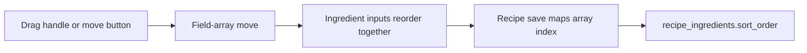

# Add Ingredient Reordering

## What Changed

- Added drag handles to ingredient rows in the add/edit recipe form.
- Added mouse, delayed-touch, and keyboard drag sensors for mobile-friendly reordering.
- Added move-up and move-down buttons as a single-tap alternative to dragging.
- Reused React Hook Form's field-array move operation so each ingredient's values remain together.
- Added component coverage for moving ingredient rows and disabling unavailable directions.
- Added the drag-and-drop dependencies required by the sortable interaction.
- Updated architecture and roadmap documentation for ingredient ordering.

## Why

Ingredient order affects how a recipe reads and cooks, but previously users could only remove and recreate rows to change it. Reordering in the form makes corrections inexpensive, and the existing repository continues to persist array position as `sort_order` without a database change.

## Changed Files

- Modified `package.json`.
- Modified `package-lock.json`.
- Modified `src/features/recipes/recipe-form-fields.tsx`.
- Created `src/features/recipes/sortable-ingredient-row.tsx`.
- Modified `src/features/recipes/__tests__/recipe-form.test.tsx`.
- Modified `docs/ARCHITECTURE.md`.
- Modified `docs/project-plan.md`.
- Created `docs/changelog/2026-07-13-2110-add-ingredient-reordering.md`.

## Localized Structure

```text
recipe-app/
├── docs/
│   ├── ARCHITECTURE.md
│   ├── project-plan.md
│   └── changelog/
│       └── 2026-07-13-2110-add-ingredient-reordering.md
├── src/features/recipes/
│   ├── __tests__/
│   │   └── recipe-form.test.tsx
│   ├── recipe-form-fields.tsx
│   └── sortable-ingredient-row.tsx
├── package.json
└── package-lock.json
```

## Reorder Flow


