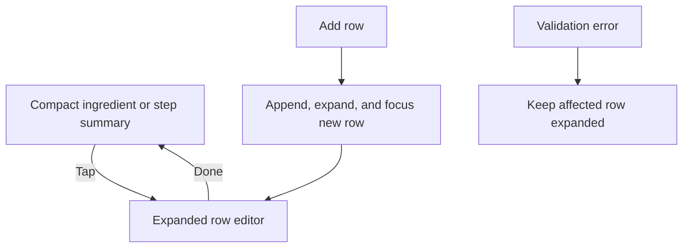

# Compact Recipe Form Rows

## What Changed

- Collapsed inactive ingredient rows into one-line summaries of their amount, unit, name, and preparation note.
- Kept the ingredient drag handle visible while moving move-up, move-down, and remove actions behind an overflow control.
- Collapsed inactive step rows into numbered one-line instruction summaries.
- Added explicit edit and done interactions so only the selected row exposes its full form controls during normal entry.
- Kept newly added rows expanded and focused, and forced rows with validation errors to remain open.
- Added ingredient and step counts to their section headings.
- Constrained the recipe form fieldset to the mobile page width so long compact summaries cannot expand the edit page horizontally.
- Extracted the expandable step row into its own feature component.
- Updated component tests for compact summaries, row reopening, focus, removal, reordering, and saved-recipe edit initialization.
- Updated architecture and roadmap documentation for the compact form workflow.

## Why

Real recipes can contain many ingredients and steps. Rendering every field for every row made the mobile form unnecessarily long and difficult to scan. Compact summaries preserve a readable overview while keeping the full structured controls available only where the user is actively editing.

## Changed Files

- Modified `src/features/recipes/recipe-form-fields.tsx`.
- Modified `src/features/recipes/recipe-form.tsx`.
- Modified `src/features/recipes/sortable-ingredient-row.tsx`.
- Created `src/features/recipes/expandable-step-row.tsx`.
- Modified `src/features/recipes/__tests__/recipe-form.test.tsx`.
- Modified `docs/ARCHITECTURE.md`.
- Modified `docs/project-plan.md`.
- Created `docs/changelog/2026-07-13-2304-compact-recipe-form-rows.md`.

## Localized Structure

```text
recipe-app/
├── docs/
│   ├── ARCHITECTURE.md
│   ├── project-plan.md
│   └── changelog/
│       └── 2026-07-13-2304-compact-recipe-form-rows.md
└── src/features/recipes/
    ├── __tests__/
    │   └── recipe-form.test.tsx
    ├── expandable-step-row.tsx
    ├── recipe-form-fields.tsx
    ├── recipe-form.tsx
    └── sortable-ingredient-row.tsx
```

## Compact Editing Flow


