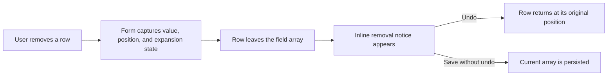

# Add Reversible Recipe Row Removal

## Why

Step rows used an overflow menu that contained only one action, which added an unnecessary tap and hid the destructive behavior. Removing any repeating form row was also immediate, making accidental taps costly during mobile editing.

## What Changed

- Replaced the step row overflow menu with a direct, red trash icon that has a specific accessible label.
- Kept the ingredient overflow menu because it still provides the accessible Move up and Move down alternatives to dragging.
- Added an inline Undo action after source, ingredient, or step removal.
- Restored each removed row's current values and original position; ingredient and step undo also preserves the relevant expanded-row state.
- Announced removal notices to assistive technology without placing the interactive Undo button inside a status role.
- Added form tests covering direct step deletion and undo restoration for every repeating row type.
- Recorded the completed slice and the still-pending iPhone input zoom slice in the project plan.

## Interaction Flow



## Files Changed

- Modified `src/features/recipes/expandable-step-row.tsx`
- Modified `src/features/recipes/recipe-form-fields.tsx`
- Modified `src/features/recipes/__tests__/recipe-form.test.tsx`
- Modified `docs/ARCHITECTURE.md`
- Modified `docs/project-plan.md`
- Created `docs/changelog/2026-07-14-0009-add-row-removal-undo.md`

## Localized Structure

```txt
docs/
  ARCHITECTURE.md
  project-plan.md
  changelog/
    2026-07-14-0009-add-row-removal-undo.md
src/
  features/
    recipes/
      expandable-step-row.tsx
      recipe-form-fields.tsx
      __tests__/
        recipe-form.test.tsx
```

## Verification

- `npm test -- --run src/features/recipes/__tests__/recipe-form.test.tsx`
- `npm run typecheck`
- `npm run lint`
