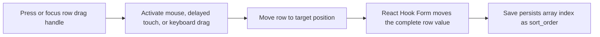

# Add Handle-Only Ingredient And Step Reordering

## Why

Ingredient overflow actions required repeatedly reopening a menu to move a row by one position. Steps could not be reordered at all, which made correcting longer recipes unnecessarily tedious.

## What Changed

- Removed the ingredient overflow menu and its one-position move actions.
- Added a direct red delete icon to ingredient rows, matching step rows.
- Kept ingredient reordering on the dedicated drag handle.
- Added the same sortable drag handle and dragged-row treatment to steps.
- Shared mouse, delayed-touch, and keyboard sensor configuration between both repeating sections.
- Kept dragging isolated to the handle so scrolling, editing, and row actions remain independent.
- Continued persisting ingredient and step array positions through the existing repository sort order mapping.
- Left the current bottom Undo notices unchanged for the separate positional-undo slice.

## Interaction Flow



## Files Changed

- Modified `src/features/recipes/sortable-ingredient-row.tsx`
- Modified `src/features/recipes/expandable-step-row.tsx`
- Modified `src/features/recipes/recipe-form-fields.tsx`
- Modified `src/features/recipes/__tests__/recipe-form.test.tsx`
- Modified `docs/ARCHITECTURE.md`
- Modified `docs/project-plan.md`
- Created `docs/changelog/2026-07-14-1015-add-step-drag-reordering.md`

## Localized Structure

```txt
docs/
  ARCHITECTURE.md
  project-plan.md
  changelog/
    2026-07-14-1015-add-step-drag-reordering.md
src/
  features/
    recipes/
      expandable-step-row.tsx
      recipe-form-fields.tsx
      sortable-ingredient-row.tsx
      __tests__/
        recipe-form.test.tsx
```

## Verification

- `npm run verify`
