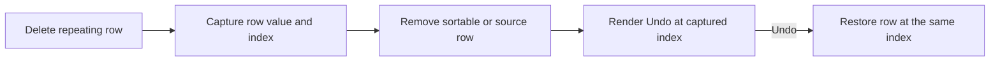

# Position Undo At The Removed Recipe Row

## Why

Undo notices appeared after an entire repeating section, regardless of which row was removed. In longer ingredient and step lists, that separated recovery from the place where the deletion happened and could require extra scrolling.

## What Changed

- Rendered source, ingredient, and step Undo notices in the deleted row's former list position.
- Kept first, middle, and last-row deletion positions meaningful, including lists that become empty.
- Preserved the existing single-level undo behavior, stored row values, original insertion index, and expanded-row restoration.
- Kept Undo notices outside the sortable item registry so they do not become draggable rows.
- Added coverage for positional notices and retained the existing restoration tests.

## Interaction Flow



## Files Changed

- Modified `src/features/recipes/recipe-form-fields.tsx`
- Modified `src/features/recipes/__tests__/recipe-form.test.tsx`
- Modified `docs/ARCHITECTURE.md`
- Modified `docs/project-plan.md`
- Created `docs/changelog/2026-07-14-1100-position-row-removal-undo.md`

## Localized Structure

```txt
docs/
  ARCHITECTURE.md
  project-plan.md
  changelog/
    2026-07-14-1100-position-row-removal-undo.md
src/
  features/
    recipes/
      recipe-form-fields.tsx
      __tests__/
        recipe-form.test.tsx
```

## Verification

- `npm run verify`
