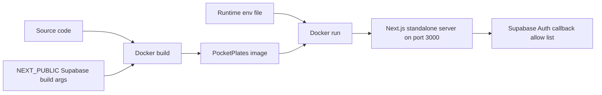

# Add Docker Image Build Inputs

## What Changed

Added the Phase 4 production Docker image setup for the AWS migration path.

The app now supports a Next.js standalone Docker build that can be run locally before later pushing images to ECR. The migration plan now clarifies that Phase 4 requires a `Dockerfile` and `.dockerignore`, but does not require Docker Compose or a dev container yet.

The local Docker workflow is exposed through `npm run docker:build` and `npm run docker:run` so the browser-safe Supabase values can be read from `.env.local` instead of being typed into every build command.

Supabase SSR cookie handling now provides `setAll` for the server client as well as the cookie-writing client, with Server Component cookie writes safely ignored because middleware refreshes sessions. The AWS migration plan also documents why Google sign-in can return to Vercel during Docker testing unless the Docker callback URL is added to Supabase Auth redirect URLs.

## Why

The AWS migration plan needs a reproducible app runtime artifact before EC2, ECR, CI/CD, CloudWatch, and rollback work can be built safely around it. A standalone Next.js image keeps the runtime smaller and avoids copying local env files into the image.

## Files Changed

Created:

- `Dockerfile`
- `.dockerignore`
- `docs/changelog/2026-07-19-1359-add-docker-image-build.md`

Modified:

- `package.json`
- `next.config.mjs`
- `src/lib/supabase/server.ts`
- `docs/ARCHITECTURE.md`
- `docs/project-plan.md`
- `temp/aws-migration-plan.md`

Deleted:

- None

## Localized Directory Structure

```txt
.
├── .dockerignore
├── Dockerfile
├── docs
│   ├── ARCHITECTURE.md
│   ├── changelog
│   │   └── 2026-07-19-1359-add-docker-image-build.md
│   └── project-plan.md
├── next.config.mjs
├── package.json
├── src
│   └── lib
│       └── supabase
│           └── server.ts
└── temp
    └── aws-migration-plan.md
```

## Flow


