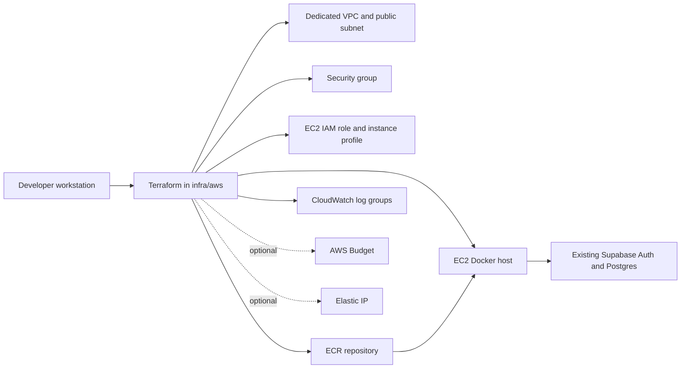

# Add AWS Terraform Phase 5

## What Changed

Implemented Phase 5 of the AWS migration path by adding a Terraform project for a low-cost, destroyable AWS learning environment. The new infrastructure code creates the first EC2-based lab foundation for PocketPlates without replacing Vercel or changing the Supabase backend.

The stack provisions dedicated networking, HTTP/HTTPS ingress, optional SSH ingress, an EC2 Docker host, an IAM instance profile, an ECR repository with image cleanup, CloudWatch log groups, an optional Elastic IP, and an optional AWS Budget. Documentation now explains each Terraform file, how the resources fit together, how to run the review workflow, and when to destroy the lab to control cost.



## Why

Phase 4 produced the Docker image inputs. Phase 5 needed the reviewable AWS infrastructure layer so the app can later be pushed to ECR and run on a small EC2 host through Docker Compose and Caddy. Keeping this in the repository makes the AWS environment reproducible, reviewable, and removable with `terraform destroy`.

## Files Created

- `infra/aws/.terraform.lock.hcl`
- `infra/aws/README.md`
- `infra/aws/main.tf`
- `infra/aws/outputs.tf`
- `infra/aws/providers.tf`
- `infra/aws/terraform.tfvars.example`
- `infra/aws/user-data.sh`
- `infra/aws/variables.tf`
- `infra/aws/versions.tf`

## Files Modified

- `.gitignore`
- `README.md`
- `docs/ARCHITECTURE.md`
- `docs/project-plan.md`
- `temp/aws-migration-plan.md`

## Files Deleted

- None.

## Localized Directory Structure

```txt
.
├── .gitignore
├── README.md
├── docs
│   ├── ARCHITECTURE.md
│   ├── changelog
│   │   └── 2026-07-19-2105-add-aws-terraform-phase5.md
│   └── project-plan.md
├── infra
│   └── aws
│       ├── .terraform.lock.hcl
│       ├── README.md
│       ├── main.tf
│       ├── outputs.tf
│       ├── providers.tf
│       ├── terraform.tfvars.example
│       ├── user-data.sh
│       ├── variables.tf
│       └── versions.tf
└── temp
    └── aws-migration-plan.md
```

## Verification

- Ran `terraform fmt -recursive infra/aws`.
- Ran `git diff --check`.
- Ran `terraform -chdir=infra/aws init -backend=false`.
- Ran `terraform -chdir=infra/aws validate`.
- Tried `terraform -chdir=infra/aws plan -input=false -no-color`; it could not complete because local AWS credentials are not configured on this machine. No AWS resources were created.
