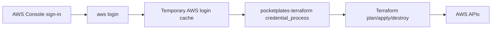

# Document AWS Login Terraform Profile

## What Changed

Updated the AWS Phase 5 setup documentation to use the login-based AWS CLI flow:

```bash
aws configure set region ap-southeast-1
aws login
```

The documentation now adds a local `pocketplates-terraform` process-credentials profile so Terraform can consume the temporary credentials from AWS CLI login without creating long-lived IAM user access keys.



The docs also warn not to run `aws configure export-credentials` directly, because that command prints temporary credentials when used outside a `credential_process` profile.

## Why

The AWS CLI login flow is safer for this learning project than local long-lived access keys. During verification, AWS CLI commands could use the login session, but Terraform did not read the login cache directly. AWS documents `credential_process` as the bridge for older SDKs or tools that do not yet support console login credentials directly, so the setup now reflects that path.

## Files Created

- `docs/changelog/2026-07-19-2234-document-aws-login-terraform-profile.md`

## Files Modified

- `README.md`
- `docs/ARCHITECTURE.md`
- `infra/aws/README.md`
- `temp/aws-migration-plan.md`

## Files Deleted

- None.

## Localized Directory Structure

```txt
.
├── README.md
├── docs
│   ├── ARCHITECTURE.md
│   └── changelog
│       └── 2026-07-19-2234-document-aws-login-terraform-profile.md
├── infra
│   └── aws
│       └── README.md
└── temp
    └── aws-migration-plan.md
```

## Verification

- Confirmed AWS CLI region was set to `ap-southeast-1`.
- Confirmed AWS CLI login was visible to `aws sts get-caller-identity`.
- Tried `terraform -chdir=infra/aws plan -input=false -no-color`; Terraform did not read the login cache directly.
- Configured a local `pocketplates-terraform` profile using AWS CLI `credential_process`.
- Signed out with `aws logout` after temporary credentials were printed during local testing.
