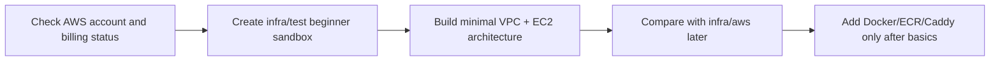

# Simplify AWS Migration Learning Plan

## What Changed

Added a tracked AWS migration refresher that makes the learning path explicit and beginner-friendly. The new plan records what is known to be complete in the repository, what manual AWS account/billing setup still needs to be verified, how to check where the work stopped, and what to build next.

The AWS migration documentation now recommends starting with a minimal `infra/test/` Terraform sandbox instead of trying to understand the fuller `infra/aws/` reference implementation first.



## Why

The previous AWS migration documentation described a fuller Terraform implementation, which is useful as a reference but too large as a first learning step. The new plan gives a small next action after time away from the project: verify manual AWS setup, then build the simplest useful infrastructure one Terraform concept at a time.

## Files Created

- `docs/aws-migration-learning-plan.md`
- `docs/changelog/2026-07-29-2336-simplify-aws-migration-learning-plan.md`

## Files Modified

- `README.md`
- `docs/ARCHITECTURE.md`
- `docs/architecture.mmd`
- `docs/project-plan.md`
- `infra/aws/README.md`

## Files Deleted

- None.

## Localized Directory Structure

```txt
.
├── README.md
├── docs
│   ├── ARCHITECTURE.md
│   ├── architecture.mmd
│   ├── aws-migration-learning-plan.md
│   ├── changelog
│   │   └── 2026-07-29-2336-simplify-aws-migration-learning-plan.md
│   └── project-plan.md
└── infra
    └── aws
        └── README.md
```

## Verification

- Ran `git diff --check`.
- Reviewed the changed documentation for consistent AWS migration wording.
- Did not regenerate `docs/assets/architecture.svg`; it remains the current app architecture image, while the AWS learning diagrams live in Markdown/Mermaid source.
