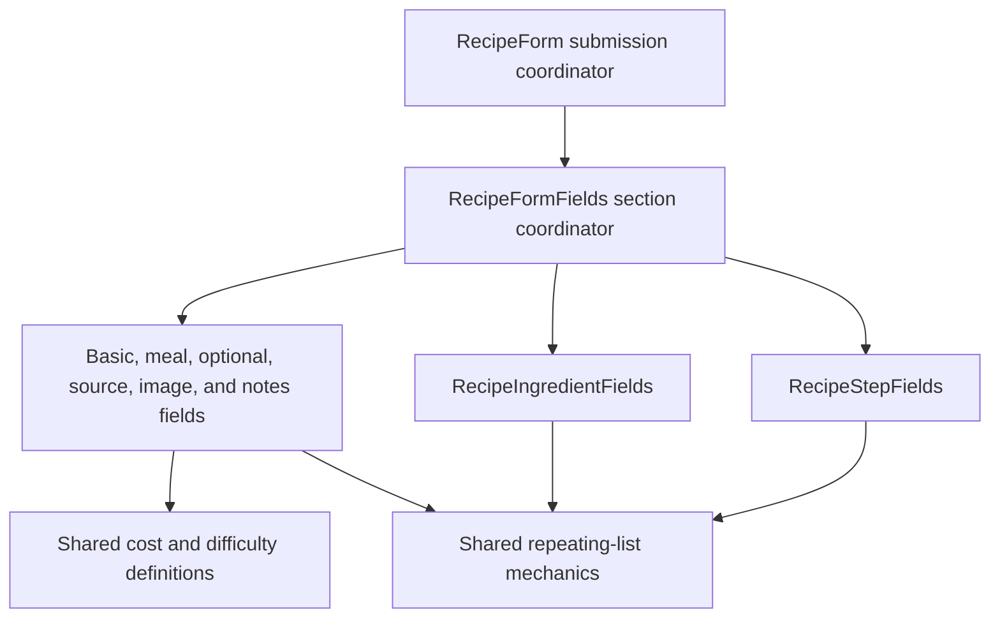

# Modularize Recipe Form Fields

## What Changed

Simplified the recipe form without changing its user-facing workflow or saved data.

- Reused the typed cost and difficulty filter definitions to render the matching form options, removing duplicate labels and values.
- Moved ingredient field-array behavior and ingredient row markup into a dedicated module.
- Moved step field-array behavior and step row markup into a dedicated module.
- Extracted only the stable mechanics shared by repeating form lists: add and undo controls, drag sensors, removed-row types, and expanded-row index adjustments.
- Removed the former standalone ingredient and step row files after their UI moved beside the field-array state that controls it.
- Classified the Supabase CLI as a development-only dependency while preserving the installed version and all existing scripts.
- Added regression coverage for the optional cost and difficulty option labels and stored values.

## Why

The previous `recipe-form-fields.tsx` coordinated the entire form while also owning both sortable field arrays and their shared mechanics. Keeping each field array with its row UI makes ingredient and step behavior easier to find and change independently. The small shared list module avoids duplicating interaction rules without forcing the two different row designs through a generic component.

The cost and difficulty controls now share one source of truth with the filter interface, reducing the chance that labels or stored values drift. The Supabase CLI is used by development scripts and CI rather than the running application, so it belongs in development dependencies.

## Recipe Form Ownership



## Files Changed

Created:

- `src/features/recipes/recipe-form-list.tsx`
- `src/features/recipes/recipe-ingredient-fields.tsx`
- `src/features/recipes/recipe-step-fields.tsx`
- `docs/changelog/2026-08-18-2147-modularize-recipe-form-fields.md`

Modified:

- `package.json`
- `package-lock.json`
- `src/features/recipes/recipe-form-fields.tsx`
- `src/features/recipes/__tests__/recipe-form.test.tsx`
- `docs/ARCHITECTURE.md`
- `docs/project-plan.md`

Deleted:

- `src/features/recipes/expandable-step-row.tsx`
- `src/features/recipes/sortable-ingredient-row.tsx`

## Localized Directory Structure

```txt
recipe-app/
├── package.json
├── package-lock.json
├── docs/
│   ├── ARCHITECTURE.md
│   ├── project-plan.md
│   └── changelog/
│       └── 2026-08-18-2147-modularize-recipe-form-fields.md
└── src/features/recipes/
    ├── __tests__/
    │   └── recipe-form.test.tsx
    ├── recipe-form-fields.tsx
    ├── recipe-form-list.tsx
    ├── recipe-ingredient-fields.tsx
    └── recipe-step-fields.tsx
```

## Verification

- TypeScript type checking.
- ESLint.
- Focused recipe-form unit and interaction tests.
- Full Vitest suite.
- Next.js production build.
- Playwright end-to-end tests at mobile Safari and desktop Chrome sizes.
- Final reference search and diff inspection.
