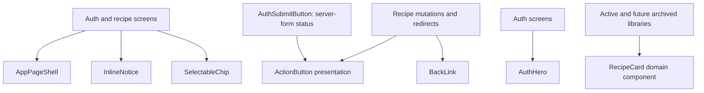

# Reuse Shared UI Components

## What Changed

Introduced a focused shared UI layer and replaced repeated application markup where the behavior and visual contract already matched.

- Added a shared mobile page shell for content, compact error, and authentication screens.
- Added a shared action button with primary, secondary, and danger presentation plus explicit pending content.
- Kept authentication server-form pending state in `AuthSubmitButton` and recipe mutation/redirect state in recipe screens while reusing the action-button rendering.
- Added a selectable chip shared by meal-type, cost, and difficulty controls in the recipe form, filter bar, and filter dialog.
- Added shared inline notices for error, informational, and neutral messages.
- Added a shared arrow-backed link for recipe form and detail navigation.
- Added an auth-specific hero shared by the sign-in panel and password-update page.
- Consolidated the repeated Notes, Ingredients, and Steps container markup behind a local recipe-detail section component.
- Added direct tests for the shared page, button, chip, notice, and navigation contracts.

## Why

The same visual contracts had spread across authentication, recipe loading, editing, filtering, and detail screens. Centralizing those stable contracts makes future interface changes consistent while leaving data loading, form status, mutations, and domain-specific cards in their existing feature owners.

## Ownership Flow



## Files Changed

Created:

- `src/components/ui/action-button.tsx`
- `src/components/ui/app-page-shell.tsx`
- `src/components/ui/back-link.tsx`
- `src/components/ui/inline-notice.tsx`
- `src/components/ui/selectable-chip.tsx`
- `src/components/ui/__tests__/shared-ui.test.tsx`
- `src/features/auth/auth-hero.tsx`
- `docs/changelog/2026-08-18-2202-reuse-shared-ui-components.md`

Modified:

- `src/app/auth/update-password/page.tsx`
- `src/features/auth/auth-panel.tsx`
- `src/features/auth/auth-submit-button.tsx`
- `src/features/recipes/recipe-detail.tsx`
- `src/features/recipes/recipe-edit.tsx`
- `src/features/recipes/recipe-filters.tsx`
- `src/features/recipes/recipe-form-fields.tsx`
- `src/features/recipes/recipe-form.tsx`
- `src/features/recipes/recipe-library.tsx`
- `src/features/recipes/recipe-skeletons.tsx`
- `docs/ARCHITECTURE.md`
- `docs/project-plan.md`

Deleted:

- None.

## Localized Directory Structure

```txt
recipe-app/
├── docs/
│   ├── ARCHITECTURE.md
│   ├── project-plan.md
│   └── changelog/
│       └── 2026-08-18-2202-reuse-shared-ui-components.md
└── src/
    ├── app/auth/update-password/page.tsx
    ├── components/ui/
    │   ├── __tests__/shared-ui.test.tsx
    │   ├── action-button.tsx
    │   ├── app-page-shell.tsx
    │   ├── back-link.tsx
    │   ├── inline-notice.tsx
    │   └── selectable-chip.tsx
    └── features/
        ├── auth/
        │   ├── auth-hero.tsx
        │   ├── auth-panel.tsx
        │   └── auth-submit-button.tsx
        └── recipes/
            ├── recipe-detail.tsx
            ├── recipe-edit.tsx
            ├── recipe-filters.tsx
            ├── recipe-form-fields.tsx
            ├── recipe-form.tsx
            ├── recipe-library.tsx
            └── recipe-skeletons.tsx
```

## Verification

- TypeScript type checking, including unused declaration checks.
- ESLint.
- Focused shared UI, recipe form, and recipe library tests.
- Full Vitest suite.
- Next.js production build.
- Playwright end-to-end tests at mobile Safari and desktop Chrome sizes.
- Final reference, secret, and diff inspection.
