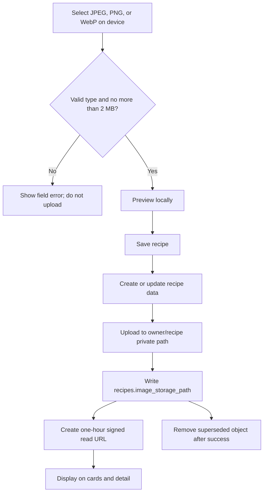

# Add Private Recipe Image Uploads

## Why

Recipe covers previously required a pasted external URL. The app now accepts a cover image directly from the user's device while preserving PocketPlates' private-first ownership boundary. The Supabase setup is captured in source control so a manually created hosted bucket and fresh environments converge on the same restrictions and policies.

## What Changed

- Added an idempotent `recipe-images` bucket migration. The bucket is private, accepts JPEG, PNG, and WebP objects up to 2 MB, and grants authenticated users read, upload, and delete access only inside their own top-level folder.
- Replaced the Image URL form control with an optional file picker, selected-image preview, and explicit replace/remove controls.
- Added a typed image repository for validation, owner/recipe-scoped object paths, uploads, removals, and one-hour signed URLs.
- Stored durable paths in `recipes.image_storage_path` while keeping `recipes.image_url` as a read-only legacy fallback until a stored image replaces or removes it.
- Added safe lifecycle behavior: create the recipe before uploading, roll back a new recipe after an image failure, clean up a newly uploaded object when its database reference fails, and remove superseded objects only after a successful replacement.
- Rendered stored covers on cards and recipe details through private signed URLs.
- Added focused validation, repository, mapper, and form interaction coverage.
- Distinguished private-image read failures from upload failures in safe user-facing error messages.
- Updated the permanent architecture/setup guide, project roadmap, and repository summary. The setup guide records that the first hosted bucket was created manually as private with a 2 MB limit and `image/*`, while the migration narrows the final MIME allowlist to the three application-supported formats.

## File Manifest

Created:

- `docs/changelog/2026-08-18-2223-add-private-recipe-image-uploads.md`
- `src/features/recipes/__tests__/recipe-image.constants.test.ts`
- `src/features/recipes/__tests__/recipe-image.repository.test.ts`
- `src/features/recipes/recipe-image-field.tsx`
- `src/features/recipes/recipe-image.constants.ts`
- `src/features/recipes/recipe-image.repository.ts`
- `supabase/migrations/20260818222347_add_private_recipe_image_storage.sql`

Modified:

- `README.md`
- `docs/ARCHITECTURE.md`
- `docs/project-plan.md`
- `src/features/recipes/__tests__/recipe-form.test.tsx`
- `src/features/recipes/__tests__/recipe.errors.test.ts`
- `src/features/recipes/__tests__/recipe.mappers.test.ts`
- `src/features/recipes/recipe-detail.tsx`
- `src/features/recipes/recipe-edit.tsx`
- `src/features/recipes/recipe.errors.ts`
- `src/features/recipes/recipe-form-fields.tsx`
- `src/features/recipes/recipe-form.tsx`
- `src/features/recipes/recipe.mappers.ts`
- `src/features/recipes/recipe.queries.ts`
- `src/features/recipes/recipe.repository.ts`
- `src/features/recipes/recipe.types.ts`
- `src/features/recipes/recipe.validation.ts`

Deleted: none.

`docs/database-schema.dbml`, `docs/database-erd.mmd`, and the generated public database types remain unchanged because `recipes.image_storage_path` already existed and this slice only adds bucket metadata and `storage.objects` policies outside the public application schema.

## Localized Structure

```txt
recipe-app/
├── README.md
├── docs/
│   ├── ARCHITECTURE.md
│   ├── project-plan.md
│   └── changelog/
│       └── 2026-08-18-2223-add-private-recipe-image-uploads.md
├── src/features/recipes/
│   ├── __tests__/
│   │   ├── recipe.errors.test.ts
│   │   ├── recipe-form.test.tsx
│   │   ├── recipe-image.constants.test.ts
│   │   ├── recipe-image.repository.test.ts
│   │   └── recipe.mappers.test.ts
│   ├── recipe-detail.tsx
│   ├── recipe-edit.tsx
│   ├── recipe.errors.ts
│   ├── recipe-form-fields.tsx
│   ├── recipe-form.tsx
│   ├── recipe-image-field.tsx
│   ├── recipe-image.constants.ts
│   ├── recipe-image.repository.ts
│   ├── recipe.mappers.ts
│   ├── recipe.queries.ts
│   ├── recipe.repository.ts
│   ├── recipe.types.ts
│   └── recipe.validation.ts
└── supabase/migrations/
    └── 20260818222347_add_private_recipe_image_storage.sql
```

## Image Lifecycle



## Verification

- `npm run verify`: ESLint, TypeScript, and all 10 Vitest files passed; 44 tests passed.
- `npm run build`: the production Next.js build completed successfully.
- `npm run test:e2e`: all 4 desktop Chrome and mobile Safari-size Playwright checks passed.
- `npx tsc --noEmit --noUnusedLocals --noUnusedParameters`
- `git diff --check`
- Local Supabase migration execution was attempted with `npx supabase status`, but Docker Desktop was not running. The hosted migration was intentionally not pushed from this change.
