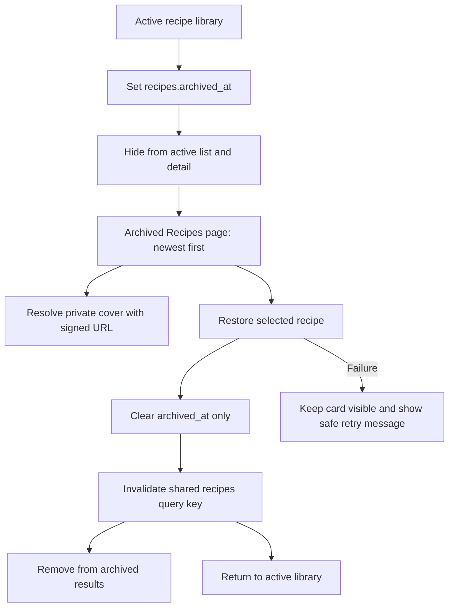

# Add Archived Recipe Recovery

## Why

Archiving already preserved recipe data through `recipes.archived_at`, but the application did not expose those rows afterward. The new recovery flow makes that soft-archive behavior visible and reversible while preserving owner-scoped access, recipe children, and private cover images.

## What Changed

- Added the authenticated `/recipes/archived` route with a route loading state, clear explanation, Library navigation, empty state, and newest-first archived results.
- Reused `RecipeCard`, shared page/navigation/notice/button components, and the existing two-column mobile grid instead of creating another card or list abstraction.
- Added archived repository and TanStack Query reads that reuse the existing batched private signed-image mapping.
- Added a restore mutation that clears only `recipes.archived_at`, relies on existing owner-scoped RLS, and invalidates the shared recipe query key after success.
- Disabled duplicate restore submissions, labeled only the affected action as pending, kept failed cards visible, and mapped restore failures to safe user-facing messages.
- Added focused repository, query, route, component, library-link, error, and signed-out browser coverage.
- Updated permanent architecture and project tracking so archive recovery is recorded as current behavior.

## File Manifest

Created:

- `docs/changelog/2026-08-19-1429-add-archived-recipe-recovery.md`
- `src/app/recipes/archived/__tests__/page.test.tsx`
- `src/app/recipes/archived/loading.tsx`
- `src/app/recipes/archived/page.tsx`
- `src/features/recipes/__tests__/archived-recipe-library.test.tsx`
- `src/features/recipes/__tests__/recipe.queries.test.tsx`
- `src/features/recipes/archived-recipe-library.tsx`

Modified:

- `docs/ARCHITECTURE.md`
- `docs/project-plan.md`
- `src/features/recipes/__tests__/recipe-library.test.tsx`
- `src/features/recipes/__tests__/recipe.errors.test.ts`
- `src/features/recipes/__tests__/recipe.repository.test.ts`
- `src/features/recipes/recipe-library.tsx`
- `src/features/recipes/recipe-skeletons.tsx`
- `src/features/recipes/recipe.errors.ts`
- `src/features/recipes/recipe.queries.ts`
- `src/features/recipes/recipe.repository.ts`
- `src/lib/query/query-keys.ts`
- `tests/e2e/home.spec.ts`

Deleted:

- `temp/01-archived-recipe-recovery.md`

No migration, generated database type, DBML, ERD, README, or setup-document change was required. The existing `recipes.archived_at` column and owner-scoped recipe policies already support list and restore operations, and the feature adds no schema, relationship, environment, dependency, bucket, or onboarding assumption.

## Localized Structure

```txt
recipe-app/
├── docs/
│   ├── ARCHITECTURE.md
│   ├── project-plan.md
│   └── changelog/
│       └── 2026-08-19-1429-add-archived-recipe-recovery.md
├── src/
│   ├── app/recipes/archived/
│   │   ├── __tests__/page.test.tsx
│   │   ├── loading.tsx
│   │   └── page.tsx
│   ├── features/recipes/
│   │   ├── __tests__/
│   │   │   ├── archived-recipe-library.test.tsx
│   │   │   ├── recipe-library.test.tsx
│   │   │   ├── recipe.errors.test.ts
│   │   │   ├── recipe.queries.test.tsx
│   │   │   └── recipe.repository.test.ts
│   │   ├── archived-recipe-library.tsx
│   │   ├── recipe-library.tsx
│   │   ├── recipe-skeletons.tsx
│   │   ├── recipe.errors.ts
│   │   ├── recipe.queries.ts
│   │   └── recipe.repository.ts
│   └── lib/query/query-keys.ts
├── tests/e2e/home.spec.ts
└── temp/
    └── 01-archived-recipe-recovery.md (removed)
```

## Archive And Restore Flow



## Verification

- `npm run verify`: ESLint, TypeScript, and all 13 Vitest files passed; 59 tests passed.
- `npm run build`: the production Next.js build completed successfully and included the dynamic `/recipes/archived` route.
- `npm run test:e2e`: all 6 desktop Chrome and mobile Safari-size Playwright checks passed, including signed-out archive-route protection.
- `npx tsc --noEmit --noUnusedLocals --noUnusedParameters`: passed.
- `git diff --check`: passed.
