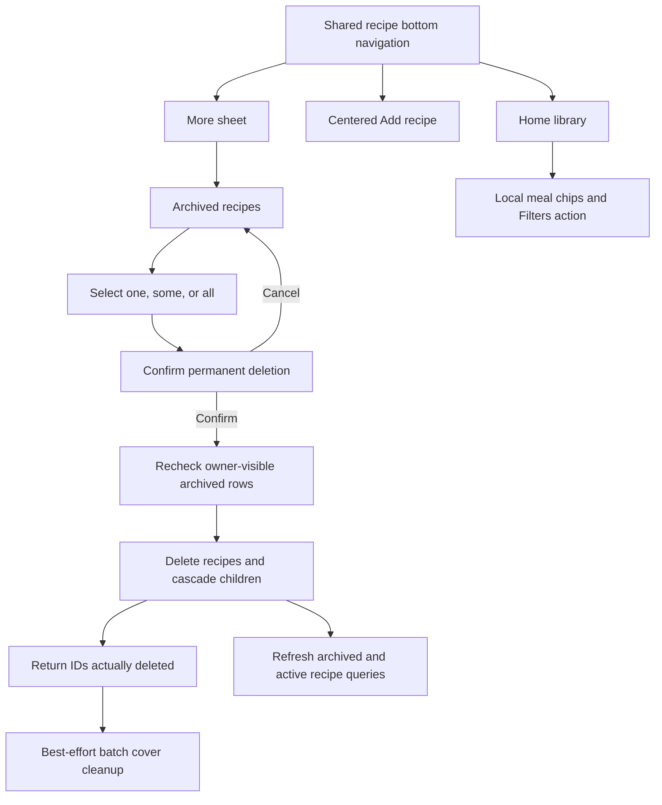

# Add Archived Bulk Deletion And Recipe Navigation

## Why

Archived recipes could be restored but not permanently removed. The active-library header also placed an Archived link beside Sign out even though those controls had different purposes and visual sizing. Archive management now supports deliberate bulk deletion, while recipe-page navigation has one consistent, extensible bottom boundary.

## What Changed

- Added checkbox selection for individual archived recipes plus Select all and Clear all actions.
- Added an explicit confirmation dialog for permanent deletion that identifies the selection, states that the action cannot be undone, supports Escape/cancel, shows pending feedback, and keeps safe failures inside the dialog.
- Added an archived-only bulk-delete repository operation that rechecks archive state and relies on existing owner RLS before deleting recipe rows.
- Preserved existing foreign-key cascades for recipe children and added one deduplicated, best-effort Storage cleanup request scoped to IDs returned by the guarded delete, so a concurrently restored recipe keeps its cover.
- Added a shared three-slot Home–Add–More bottom-navigation component. Add Recipe stays exactly centered, while More opens a focused bottom sheet driven by a small list of real secondary destinations.
- Moved Archived Recipes into the More sheet and kept future destinations out until their routes exist.
- Moved the Filters action beside the active library's persistent meal-type chips so filtering remains a page-level control rather than global navigation.
- Removed the mismatched Archived header button so Sign out remains the header's account action.
- Added repository, query, image cleanup, error, navigation, selection, confirmation, and failure coverage.

## File Manifest

Created:

- `docs/changelog/2026-08-19-1449-add-archived-bulk-deletion-and-navigation.md`
- `src/features/recipes/__tests__/recipe-navigation.test.tsx`
- `src/features/recipes/delete-archived-recipes-dialog.tsx`
- `src/features/recipes/recipe-navigation.tsx`

Modified:

- `docs/ARCHITECTURE.md`
- `docs/project-plan.md`
- `src/features/recipes/__tests__/archived-recipe-library.test.tsx`
- `src/features/recipes/__tests__/recipe-image.repository.test.ts`
- `src/features/recipes/__tests__/recipe-library.test.tsx`
- `src/features/recipes/__tests__/recipe.errors.test.ts`
- `src/features/recipes/__tests__/recipe.queries.test.tsx`
- `src/features/recipes/__tests__/recipe.repository.test.ts`
- `src/features/recipes/archived-recipe-library.tsx`
- `src/features/recipes/recipe-image.repository.ts`
- `src/features/recipes/recipe-filters.tsx`
- `src/features/recipes/recipe-library.tsx`
- `src/features/recipes/recipe-skeletons.tsx`
- `src/features/recipes/recipe.errors.ts`
- `src/features/recipes/recipe.queries.ts`
- `src/features/recipes/recipe.repository.ts`

Deleted: none.

No migration, generated database type, DBML, ERD, README, setup-document, dependency, or environment change was required. Existing owner-scoped recipe delete policies and foreign-key cascades already support permanent deletion, and the Storage bucket already has an owner-scoped delete policy.

## Localized Structure

```txt
recipe-app/
├── docs/
│   ├── ARCHITECTURE.md
│   ├── project-plan.md
│   └── changelog/
│       └── 2026-08-19-1449-add-archived-bulk-deletion-and-navigation.md
└── src/features/recipes/
    ├── __tests__/
    │   ├── archived-recipe-library.test.tsx
    │   ├── recipe-image.repository.test.ts
    │   ├── recipe-library.test.tsx
    │   ├── recipe-navigation.test.tsx
    │   ├── recipe.errors.test.ts
    │   ├── recipe.queries.test.tsx
    │   └── recipe.repository.test.ts
    ├── archived-recipe-library.tsx
    ├── delete-archived-recipes-dialog.tsx
    ├── recipe-image.repository.ts
    ├── recipe-filters.tsx
    ├── recipe-library.tsx
    ├── recipe-navigation.tsx
    ├── recipe-skeletons.tsx
    ├── recipe.errors.ts
    ├── recipe.queries.ts
    └── recipe.repository.ts
```

## Delete And Navigation Flow



## Verification

- `npm run verify`: ESLint, TypeScript, and all 14 Vitest files passed; 69 tests passed.
- `npm run build`: the production Next.js build completed successfully, including `/recipes/archived`.
- `npm run test:e2e`: all 6 desktop Chrome and mobile Safari-size Playwright checks passed.
- `npx tsc --noEmit --noUnusedLocals --noUnusedParameters`: passed.
- `git diff --check`: passed.
