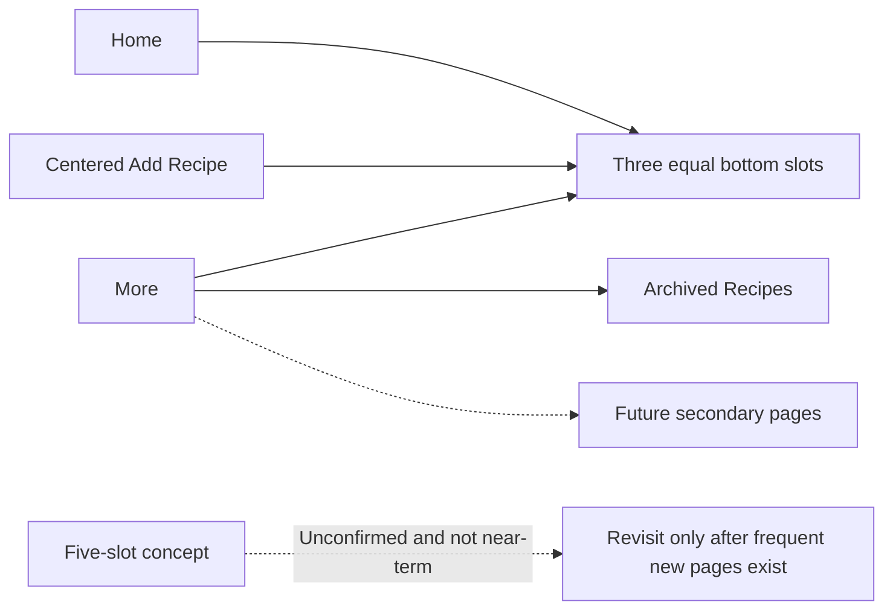

# Document Approved Navigation Mockups

## Why

The four-control bottom bar moved the emphasized Add Recipe action away from the visual center. A dedicated reference now records the approved near-term navigation before additional application changes are made.

## What Changed

- Added a tracked mobile mockup showing the confirmed Home–Add–More bar with three equal slots and an exactly centered Add Recipe action.
- Added the confirmed More bottom sheet with Archived Recipes and space for future secondary destinations.
- Included a separate five-slot concept only for future exploration and labeled it as unconfirmed and not near-term.
- Excluded the rejected header-selector concept.
- Updated the README asset index and project UI plan to link the mockup and record the decision.

## File Manifest

Created:

- `docs/assets/navigation-mockups.svg`
- `docs/changelog/2026-08-19-1504-document-approved-navigation-mockups.md`

Modified:

- `README.md`
- `docs/project-plan.md`

Deleted: none.

No application code, current architecture, database schema, migration, generated type, dependency, environment, or setup behavior changed. `docs/ARCHITECTURE.md`, the DBML source, and the ERD therefore remain unchanged.

## Localized Structure

```txt
recipe-app/
├── README.md
└── docs/
    ├── assets/
    │   └── navigation-mockups.svg
    ├── changelog/
    │   └── 2026-08-19-1504-document-approved-navigation-mockups.md
    └── project-plan.md
```

## Approved Navigation Direction



## Verification

- Opened the SVG for visual inspection.
- Confirmed that the Add Recipe circle is centered in the approved three-slot bar.
- Confirmed that no header-selector mockup is present.
- Confirmed that the five-slot concept is labeled unconfirmed and not near-term.
- `git diff --check` passed for the documentation changes.
