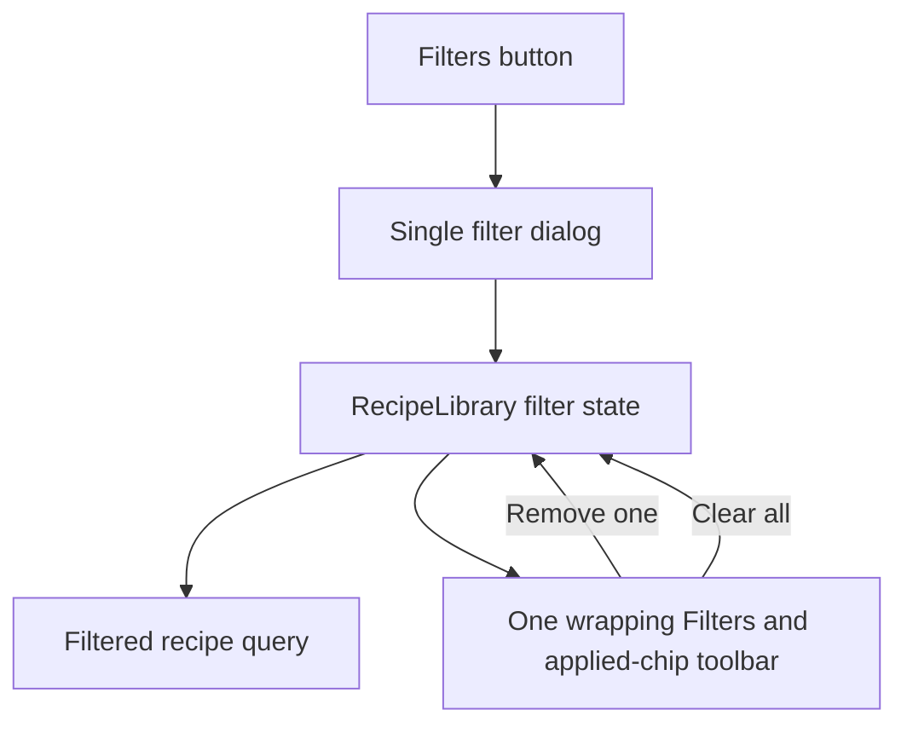

# Simplify Recipe Filter Controls

## Why

The persistent meal-type chips competed with the Filters action for limited mobile width, produced a nested horizontal scrollbar, and duplicated options already available in the filter dialog. The library now has one selection surface and a compact summary of only the filters that are actually active.

## What Changed

- Removed the horizontally scrolling meal-type quick-filter row.
- Kept one page-level Filters button and added a compact active-filter count badge.
- Placed the Filters button, applied chips, and Clear all action in one left-aligned wrapping toolbar so the first row fills naturally before additional selections expand downward.
- Added applied-filter chips for selected meal types, cost ratings, and difficulty.
- Added an accessible remove action to each applied chip and a Clear all action when more than one filter is active.
- Kept filter state and mutation callbacks in `RecipeLibrary`; `recipe-filters.tsx` remains responsible only for filter presentation.
- Made the Meal type `All` option clear only meal-type selections, while the dialog's Clear action continues to clear every filter dimension.
- Simplified the route-level filter loading placeholder to match the single-entry-point layout.

## File Manifest

Created:

- `docs/changelog/2026-08-19-1531-simplify-recipe-filter-controls.md`

Modified:

- `docs/ARCHITECTURE.md`
- `docs/project-plan.md`
- `src/features/recipes/__tests__/recipe-library.test.tsx`
- `src/features/recipes/recipe-filters.tsx`
- `src/features/recipes/recipe-library.tsx`
- `src/features/recipes/recipe-skeletons.tsx`

Deleted: none.

No database, migration, generated type, dependency, environment, setup, or external-infrastructure change was required.

## Localized Structure

```txt
recipe-app/
├── docs/
│   ├── ARCHITECTURE.md
│   ├── project-plan.md
│   └── changelog/
│       └── 2026-08-19-1531-simplify-recipe-filter-controls.md
└── src/features/recipes/
    ├── __tests__/
    │   └── recipe-library.test.tsx
    ├── recipe-filters.tsx
    ├── recipe-library.tsx
    └── recipe-skeletons.tsx
```

## Filter Flow



## Verification

- `npm run verify`: ESLint, TypeScript, and all 14 Vitest files passed; 71 tests passed.
- `npx tsc --noEmit --noUnusedLocals --noUnusedParameters`: passed.
- `npm run build`: the production Next.js build completed successfully.
- `npm run test:e2e`: all 6 desktop Chrome and mobile Safari-size Playwright checks passed.
- `git diff --check`: passed.
