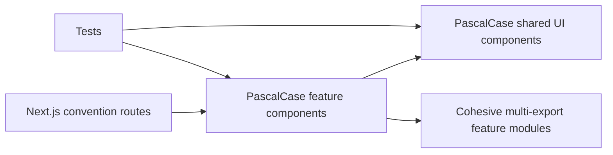

# Align component filenames with exported components

## Why

Component modules previously used kebab-case filenames even when they exported one clearly named React component. That made an imported component's source filename less predictable. This refactor gives every single-component module the exact PascalCase name of its exported component while preserving the existing feature boundaries and runtime behavior.

The accompanying simplification audit traced source and test references before any move. It found no stale application tests, unused UI elements, or removable components. Next.js convention exports, generated Supabase types, and cohesive multi-export modules were retained intentionally.

## What changed

- Renamed 22 single-component modules to exact PascalCase component filenames.
- Updated every source import, test import, and module mock to the new paths.
- Kept `page.tsx`, `layout.tsx`, and `loading.tsx` as Next.js framework conventions.
- Kept `recipe-filters.tsx`, `recipe-skeletons.tsx`, and `recipe-form-list.tsx` as cohesive multi-export modules rather than splitting related behavior only for naming symmetry.
- Documented the component filename convention and current component tree.

## File manifest

Created:

- `docs/changelog/2026-08-19-1545-align-component-filenames.md`

Renamed:

- `src/app/providers.tsx` → `src/app/AppProviders.tsx`
- `src/components/ui/action-button.tsx` → `src/components/ui/ActionButton.tsx`
- `src/components/ui/app-page-shell.tsx` → `src/components/ui/AppPageShell.tsx`
- `src/components/ui/back-link.tsx` → `src/components/ui/BackLink.tsx`
- `src/components/ui/inline-notice.tsx` → `src/components/ui/InlineNotice.tsx`
- `src/components/ui/selectable-chip.tsx` → `src/components/ui/SelectableChip.tsx`
- `src/features/auth/auth-hero.tsx` → `src/features/auth/AuthHero.tsx`
- `src/features/auth/auth-panel.tsx` → `src/features/auth/AuthPanel.tsx`
- `src/features/auth/auth-submit-button.tsx` → `src/features/auth/AuthSubmitButton.tsx`
- `src/features/auth/sign-out-button.tsx` → `src/features/auth/SignOutButton.tsx`
- `src/features/recipes/archived-recipe-library.tsx` → `src/features/recipes/ArchivedRecipeLibrary.tsx`
- `src/features/recipes/delete-archived-recipes-dialog.tsx` → `src/features/recipes/DeleteArchivedRecipesDialog.tsx`
- `src/features/recipes/recipe-card.tsx` → `src/features/recipes/RecipeCard.tsx`
- `src/features/recipes/recipe-detail.tsx` → `src/features/recipes/RecipeDetail.tsx`
- `src/features/recipes/recipe-edit.tsx` → `src/features/recipes/RecipeEdit.tsx`
- `src/features/recipes/recipe-form-fields.tsx` → `src/features/recipes/RecipeFormFields.tsx`
- `src/features/recipes/recipe-form.tsx` → `src/features/recipes/RecipeForm.tsx`
- `src/features/recipes/recipe-image-field.tsx` → `src/features/recipes/RecipeImageField.tsx`
- `src/features/recipes/recipe-ingredient-fields.tsx` → `src/features/recipes/RecipeIngredientFields.tsx`
- `src/features/recipes/recipe-library.tsx` → `src/features/recipes/RecipeLibrary.tsx`
- `src/features/recipes/recipe-navigation.tsx` → `src/features/recipes/RecipeNavigation.tsx`
- `src/features/recipes/recipe-step-fields.tsx` → `src/features/recipes/RecipeStepFields.tsx`

Modified:

- `docs/ARCHITECTURE.md`
- `docs/project-plan.md`
- `src/app/auth/update-password/page.tsx`
- `src/app/layout.tsx`
- `src/app/page.tsx`
- `src/app/recipes/[id]/edit/page.tsx`
- `src/app/recipes/[id]/page.tsx`
- `src/app/recipes/archived/__tests__/page.test.tsx`
- `src/app/recipes/archived/page.tsx`
- `src/app/recipes/new/page.tsx`
- `src/components/ui/__tests__/shared-ui.test.tsx`
- `src/features/recipes/__tests__/archived-recipe-library.test.tsx`
- `src/features/recipes/__tests__/recipe-form.test.tsx`
- `src/features/recipes/__tests__/recipe-library.test.tsx`
- `src/features/recipes/__tests__/recipe-navigation.test.tsx`
- `src/features/recipes/recipe-filters.tsx`
- `src/features/recipes/recipe-skeletons.tsx`

Deleted:

- None. The old component paths were renamed rather than removed as abandoned modules.

## Localized structure

```text
docs/
├── ARCHITECTURE.md
├── project-plan.md
└── changelog/
    └── 2026-08-19-1545-align-component-filenames.md
src/
├── app/
│   ├── AppProviders.tsx
│   ├── layout.tsx
│   ├── page.tsx
│   ├── auth/update-password/page.tsx
│   └── recipes/
│       ├── [id]/page.tsx
│       ├── [id]/edit/page.tsx
│       ├── archived/page.tsx
│       ├── archived/__tests__/page.test.tsx
│       └── new/page.tsx
├── components/ui/
│   ├── ActionButton.tsx
│   ├── AppPageShell.tsx
│   ├── BackLink.tsx
│   ├── InlineNotice.tsx
│   ├── SelectableChip.tsx
│   └── __tests__/shared-ui.test.tsx
└── features/
    ├── auth/
    │   ├── AuthHero.tsx
    │   ├── AuthPanel.tsx
    │   ├── AuthSubmitButton.tsx
    │   └── SignOutButton.tsx
    └── recipes/
        ├── ArchivedRecipeLibrary.tsx
        ├── DeleteArchivedRecipesDialog.tsx
        ├── RecipeCard.tsx
        ├── RecipeDetail.tsx
        ├── RecipeEdit.tsx
        ├── RecipeForm.tsx
        ├── RecipeFormFields.tsx
        ├── RecipeImageField.tsx
        ├── RecipeIngredientFields.tsx
        ├── RecipeLibrary.tsx
        ├── RecipeNavigation.tsx
        ├── RecipeStepFields.tsx
        ├── recipe-filters.tsx
        ├── recipe-skeletons.tsx
        └── __tests__/
            ├── archived-recipe-library.test.tsx
            ├── recipe-form.test.tsx
            ├── recipe-library.test.tsx
            └── recipe-navigation.test.tsx
```

## Ownership after the refactor



Routes continue to own authentication and routing boundaries, feature components continue to own recipe and auth behavior, and generic presentation remains in `components/ui`. No barrel exports or new abstraction layers were introduced.

## Verification

- Static export/reference audit: passed; no removable application export was found.
- Single-export component filename audit: passed; no filename/component mismatch remains.
- `npm run verify`: passed (ESLint, TypeScript, 14 Vitest files, and 71 tests).
- `npx tsc --noEmit --noUnusedLocals --noUnusedParameters`: passed.
- `npm run build`: passed.
- `npm run test:e2e`: passed (6 Playwright checks across desktop Chrome and the mobile Safari-size project).
