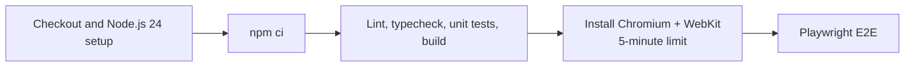

# Stabilize Playwright CI Installation

## Why

Two consecutive GitHub Actions attempts passed dependency installation, linting, type checking, unit tests, and the production build, then remained stuck in `playwright install --with-deps`. The current and preceding successful commits both resolved Playwright 1.61.1, isolating the failure to the hosted Ubuntu browser-installation environment rather than the application dependency refresh.

## What changed

- Pinned the CI runner to Ubuntu 22.04 instead of the moving `ubuntu-latest` label.
- Limited Playwright installation to Chromium and WebKit, the two browser engines used by the configured desktop and mobile projects.
- Added a five-minute browser-install timeout and a fifteen-minute overall job timeout so an external package or browser-download stall fails promptly.
- Updated current-state documentation and feature progress tracking to record the stabilized CI assumptions.

## File manifest

Created:

- `docs/changelog/2026-08-19-1719-stabilize-playwright-ci-installation.md`

Modified:

- `.github/workflows/ci.yml`
- `README.md`
- `docs/ARCHITECTURE.md`
- `docs/project-plan.md`

Deleted:

- None.

## Localized structure

```text
.
├── .github/
│   └── workflows/
│       └── ci.yml
├── README.md
└── docs/
    ├── ARCHITECTURE.md
    ├── project-plan.md
    └── changelog/
        └── 2026-08-19-1719-stabilize-playwright-ci-installation.md
```

## CI flow



## Verification

- Ruby YAML parsing: passed for `.github/workflows/ci.yml`.
- `npx playwright install --dry-run chromium webkit`: passed and resolved only Chromium, its shared FFmpeg dependency, and WebKit.
- `git diff --check`: passed.
- Current-document consistency sweep: passed; the separate Supabase migration workflow intentionally retains its independent runner configuration.
- The definitive hosted-runner verification requires committing and pushing this workflow change.
