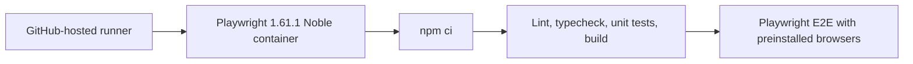

# Use A Playwright CI Container

## Why

Pinning the application workflow to Ubuntu 22.04 and limiting browser selection did not remove Playwright's live system-package installation. The next hosted run spent its entire five-minute browser-installation window downloading 86.1 MB across 147 packages from the Ubuntu mirror and timed out before downloading any browser binary. Application installation, linting, type checking, unit tests, and the production build all passed before that infrastructure failure.

## What changed

- Run the application CI job inside Microsoft's Playwright 1.61.1 Noble container, which includes its browser binaries and Linux system dependencies.
- Remove the live `playwright install --with-deps` step and retain the fifteen-minute overall job timeout.
- Pin `@playwright/test` to exactly 1.61.1 so the project dependency and container browser revision remain compatible.
- Restore the host runner label to `ubuntu-latest`; the versioned container now owns the browser execution environment.
- Update the current README, architecture guide, and project plan to describe the containerized CI boundary.

## File manifest

Created:

- `docs/changelog/2026-08-19-1751-use-playwright-ci-container.md`

Modified:

- `.github/workflows/ci.yml`
- `README.md`
- `docs/ARCHITECTURE.md`
- `docs/project-plan.md`
- `package-lock.json`
- `package.json`

Deleted:

- None.

## Localized structure

```text
.
├── .github/
│   └── workflows/
│       └── ci.yml
├── README.md
├── package-lock.json
├── package.json
└── docs/
    ├── ARCHITECTURE.md
    ├── project-plan.md
    └── changelog/
        └── 2026-08-19-1751-use-playwright-ci-container.md
```

## CI flow



## Verification

- Ruby YAML parsing: passed for `.github/workflows/ci.yml`.
- `docker manifest inspect mcr.microsoft.com/playwright:v1.61.1-noble`: passed and confirmed the pinned image tag exists.
- Package manifest/lock comparison: passed with both resolving `@playwright/test` 1.61.1.
- `npm ci`: passed with zero reported vulnerabilities.
- `npm run verify`: passed ESLint, TypeScript, and 14 Vitest files with 71 tests.
- `npx tsc --noEmit --noUnusedLocals --noUnusedParameters`: passed.
- `npm run build`: passed with Next.js 16.3.1.
- `npm run test:e2e`: passed all 6 Playwright scenarios locally.
- `git diff --check`: passed.
- The definitive container verification requires pushing the commit and observing GitHub Actions.
