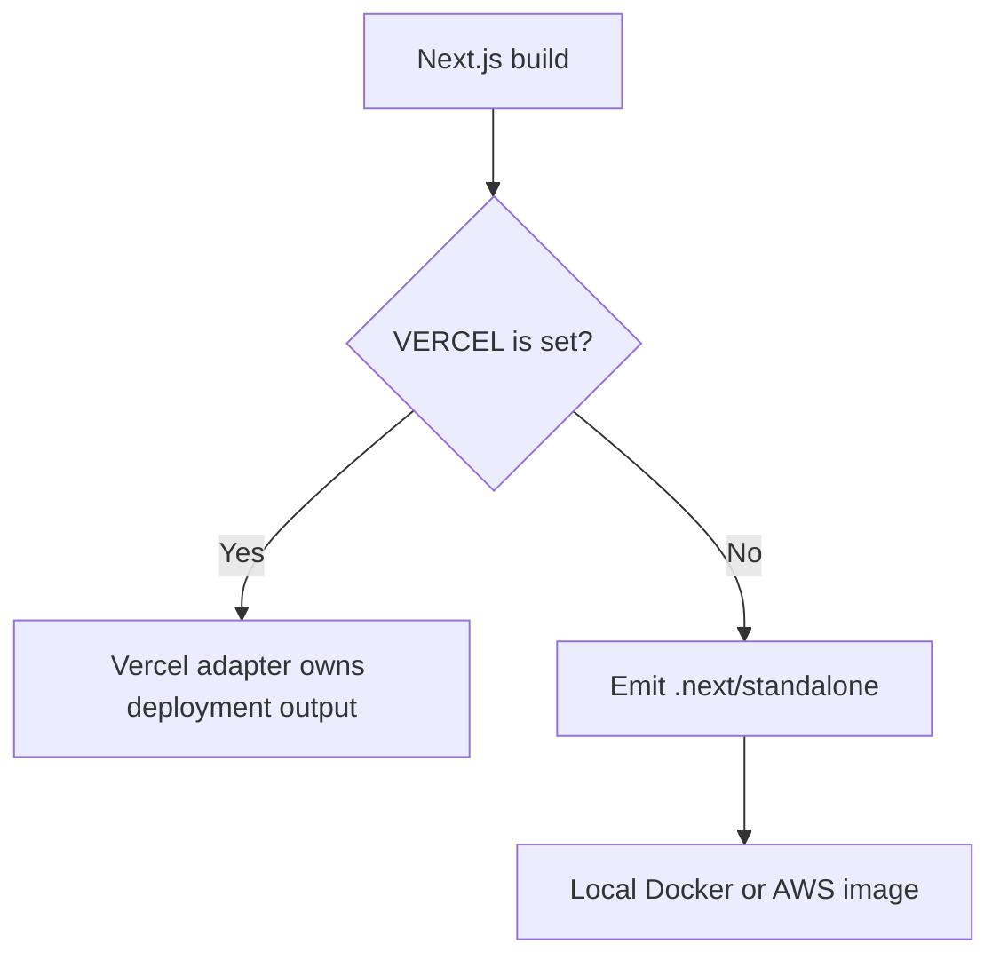

# Fix Vercel Standalone Build Conflict

## Why

Next.js 16.3 Vercel builds completed application compilation but failed while preparing standalone output because Vercel's build adapter does not emit the root trace file that the standalone copy phase expected. Local and GitHub Actions builds did not expose the issue because they do not run through that adapter.

## What Changed

- Made Next.js standalone output conditional: it remains enabled for local, Docker, and AWS builds, and is left unset when Vercel supplies the `VERCEL` environment variable.
- Documented the platform-specific output ownership and marked the Vercel deployment configuration work complete.

## Files

- Modified `next.config.mjs`.
- Modified `README.md`.
- Modified `docs/ARCHITECTURE.md`.
- Modified `docs/project-plan.md`.
- Created `docs/changelog/2026-08-19-1812-fix-vercel-standalone-build.md`.

## Changed Structure

```text
recipe-app/
├── next.config.mjs
├── README.md
└── docs/
    ├── ARCHITECTURE.md
    ├── project-plan.md
    └── changelog/
        └── 2026-08-19-1812-fix-vercel-standalone-build.md
```

## Build Flow


