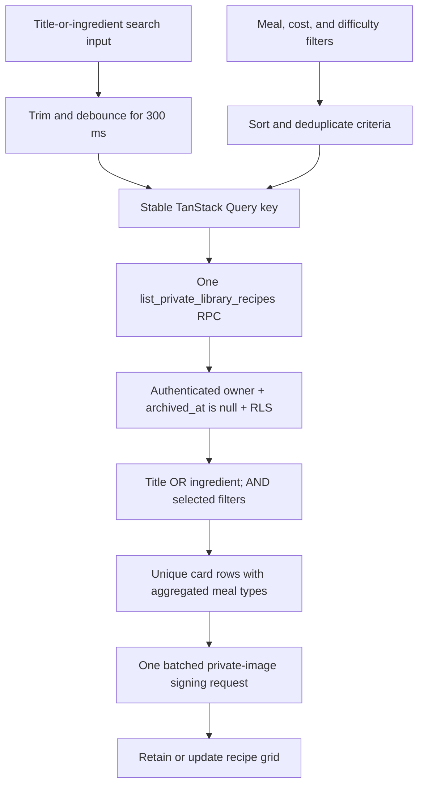

# Add Private-Library Ingredient Search

## Why

The active recipe library could search only recipe titles, so users had to remember a saved recipe's name even when they knew which ingredient they wanted to use. Meal-type filtering also required a preliminary recipe-ID lookup before the card query. This slice makes title-or-ingredient discovery useful while keeping the private owner boundary, archive exclusion, existing filter semantics, and batched image behavior explicit.

## What Changed

- Added forward Supabase migrations that enable `pg_trgm`, create GIN trigram indexes for recipe titles and ingredient names, expose an authenticated-only `list_private_library_recipes` function, and grant the source-table reads required by its invoker rights.
- Kept the function `security invoker`, retained underlying RLS, explicitly selected only `auth.uid()`-owned active recipes, escaped user-entered wildcard characters, and returned each matching recipe once with aggregated meal types.
- Combined title-or-ingredient search, meal types, cost ratings, and difficulty in one database request while preserving the rule that flexible recipes appear under specific meal-type filters.
- Replaced the active list's direct recipe query and preliminary meal-type lookup with the typed RPC. The archived list remains unchanged.
- Normalized trimmed search text and sorted/deduplicated multi-select values so equivalent criteria share a TanStack Query cache key.
- Debounced search by 300 ms, retained previous cards while new criteria load, and announced background updates.
- Distinguished a genuinely empty library from an empty search/filter result and added relevant Clear search and Clear filters actions.
- Preserved compact cards and the existing one-request batch for signed private image URLs.
- Added repository, mapper, query-hook, and library-component coverage for the new contracts.
- Updated the README, architecture, roadmap, DBML, and Mermaid ERD notes to describe the current behavior and indexes.

## File Manifest

Created:

- `docs/changelog/2026-08-19-1951-add-private-library-ingredient-search.md`
- `supabase/migrations/20260819194346_add_private_library_search.sql`
- `supabase/migrations/20260819200746_grant_private_library_search_reads.sql`

Modified:

- `README.md`
- `docs/ARCHITECTURE.md`
- `docs/database-erd.mmd`
- `docs/database-schema.dbml`
- `docs/project-plan.md`
- `src/features/recipes/RecipeLibrary.tsx`
- `src/features/recipes/__tests__/recipe-library.test.tsx`
- `src/features/recipes/__tests__/recipe.mappers.test.ts`
- `src/features/recipes/__tests__/recipe.queries.test.tsx`
- `src/features/recipes/__tests__/recipe.repository.test.ts`
- `src/features/recipes/recipe-library.constants.ts`
- `src/features/recipes/recipe.mappers.ts`
- `src/features/recipes/recipe.queries.ts`
- `src/features/recipes/recipe.repository.ts`
- `src/lib/supabase/database.types.ts`

Deleted: none.

No dependency, environment-variable, storage-bucket, auth-provider, route, or setup command changed.

## Localized Structure

```txt
recipe-app/
├── README.md
├── docs/
│   ├── ARCHITECTURE.md
│   ├── database-erd.mmd
│   ├── database-schema.dbml
│   ├── project-plan.md
│   └── changelog/
│       └── 2026-08-19-1951-add-private-library-ingredient-search.md
├── src/
│   ├── features/recipes/
│   │   ├── RecipeLibrary.tsx
│   │   ├── recipe-library.constants.ts
│   │   ├── recipe.mappers.ts
│   │   ├── recipe.queries.ts
│   │   ├── recipe.repository.ts
│   │   └── __tests__/
│   │       ├── recipe-library.test.tsx
│   │       ├── recipe.mappers.test.ts
│   │       ├── recipe.queries.test.tsx
│   │       └── recipe.repository.test.ts
│   └── lib/supabase/
│       └── database.types.ts
└── supabase/migrations/
    ├── 20260819194346_add_private_library_search.sql
    └── 20260819200746_grant_private_library_search_reads.sql
```

## Private Search Flow



## Database Notes

- The initial migration was not rewritten; all database behavior is introduced by two new forward migrations.
- The list function accepts no owner parameter. It derives ownership from `auth.uid()`, runs with invoker rights, and is executable only by `authenticated`.
- The authenticated role receives only the source-table reads needed by the function. Existing table RLS remains the authoritative boundary for direct and function-mediated access; no anonymous, public-read, or visibility behavior was introduced.
- Database types were regenerated from the migrated local schema and diffed. The checked-in contract retains explicit nullable RPC arguments and return fields because those match the SQL defaults and nullable source columns, while the installed CLI narrows them in generated output; the existing PostgREST version metadata was also retained.

## Verification

- `npm run verify`: ESLint, TypeScript, and all 14 Vitest files passed; 78 tests passed.
- `npm run build`: the production Next.js build completed successfully.
- `npm run test:e2e`: all 6 existing mobile Safari-size and desktop Chrome signed-out checks passed.
- Targeted repository, mapper, query-hook, and library tests passed: 34 tests across 4 files.
- `git diff --check`: passed during the final consistency sweep.
- `npx supabase db reset --local`: the complete migration chain applied cleanly to a fresh local database.
- `npx supabase migration list --local`: all seven local migrations, including both private-library search migrations, are applied.
- `npx supabase db lint --local --level error --fail-on error`: no schema errors found.
- Local SQL integration checks passed for authenticated grants, direct RLS visibility, two-owner isolation, archive exclusion, title/ingredient matching, duplicate ingredient matches, literal `%`/`_`, flexible meal behavior, combined filters, and aggregated meal types.
- Representative forced-index plans used `recipes_title_trgm_idx` and `recipe_ingredients_name_trgm_idx` for case-insensitive contains predicates.
- Supabase types were generated from the local database URL and diffed; only the documented CLI metadata/nullability differences remained.
- Authenticated Playwright search coverage remains pending because the current suite has no signed-in local Supabase fixture; repository/query/component behavior is covered by Vitest and the database behavior is now covered by direct local integration checks.
