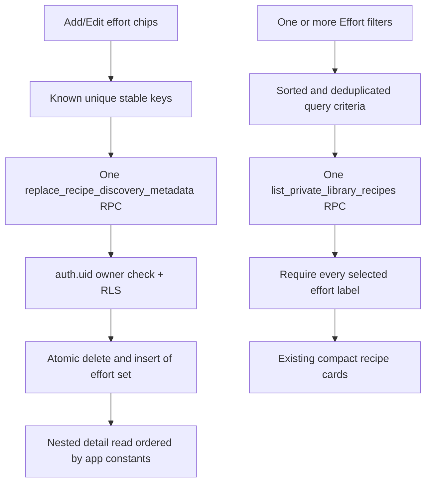

# Add Controlled Recipe Effort Labels

## Why

Title and ingredient search made the private library easier to query, but users still could not record or find practical cooking traits such as quick preparation or low cleanup. This slice adds a small controlled effort vocabulary without introducing free-form labels, changing recipe-card density, or weakening the existing private owner boundary.

## What Changed

- Added the controlled effort values `quick`, `make_ahead`, `one_pot`, and `low_cleanup` as a Postgres enum and the owner-scoped-through-recipe `recipe_effort_labels` relation.
- Added authenticated Row Level Security, an effort-first filter index, and table/function grants that keep anonymous access disabled.
- Added `replace_recipe_discovery_metadata`, a security-invoker function that verifies the authenticated recipe owner and atomically replaces a recipe's complete effort selection. Null and duplicate values fail before existing metadata is changed.
- Extended `list_private_library_recipes` with optional match-all effort filtering. Effort combines with title-or-ingredient search and the existing meal, cost, and difficulty filters while retaining active-only and owner-only scope.
- Added stable typed effort constants, descriptions, deterministic display ordering, validation, DTO/form fields, nested detail reads, and one bounded metadata RPC per recipe save.
- Added optional effort choices to add/edit forms, an Effort filter section, category-qualified removable filter chips, active-count and Clear behavior, and an optional At a glance detail section.
- Kept active and archived recipe cards unchanged. Archived list filtering remains out of scope, while saved effort metadata remains attached through archive and restore.
- Documented the existing broader save boundary: effort replacement is atomic, but base fields, ordinary child collections, discovery metadata, and image changes are still separate operations during update.

## File Manifest

Created:

- `docs/changelog/2026-08-19-2038-add-controlled-effort-labels.md`
- `src/features/recipes/RecipeDiscoveryFields.tsx`
- `src/features/recipes/recipe-discovery.constants.ts`
- `src/features/recipes/recipe-discovery.repository.ts`
- `src/features/recipes/__tests__/recipe-detail.test.tsx`
- `src/features/recipes/__tests__/recipe-discovery.constants.test.ts`
- `src/features/recipes/__tests__/recipe-discovery.repository.test.ts`
- `src/features/recipes/__tests__/recipe-save-effort.test.ts`
- `supabase/migrations/20260819203000_add_recipe_effort_labels.sql`

Modified:

- `README.md`
- `docs/ARCHITECTURE.md`
- `docs/database-erd.mmd`
- `docs/database-schema.dbml`
- `docs/project-plan.md`
- `src/features/recipes/RecipeDetail.tsx`
- `src/features/recipes/RecipeFormFields.tsx`
- `src/features/recipes/RecipeLibrary.tsx`
- `src/features/recipes/recipe-filters.tsx`
- `src/features/recipes/recipe.mappers.ts`
- `src/features/recipes/recipe.repository.ts`
- `src/features/recipes/recipe.types.ts`
- `src/features/recipes/recipe.validation.ts`
- `src/features/recipes/__tests__/recipe-form.test.tsx`
- `src/features/recipes/__tests__/recipe-library.test.tsx`
- `src/features/recipes/__tests__/recipe.mappers.test.ts`
- `src/features/recipes/__tests__/recipe.queries.test.tsx`
- `src/features/recipes/__tests__/recipe.repository.test.ts`
- `src/lib/supabase/database.types.ts`
- `temp/03-private-library-discovery.md` (local Git-excluded implementation status only)

Deleted: none.

No dependency, environment-variable, storage-bucket, auth-provider, route, or external setup command changed.

## Localized Structure

```txt
recipe-app/
├── README.md
├── docs/
│   ├── ARCHITECTURE.md
│   ├── database-erd.mmd
│   ├── database-schema.dbml
│   ├── project-plan.md
│   └── changelog/
│       └── 2026-08-19-2038-add-controlled-effort-labels.md
├── src/
│   ├── features/recipes/
│   │   ├── RecipeDetail.tsx
│   │   ├── RecipeDiscoveryFields.tsx
│   │   ├── RecipeFormFields.tsx
│   │   ├── RecipeLibrary.tsx
│   │   ├── recipe-discovery.constants.ts
│   │   ├── recipe-discovery.repository.ts
│   │   ├── recipe-filters.tsx
│   │   ├── recipe.mappers.ts
│   │   ├── recipe.repository.ts
│   │   ├── recipe.types.ts
│   │   ├── recipe.validation.ts
│   │   └── __tests__/
│   │       ├── recipe-detail.test.tsx
│   │       ├── recipe-discovery.constants.test.ts
│   │       ├── recipe-discovery.repository.test.ts
│   │       ├── recipe-save-effort.test.ts
│   │       ├── recipe-form.test.tsx
│   │       ├── recipe-library.test.tsx
│   │       ├── recipe.mappers.test.ts
│   │       ├── recipe.queries.test.tsx
│   │       └── recipe.repository.test.ts
│   └── lib/supabase/
│       └── database.types.ts
├── supabase/migrations/
│   └── 20260819203000_add_recipe_effort_labels.sql
└── temp/
    └── 03-private-library-discovery.md
```

## Effort Read And Write Flow



## Database Notes

- The initial migration and the committed Slice 1 migrations were not rewritten. Slice 2 is one new forward migration.
- `recipe_effort_labels` cascades when its recipe is permanently deleted and remains present when `archived_at` changes.
- Both functions run with invoker rights, use explicit safe search paths, accept no owner parameter, and are executable only by `authenticated`.
- Direct relation access is still protected by RLS; the metadata function also performs an explicit owner check before changing rows.
- Generated local types were diffed against the migrated schema. The checked-in file adds the new enum, table, relationship, and function contracts while retaining the documented PostgREST metadata and SQL-nullability corrections not represented by this CLI version.

## Verification

- A complete local Supabase reset applied all eight migrations successfully.
- Direct local SQL checks passed for one-value and match-all effort filtering, effort combined with ingredient search, archived exclusion, two-owner read isolation, cross-owner replacement rejection, empty selection clearing, duplicate rejection without partial replacement, and anonymous function denial.
- `npm run verify`: ESLint and TypeScript passed; all 18 Vitest files passed with 89 tests.
- `npm run build`: the Next.js production build completed successfully.
- `npm run test:e2e`: all 6 existing mobile Safari-size and desktop Chrome signed-out checks passed. Authenticated effort workflows remain assigned to the Slice 3 signed-in fixture.
- `npx supabase migration list --local`: all eight local migrations are applied.
- `npx supabase db lint --local --level error --fail-on error`: no schema errors were found.
- A forced-index representative plan used `recipe_effort_labels_effort_label_idx` for an effort-key predicate.
- `git diff --check`: passed during the final consistency sweep.
