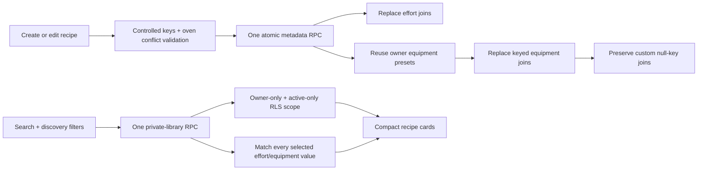

# Add controlled equipment discovery

## Why

Private-library discovery already supported title/ingredient search and controlled effort traits, but users could not record the kitchen setup a recipe needs or limit results to recipes matching the equipment they have. This slice completes the recommended shippable discovery scope while leaving student-oriented tags deferred.

## What changed

- Added six optional controlled equipment/setup choices: Microwave, Rice cooker, Stovetop, Oven, Blender, and No oven needed.
- Added equipment selection to recipe create/edit, deterministic detail display, filter-dialog selection, active-filter counts, removable applied chips, Clear behavior, and normalized query keys.
- Made Oven and No oven needed mutually exclusive in form/filter interactions and enforced the same invariant in both Zod and Postgres.
- Added nullable `equipment.preset_key`, controlled-value validation, and owner/key uniqueness. Exact canonical legacy labels are backfilled; other existing rows stay null-key custom values.
- Extended the authenticated metadata function to atomically replace effort and controlled equipment selections, reuse the owner's catalog rows, and preserve custom null-key equipment joins.
- Extended the active-library function with match-all equipment filtering that combines with search, meal type, cost, difficulty, and match-all effort criteria.
- Added the explicit authenticated recipe-table CRUD grants needed by a clean local migration install. Existing owner-scoped RLS remains the authorization boundary.
- Made the expanded filter dialog viewport-bounded and scrollable, kept actions reachable, added initial focus, Tab containment, Escape/backdrop close, and focus return, and retained previous results with an updating announcement and recoverable no-match state.
- Added a local-Supabase Playwright runner that uses an isolated free port and Next.js output directory, keeping signed-in tests away from `.env.local`, hosted data, and an already-running development server.
- Added transactional SQL verification and authenticated mobile/desktop browser coverage. Student-oriented tags remain pending as Slice 4.

## Flow



## Files changed

Created:

- `docs/changelog/2026-08-19-2106-add-equipment-discovery.md`
- `scripts/run-local-e2e.mjs`
- `supabase/migrations/20260819205000_add_equipment_presets.sql`
- `supabase/tests/equipment_presets.sql`
- `tests/e2e/private-library-discovery.spec.ts`

Modified:

- `README.md`
- `docs/ARCHITECTURE.md`
- `docs/database-erd.mmd`
- `docs/database-schema.dbml`
- `docs/project-plan.md`
- `next.config.mjs`
- `package.json`
- `playwright.config.ts`
- `src/features/recipes/RecipeDetail.tsx`
- `src/features/recipes/RecipeDiscoveryFields.tsx`
- `src/features/recipes/RecipeLibrary.tsx`
- `src/features/recipes/__tests__/recipe-detail.test.tsx`
- `src/features/recipes/__tests__/recipe-discovery.constants.test.ts`
- `src/features/recipes/__tests__/recipe-discovery.repository.test.ts`
- `src/features/recipes/__tests__/recipe-form.test.tsx`
- `src/features/recipes/__tests__/recipe-library.test.tsx`
- `src/features/recipes/__tests__/recipe-save-effort.test.ts`
- `src/features/recipes/__tests__/recipe.mappers.test.ts`
- `src/features/recipes/__tests__/recipe.queries.test.tsx`
- `src/features/recipes/__tests__/recipe.repository.test.ts`
- `src/features/recipes/recipe-discovery.constants.ts`
- `src/features/recipes/recipe-discovery.repository.ts`
- `src/features/recipes/recipe-filters.tsx`
- `src/features/recipes/recipe.mappers.ts`
- `src/features/recipes/recipe.repository.ts`
- `src/features/recipes/recipe.types.ts`
- `src/features/recipes/recipe.validation.ts`
- `src/lib/supabase/database.types.ts`
- `temp/03-private-library-discovery.md`
- `tsconfig.json`

Deleted: none.

## Localized structure

```text
recipe-app/
├── docs/
│   ├── changelog/
│   │   └── 2026-08-19-2106-add-equipment-discovery.md
│   ├── ARCHITECTURE.md
│   ├── database-erd.mmd
│   ├── database-schema.dbml
│   └── project-plan.md
├── scripts/
│   └── run-local-e2e.mjs
├── src/
│   ├── features/recipes/
│   │   ├── __tests__/
│   │   ├── RecipeDetail.tsx
│   │   ├── RecipeDiscoveryFields.tsx
│   │   ├── RecipeLibrary.tsx
│   │   ├── recipe-discovery.constants.ts
│   │   ├── recipe-discovery.repository.ts
│   │   ├── recipe-filters.tsx
│   │   ├── recipe.mappers.ts
│   │   ├── recipe.repository.ts
│   │   ├── recipe.types.ts
│   │   └── recipe.validation.ts
│   └── lib/supabase/database.types.ts
├── supabase/
│   ├── migrations/20260819205000_add_equipment_presets.sql
│   └── tests/equipment_presets.sql
├── temp/03-private-library-discovery.md
└── tests/e2e/private-library-discovery.spec.ts
```

## Verification

- Clean local Supabase migration reset.
- Supabase error-level schema lint.
- Transactional local SQL integration checks for reuse, filtering, validation, custom-row preservation, RLS, and function grants.
- TypeScript typecheck and ESLint.
- Full Vitest suite.
- Production Next.js build.
- Playwright signed-out checks plus the authenticated discovery journey on mobile Safari-size and desktop Chrome projects.

## Deferred

Student-oriented controlled tags are not part of this change. Discovery Slice 4 remains pending in `temp/03-private-library-discovery.md` and current-state documentation.
