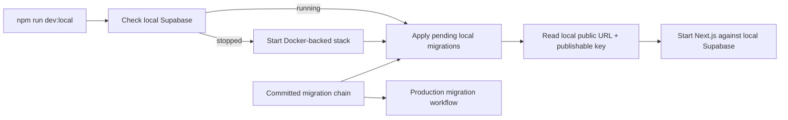

# Align local development with repository migrations

## Why

The normal development command could inherit hosted Supabase values from `.env.local`, making localhost dependent on production migration timing and creating a risk of testing against hosted data. Local development needs a durable, non-destructive path that uses the same committed migration chain while keeping accounts and recipes isolated from production.

## What changed

- Added `npm run dev:local` as the preferred localhost command.
- Added a shared local-Supabase preparation module that starts the Docker stack when necessary, reads public connection values without printing them, and forward-applies pending local migrations.
- Kept routine startup non-destructive by using `supabase migration up --local`; a deliberate `supabase db reset --local` remains the clean-rebuild check.
- Made authenticated E2E use the same preparation module so normal local development and automated browser tests begin from the same migration state.
- Ensured local public configuration overrides `.env.local` only for the spawned process. No production credentials or production data are copied locally.
- Documented the separation between schema alignment and data isolation.

## Development flow



## Files changed

Created:

- `docs/changelog/2026-08-19-2136-align-local-development-schema.md`
- `scripts/local-supabase.mjs`
- `scripts/run-local-dev.mjs`

Modified:

- `README.md`
- `docs/ARCHITECTURE.md`
- `docs/project-plan.md`
- `package.json`
- `scripts/run-local-e2e.mjs`

Deleted: none.

## Localized structure

```text
recipe-app/
├── docs/
│   ├── changelog/
│   │   └── 2026-08-19-2136-align-local-development-schema.md
│   ├── ARCHITECTURE.md
│   └── project-plan.md
├── scripts/
│   ├── local-supabase.mjs
│   ├── run-local-dev.mjs
│   └── run-local-e2e.mjs
├── package.json
└── README.md
```

## Operational boundary

- Local and production should share migration history, not user data or credentials.
- `dev:local` never applies migrations to the linked production project.
- Production remains updated only through the production migration workflow or an explicitly approved linked deployment.

## Verification

- Confirmed the local migration history contains all nine repository migrations.
- Confirmed the linked production project currently has four pending repository migrations; production was not changed.
- Verified `npm run dev:local -- --help` prepares local Supabase and delegates to Next.js successfully.
- ESLint and TypeScript typecheck passed.
- All eight local-Supabase Playwright checks passed across the mobile Safari-size and desktop Chrome projects after the E2E runner was moved to the shared preparation helper.
