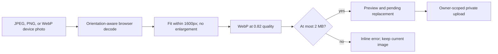

# Optimize recipe images before upload

## Why

Modern phone photos can exceed the private Storage bucket's 2 MB object limit even when a smaller cover would look the same in the app. Recipe covers should be normalized before upload without sending original camera files, changing the existing privacy boundary, or risking the current image during an edit.

## What changed

- Added a small browser-native image processor with no new dependency.
- Accept JPEG, PNG, and WebP source selections even when the original exceeds 2 MB.
- Decode with image orientation applied, preserve aspect ratio, limit the longest edge to 1600 pixels without enlargement, and export WebP at 0.82 quality.
- Enforce the existing 2 MB hard limit on the processed upload.
- Wait for processing before changing the preview or pending image mutation, and block recipe submission during that interval.
- Preserve the current or already processed replacement when another selection fails.
- Release decoded image and object URL resources after replacement, removal, failure, or unmount.
- Keep private owner-scoped paths, signed reads, bucket configuration, and safe upload/reference/cleanup ordering unchanged.
- Expanded the local implementation plan with decisions, acceptance criteria, file-level work, verification, and explicit non-goals.

## Image flow



## Files changed

Created:

- `docs/changelog/2026-08-20-1833-optimize-recipe-images.md`
- `src/features/recipes/recipe-image.processor.ts`
- `src/features/recipes/__tests__/recipe-image.processor.test.ts`

Modified:

- `README.md`
- `docs/ARCHITECTURE.md`
- `docs/project-plan.md`
- `src/features/recipes/RecipeForm.tsx`
- `src/features/recipes/RecipeFormFields.tsx`
- `src/features/recipes/RecipeImageField.tsx`
- `src/features/recipes/recipe-image.constants.ts`
- `src/features/recipes/recipe-image.repository.ts`
- `src/features/recipes/__tests__/recipe-form.test.tsx`
- `src/features/recipes/__tests__/recipe-image.constants.test.ts`
- `temp/04-image-optimization.md` (local Git-excluded implementation plan)

Deleted: none.

## Localized structure

```text
recipe-app/
├── docs/
│   ├── changelog/
│   │   └── 2026-08-20-1833-optimize-recipe-images.md
│   ├── ARCHITECTURE.md
│   └── project-plan.md
├── src/features/recipes/
│   ├── __tests__/
│   │   ├── recipe-form.test.tsx
│   │   ├── recipe-image.constants.test.ts
│   │   └── recipe-image.processor.test.ts
│   ├── RecipeForm.tsx
│   ├── RecipeFormFields.tsx
│   ├── RecipeImageField.tsx
│   ├── recipe-image.constants.ts
│   ├── recipe-image.processor.ts
│   └── recipe-image.repository.ts
├── temp/
│   └── 04-image-optimization.md
└── README.md
```

## Verification

- `npm run verify`
- `npm run build`
- `npm run test:e2e:local` (8 mobile and desktop checks)
